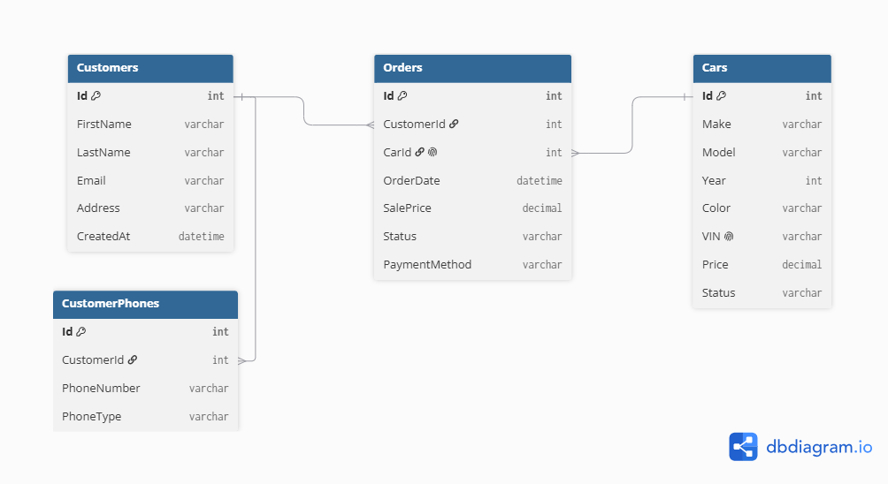

# Day 2 — SQL Server Schema Design & Normalization

## 1. Entities and Attributes

Based on the Day 1 API resource map, the Car Dealership Management System requires the following entities.

### Car

Represents an individual vehicle available at the dealership.

**Attributes:**

* `Id`: Internal unique identifier for the car.
* `Make`: Vehicle manufacturer, such as Kia, BMW, or Toyota.
* `Model`: Vehicle model, such as Sportage or Corolla.
* `Year`: Manufacturing year of the vehicle.
* `Color`: Exterior color of the vehicle.
* `VIN`: Unique Vehicle Identification Number assigned to the physical car.
* `Price`: Listed price of the vehicle.
* `Status`: Current vehicle status, such as Available, Reserved, or Sold.

The `Id` is used internally as the database primary key, while the `VIN` identifies the physical vehicle and must be unique.

### Customer

Represents a person who may purchase a vehicle from the dealership.

**Attributes:**

* `Id`: Unique identifier for the customer.
* `FirstName`: Customer's first name.
* `LastName`: Customer's last name.
* `Email`: Customer's email address.
* `Address`: Customer's address.
* `CreatedAt`: Date and time when the customer was added to the system.

Phone numbers are not stored directly in this entity because one customer may have multiple phone numbers.

### CustomerPhone

Represents a phone number belonging to a customer.

**Attributes:**

* `Id`: Unique identifier for the phone number record.
* `CustomerId`: Identifier of the customer who owns the phone number.
* `PhoneNumber`: Customer's phone number.
* `PhoneType`: Optional description of the number, such as Mobile, Home, or Work.

Each phone number is stored in a separate row to keep the values atomic and support customers with multiple phone numbers.

### Order

Represents the purchase of a car by a customer.

**Attributes:**

* `Id`: Unique identifier for the order.
* `CustomerId`: Identifier of the customer who placed the order.
* `CarId`: Identifier of the car included in the order.
* `OrderDate`: Date and time when the order was created.
* `SalePrice`: Final agreed price of the vehicle.
* `Status`: Current order status, such as Pending, Completed, or Cancelled.
* `PaymentMethod`: Payment method used for the purchase.

### Initial Relationships

* One customer can have multiple phone numbers.
* Each phone number belongs to one customer.
* One customer can place multiple orders.
* Each order belongs to one customer.
* Each order references one car.
* A physical car can be included in only one completed sale.

## 2. Applying Normalization

### First Normal Form (1NF)

The schema satisfies First Normal Form (1NF) because every table stores atomic values only. No column contains multiple values or comma-separated lists. Since a customer may have multiple phone numbers, phone numbers were moved into a separate **CustomerPhones** table, where each phone number is stored in its own row.

### Second Normal Form (2NF)

The schema satisfies Second Normal Form (2NF) because every table uses a single-column primary key (`Id`). Therefore, every non-key attribute depends entirely on its table's primary key, and there are no partial dependencies.

### Third Normal Form (3NF)

The schema satisfies Third Normal Form (3NF) because every non-key attribute depends only on its table's primary key. Customer information is stored only in the **Customers** table, phone numbers are stored in the **CustomerPhones** table, and the **Orders** table references customers and cars using foreign keys instead of duplicating their data.

## 3. Primary Keys, Foreign Keys, and Relationships

### Primary Keys

Each table has a single-column primary key named `Id`:

* `Cars.Id` is the primary key of the `Cars` table.
* `Customers.Id` is the primary key of the `Customers` table.
* `CustomerPhones.Id` is the primary key of the `CustomerPhones` table.
* `Orders.Id` is the primary key of the `Orders` table.

These primary keys uniquely identify every record in their respective tables.

### Foreign Keys

The following foreign keys define the relationships between the tables:

* `CustomerPhones.CustomerId` references `Customers.Id`.
* `Orders.CustomerId` references `Customers.Id`.
* `Orders.CarId` references `Cars.Id`.

### Relationships

* One customer can have multiple phone numbers, while each phone number belongs to one customer.
* One customer can place multiple orders, while each order belongs to one customer.
* Each order references one car.
* A car may not have an order if it has not been sold yet.
* A physical car can be associated with only one sale order, so `Orders.CarId` should be unique.

### Schema with Keys

```text
Cars
-----
Id PK
Make
Model
Year
Color
VIN
Price
Status

Customers
---------
Id PK
FirstName
LastName
Email
Address
CreatedAt

CustomerPhones
--------------
Id PK
CustomerId FK → Customers.Id
PhoneNumber
PhoneType

Orders
------
Id PK
CustomerId FK → Customers.Id
CarId FK → Cars.Id
OrderDate
SalePrice
Status
PaymentMethod
```
## 4. Entity Relationship Diagram (ERD)

An Entity Relationship Diagram (ERD) was created using **dbdiagram.io** to visualize the database schema and the relationships between all entities.

The diagram includes the following tables:

* Cars
* Customers
* CustomerPhones
* Orders

It also illustrates the primary keys, foreign keys, and one-to-many relationships between the tables.

**ERD Diagram:**



## 5. Choosing Appropriate Column Types

The following column types were selected to ensure efficient storage, data accuracy, and proper validation.

### Cars

| Column | Data Type     |
| ------ | ------------- |
| Id     | INT           |
| Make   | NVARCHAR(50)  |
| Model  | NVARCHAR(50)  |
| Year   | INT           |
| Color  | NVARCHAR(30)  |
| VIN    | VARCHAR(17)   |
| Price  | DECIMAL(18,2) |
| Status | NVARCHAR(20)  |

### Customers

| Column    | Data Type     |
| --------- | ------------- |
| Id        | INT           |
| FirstName | NVARCHAR(50)  |
| LastName  | NVARCHAR(50)  |
| Email     | VARCHAR(255)  |
| Address   | NVARCHAR(200) |
| CreatedAt | DATETIME2     |

### CustomerPhones

| Column      | Data Type    |
| ----------- | ------------ |
| Id          | INT          |
| CustomerId  | INT          |
| PhoneNumber | VARCHAR(20)  |
| PhoneType   | NVARCHAR(20) |

### Orders

| Column        | Data Type     |
| ------------- | ------------- |
| Id            | INT           |
| CustomerId    | INT           |
| CarId         | INT           |
| OrderDate     | DATETIME2     |
| SalePrice     | DECIMAL(18,2) |
| Status        | NVARCHAR(20)  |
| PaymentMethod | NVARCHAR(20)  |

### Design Decisions

* `INT` is used for all primary and foreign keys.
* `NVARCHAR` is used for names, addresses, and other text that may contain Unicode characters.
* `VARCHAR` is used for email addresses, VINs, and phone numbers because they contain only English characters and numbers.
* `DECIMAL(18,2)` is used for monetary values to avoid floating-point rounding errors.
* `DATETIME2` is used for storing dates and times accurately.
