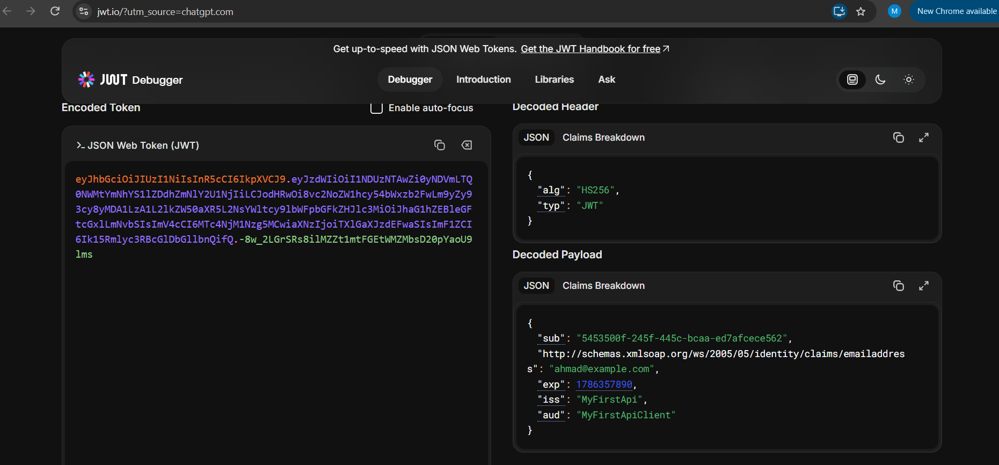

# Week 4 - Day 2: JWT Authentication & Token Issuance

## Overview

Today I continued working on the Car Dealership API from Day 1. Instead of creating a new project, I made a copy of the existing Identity-based project and extended it with JWT authentication.

The main idea of today's work was to move from simply having registered users in the database to actually authenticating those users and protecting API endpoints.

After implementing JWT authentication, the flow became:

```text
User sends email and password
        ↓
ASP.NET Core Identity verifies the credentials
        ↓
Login succeeds
        ↓
API creates and signs a JWT
        ↓
JWT is returned to the client
        ↓
Client sends the token with protected requests
        ↓
JWT Bearer Authentication validates the token
        ↓
[Authorize] allows or rejects the request
```

This made the authentication process much clearer to me because the password is only needed during login. After that, the client uses the JWT to prove that the user has already been authenticated.

---

# Understanding JWT

A JWT (JSON Web Token) is a compact token commonly used to carry authentication information between a client and an API.

A JWT contains three parts:

```text
Header.Payload.Signature
```

### Header

The header describes information about the token, mainly the algorithm used to sign it.

In this project, the token is signed using:

```text
HS256
```

### Payload

The payload contains claims.

Claims are pieces of information stored inside the token about the authenticated user or the token itself.

For this project, the important claims are:

| Claim | Purpose |
|---|---|
| `sub` | Stores the Identity user ID |
| Email | Stores the user's email address |
| `exp` | Token expiration time |
| `iss` | Identifies who issued the token |
| `aud` | Identifies who the token is intended for |

One important thing I learned is that the JWT payload is **not encrypted**.

It can be decoded and read by the client, which means passwords, signing keys, or other sensitive information should never be placed inside JWT claims.

### Signature

The signature is used by the API to verify that the token was created using the expected signing key and that its contents were not modified after it was issued.

---

# Hands-On Lab

## Task 1 - Implement Login and Validate Credentials

The first task was to implement a login endpoint that verifies the user's credentials using ASP.NET Core Identity.

The project already had registration from Day 1, so I kept that implementation and added login functionality to `AuthController`.

I injected both `UserManager` and `SignInManager` into the controller:

```csharp
private readonly UserManager<IdentityUser> _userManager;
private readonly SignInManager<IdentityUser> _signInManager;
private readonly IConfiguration _configuration;

public AuthController(
    UserManager<IdentityUser> userManager,
    SignInManager<IdentityUser> signInManager,
    IConfiguration configuration)
{
    _userManager = userManager;
    _signInManager = signInManager;
    _configuration = configuration;
}
```

The login endpoint first searches for the user by email:

```csharp
var user = await _userManager.FindByEmailAsync(email);

if (user == null)
{
    return Unauthorized(new
    {
        message = "Invalid email or password."
    });
}
```

If the user exists, the submitted password is verified using Identity:

```csharp
var result = await _signInManager.CheckPasswordSignInAsync(
    user,
    password,
    lockoutOnFailure: false
);

if (!result.Succeeded)
{
    return Unauthorized(new
    {
        message = "Invalid email or password."
    });
}
```

I used `SignInManager` instead of manually comparing passwords because ASP.NET Core Identity handles password hashing and verification securely.

### Testing the Login

I tested two login cases in Postman.

#### Valid Credentials

Request:

```http
POST /api/auth/login
```

Result:

```text
200 OK
```

The API successfully authenticated the user and returned a JWT.

#### Invalid Credentials

I sent the same request with an incorrect password.

Result:

```text
401 Unauthorized
```

No token was generated.

This completed the first task because invalid authentication attempts are rejected while valid credentials continue to token generation.

---

# Task 2 - Generate and Return a Signed JWT

After the user's credentials are verified, the next step is to create a JWT.

## Adding Claims

I added the user's ID and email to the token:

```csharp
var claims = new[]
{
    new Claim(JwtRegisteredClaimNames.Sub, user.Id),
    new Claim(ClaimTypes.Email, user.Email!)
};
```

The `sub` claim represents the authenticated user's Identity ID.

The email claim stores the user's email address.

## Creating the Signing Key

The signing key is read from configuration:

```csharp
var key = new SymmetricSecurityKey(
    Encoding.UTF8.GetBytes(_configuration["Jwt:Key"]!)
);
```

The key itself is not hardcoded inside the controller.

## Creating the Token

The JWT is then created with the issuer, audience, claims, expiration time, and signing credentials:

```csharp
var token = new JwtSecurityToken(
    issuer: _configuration["Jwt:Issuer"],
    audience: _configuration["Jwt:Audience"],
    claims: claims,
    expires: DateTime.UtcNow.AddMinutes(15),
    signingCredentials: new SigningCredentials(
        key,
        SecurityAlgorithms.HmacSha256
    )
);
```

The token object is converted into the JWT string returned to the client:

```csharp
var tokenString =
    new JwtSecurityTokenHandler().WriteToken(token);

return Ok(new
{
    token = tokenString
});
```

A successful login therefore returns a response in this form:

```json
{
  "token": "JWT_TOKEN"
}
```

The actual token is not stored in this README because authentication tokens should not be committed to the repository.

---

# Task 3 - Configure JWT Bearer Authentication

Generating a JWT is only half of the authentication process.

The API also needs to know how to validate a token when it comes back with another request.

For this, I installed JWT Bearer Authentication:

```text
Microsoft.AspNetCore.Authentication.JwtBearer
```

and configured it in `Program.cs`.

## Authentication Configuration

```csharp
builder.Services
    .AddAuthentication(options =>
    {
        options.DefaultAuthenticateScheme =
            JwtBearerDefaults.AuthenticationScheme;

        options.DefaultChallengeScheme =
            JwtBearerDefaults.AuthenticationScheme;
    })
    .AddJwtBearer(options =>
    {
        options.TokenValidationParameters =
            new TokenValidationParameters
            {
                ValidateIssuer = true,
                ValidIssuer =
                    builder.Configuration["Jwt:Issuer"],

                ValidateAudience = true,
                ValidAudience =
                    builder.Configuration["Jwt:Audience"],

                ValidateLifetime = true,

                ClockSkew = TimeSpan.Zero,

                ValidateIssuerSigningKey = true,
                IssuerSigningKey =
                    new SymmetricSecurityKey(
                        Encoding.UTF8.GetBytes(
                            builder.Configuration["Jwt:Key"]!
                        )
                    )
            };
    });
```

This configuration checks four important things when a JWT is received:

1. The token came from the expected issuer.
2. The token is intended for the expected audience.
3. The token has not expired.
4. The token has a valid signature created with the expected signing key.

I also added the authentication middleware before authorization:

```csharp
app.UseAuthentication();
app.UseAuthorization();
```

`UseAuthentication()` reads and validates the authentication information from the request.

`UseAuthorization()` then applies authorization rules to endpoints.

---

## Protecting an Endpoint

To verify that authentication was actually working, I protected the existing Cars endpoint.

I added:

```csharp
using Microsoft.AspNetCore.Authorization;
```

and then placed `[Authorize]` on the `GetAll` action:

```csharp
[Authorize]
[HttpGet]
public async Task<IActionResult> GetAll()
{
    var cars = await _context.Cars
        .AsNoTracking()
        .ToListAsync();

    return Ok(cars);
}
```

The endpoint:

```http
GET /api/cars
```

now requires authentication.

### Test 1 - Request Without a Token

I sent the request from Postman without any authentication.

```text
GET /api/cars
Authorization: No Auth
```

Result:

```text
401 Unauthorized
```

This confirmed that `[Authorize]` was blocking anonymous requests.

### Test 2 - Request With a Valid Token

I logged in again, copied the generated JWT, and added it in Postman using:

```text
Authorization
    ↓
Bearer Token
    ↓
JWT
```

The request is sent as:

```http
Authorization: Bearer <token>
```

Result:

```text
200 OK
```

The protected endpoint returned the cars stored in the database:

```json
[
  {
    "id": 1,
    "make": "Toyota",
    "model": "Corolla",
    "year": 2022,
    "color": "White",
    "vin": "JTDBR32E720123456",
    "price": 95000.00,
    "status": "Sold",
    "orders": []
  },
  {
    "id": 3,
    "make": "Kia",
    "model": "Sportage",
    "year": 2021,
    "color": "Black",
    "vin": "KNA12345678901234",
    "price": 85000.00,
    "status": "Available",
    "orders": []
  }
]
```

This gave a clear comparison:

```text
No Token       → 401 Unauthorized
Valid JWT      → 200 OK
```

So the API is not only generating JWTs, but is also validating them before allowing access to protected resources.

---

# Task 4 - Decode and Inspect the JWT

After generating the token, I decoded it using JWT.io.

The goal was not to modify the token, but to inspect its structure and verify that the expected claims were included.

The decoded payload contained:

- The user's ID in `sub`.
- The user's email.
- The token expiration time in `exp`.
- The configured issuer in `iss`.
- The configured audience in `aud`.

## JWT.io Result



This test also demonstrated an important property of JWTs:

> The payload can be decoded without knowing the signing key.

The signing key is needed to verify the signature, not to read the payload.

For that reason, I only included information that is safe to expose inside the token claims.

---

# Task 5 - Test Token Expiration

The final token lifetime was configured to 15 minutes:

```csharp
expires: DateTime.UtcNow.AddMinutes(15)
```

Waiting 15 minutes every time would make the expiration test unnecessarily slow, so I temporarily changed it to one minute:

```csharp
expires: DateTime.UtcNow.AddMinutes(1)
```

I generated a new token and immediately called the protected endpoint.

Result:

```text
200 OK
```

This was expected because the token had not expired yet.

## An Issue I Found During the Test

After waiting for the one-minute expiration time, the token was still temporarily accepted.

At first this looked like the expiration validation was not working.

The reason was the default JWT clock tolerance used during token validation.

To make the expiration test exact, I added:

```csharp
ClockSkew = TimeSpan.Zero
```

to `TokenValidationParameters`.

I then restarted the application, generated a completely new one-minute token, and repeated the test.

### Before Expiration

```text
GET /api/cars
Bearer Token: Valid
```

Result:

```text
200 OK
```

### After Expiration

I sent the exact same request using the same token after its lifetime had ended.

Result:

```text
401 Unauthorized
```

This confirmed that the API correctly rejects expired JWTs.

After completing the test, I restored the final token lifetime to:

```csharp
expires: DateTime.UtcNow.AddMinutes(15)
```

while keeping:

```csharp
ClockSkew = TimeSpan.Zero
```

in the validation configuration.

---

# Postman Test Summary

I created a Postman collection called:

```text
Car project -JWT
```

It contains all of the requests used during today's lab.

| Request | Purpose | Result |
|---|---|---|
| `Register - Ahmad` | Create the test Identity user | `200 OK` |
| `Login - Valid Credentials` | Authenticate and issue JWT | `200 OK` + JWT |
| `Login - Invalid Credentials` | Verify invalid login handling | `401 Unauthorized` |
| `Get Cars - No Token` | Test protected endpoint without authentication | `401 Unauthorized` |
| `Get Cars - Valid Token` | Access protected endpoint using JWT | `200 OK` |
| Expired token test | Try protected endpoint after token expiry | `401 Unauthorized` |

The Bearer token in the Postman collection is stored as a variable instead of placing the real JWT directly in the exported collection.

---

# JWT Configuration

The JWT settings used by the application include:

```json
{
  "Jwt": {
    "Issuer": "MyFirstApi",
    "Audience": "MyFirstApiClient",
    "Key": "Development signing key"
  }
}
```

The actual signing key is treated as a secret and should not be committed to source control.

The local development value belongs in a development configuration or secrets mechanism, while a production application should use the hosting platform's secret management system.

---

# Packages Used

The main packages used for today's work were:

```text
Microsoft.AspNetCore.Identity.EntityFrameworkCore
Microsoft.AspNetCore.Authentication.JwtBearer
System.IdentityModel.Tokens.Jwt
Microsoft.EntityFrameworkCore.SqlServer
```

The JWT-related versions used in the project are:

```text
Microsoft.AspNetCore.Authentication.JwtBearer  10.0.10
System.IdentityModel.Tokens.Jwt                8.19.2
```

---

# Troubleshooting During the Lab

Two useful issues came up while implementing and testing JWT authentication.

## 1. JWT Package Version Conflict

When I first installed:

```text
Microsoft.AspNetCore.Authentication.JwtBearer 10.0.10
```

the project failed to restore with:

```text
NU1605: Detected package downgrade
```

The project had:

```text
System.IdentityModel.Tokens.Jwt 8.14.0
```

while JWT Bearer Authentication required a newer compatible version.

I updated the package to:

```text
System.IdentityModel.Tokens.Jwt 8.19.2
```

After restoring the project again, the package conflict was resolved.

This was a useful reminder that installing one package can introduce version requirements for its dependencies.

## 2. Expired Token Still Returning 200

During the one-minute expiration test, the token continued to work briefly after its expiration time.

The issue was not with the `exp` claim itself. It was caused by the default clock tolerance during JWT validation.

Adding:

```csharp
ClockSkew = TimeSpan.Zero
```

made the validation match the exact expiration time and allowed me to verify the expected behavior:

```text
Before expiry → 200 OK
After expiry  → 401 Unauthorized
```

---

# Final Authentication Flow

After today's implementation, the complete authentication flow is:

```text
        Register
           │
           ▼
   ASP.NET Core Identity
     stores the user
           │
           ▼
         Login
           │
           ▼
 Identity verifies password
           │
      ┌────┴────┐
      │         │
   Invalid     Valid
      │         │
      ▼         ▼
 401 Unauthorized
              │
              ▼
        Generate JWT
              │
              ▼
       Add ID + Email
           claims
              │
              ▼
      Sign the token
              │
              ▼
       Return JWT
              │
              ▼
 Client sends Bearer Token
              │
              ▼
 JWT Bearer Authentication
 validates issuer, audience,
 signature and expiration
              │
       ┌──────┴──────┐
       │             │
    Invalid         Valid
       │             │
       ▼             ▼
401 Unauthorized   [Authorize]
                     │
                     ▼
              Protected Endpoint
                     │
                     ▼
                   200 OK
```

---

# What I Learned

The most important thing I understood from this lab is that **authentication and authorization are two separate parts of the request flow**.

ASP.NET Core Identity is responsible for managing the user and verifying the password during login.

JWT is then used as proof that the login already happened successfully.

JWT Bearer Authentication validates that proof on later requests, while `[Authorize]` decides whether the request is allowed to reach the protected endpoint.

I also learned that a JWT is signed rather than encrypted. Its claims can be decoded, so sensitive information should never be stored inside the payload.

Finally, testing the expiration behavior helped me understand that token lifetime is not only about setting `expires`. The API also needs to validate the lifetime correctly, and settings such as `ClockSkew` can affect exactly when a token is considered invalid.

---

# Final Result

By the end of Day 2, I successfully:

- Implemented login using ASP.NET Core Identity.
- Verified passwords using `SignInManager`.
- Returned `401 Unauthorized` for invalid credentials.
- Generated signed JWT access tokens.
- Added the user's ID and email as claims.
- Configured JWT Bearer Authentication.
- Validated issuer, audience, lifetime, signing key, and signature.
- Protected an existing API endpoint using `[Authorize]`.
- Verified unauthorized access without a token.
- Verified authorized access with a valid Bearer token.
- Decoded and inspected the JWT using JWT.io.
- Tested token expiration.
- Resolved a JWT package version conflict.
- Restored the final access token lifetime to 15 minutes.

This completed the JWT Authentication & Token Issuance lab while continuing directly from the Identity and EF Core work completed on Day 1.