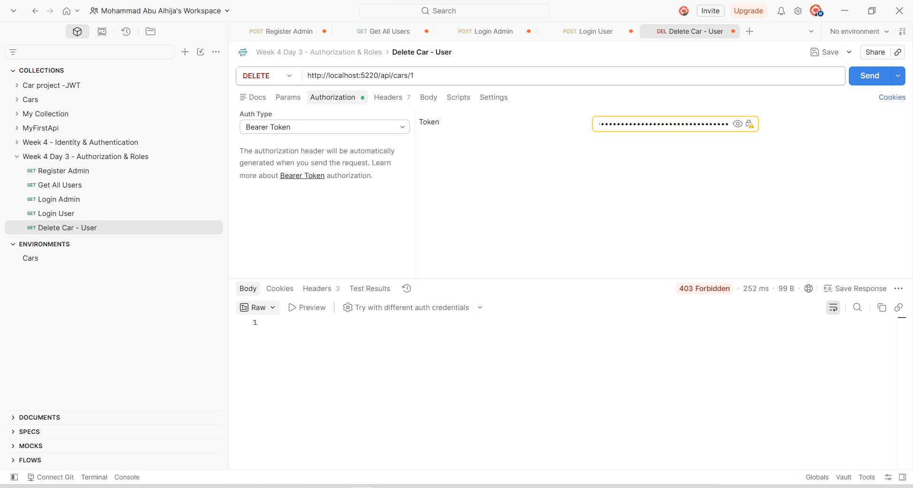
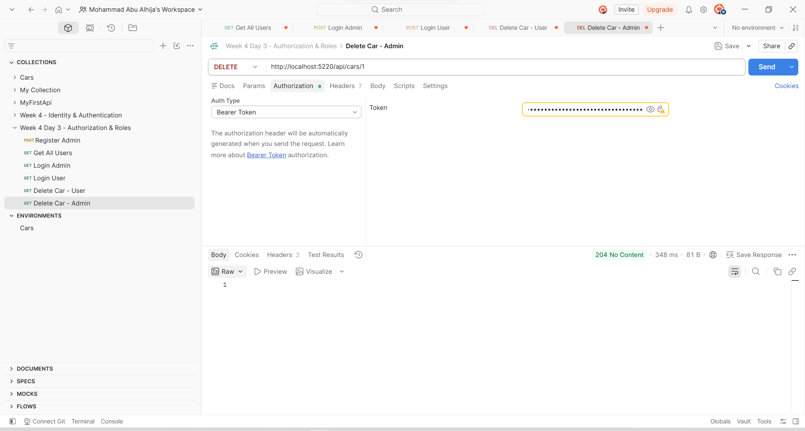
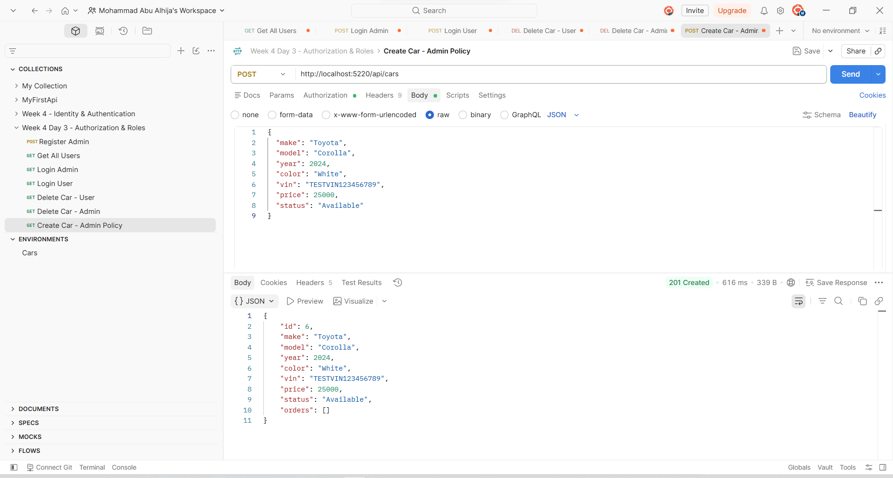
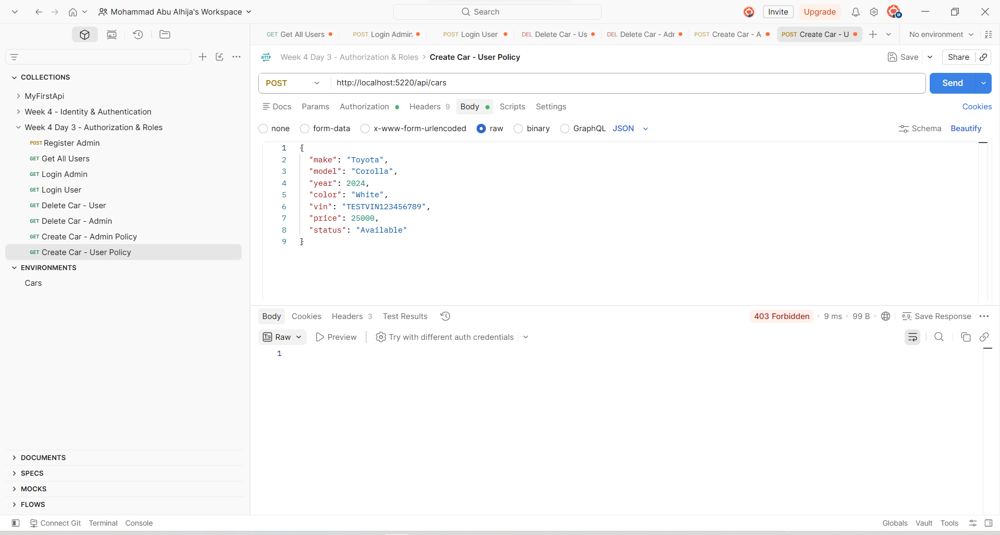
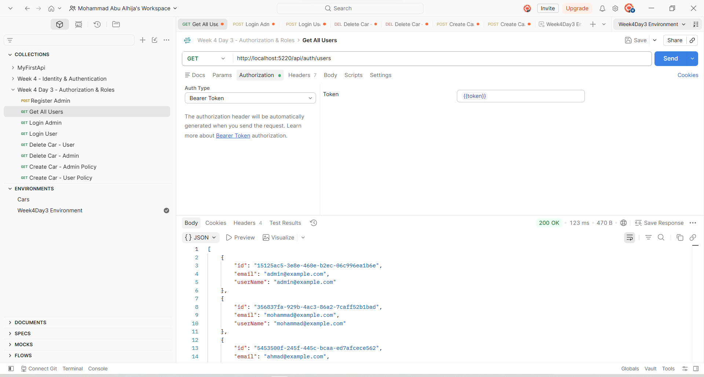

# Week 4 - Day 3: Protecting Routes with Authorization & Role-Based Access Control

## Overview

Today I continued working on the Car Dealership API from Day 2. Instead of starting a new project, I created a copy of the JWT-based project and extended it with authorization, roles, permissions, and policy-based access control.

Day 2 focused mainly on **authentication**: verifying who the user is and issuing a JWT after a successful login.

Today the focus moved to **authorization**: deciding what an authenticated user is actually allowed to do.

The main idea became:

```text
User logs in
      ↓
Identity verifies credentials
      ↓
API reads the user's roles
      ↓
JWT is generated
      ↓
Role and permission claims are added
      ↓
Client sends JWT with a request
      ↓
Authentication validates the token
      ↓
Authorization checks roles / policies
      ↓
Endpoint is allowed or rejected
```

This made the difference between authentication and authorization much clearer to me.

Authentication answers:

```text
Who is this user?
```

Authorization answers:

```text
What is this user allowed to do?
```

---

# Understanding Authorization

ASP.NET Core provides several levels of authorization.

During today's lab, I worked with three of them:

| Authorization Type      | Example                                 | Purpose                                       |
| ----------------------- | --------------------------------------- | --------------------------------------------- |
| Authentication required | `[Authorize]`                           | Any authenticated user                        |
| Role-based              | `[Authorize(Roles = "Admin")]`          | Only users in a specific role                 |
| Policy-based            | `[Authorize(Policy = "CanManageCars")]` | Users who satisfy a custom authorization rule |

This allowed the API to move beyond simply checking whether a JWT exists.

The application can now make different authorization decisions depending on the identity and permissions of the user.

---

# Hands-On Lab

## Task 1 - Protect the CRUD Controller with `[Authorize]`

The first task was to protect the existing Cars CRUD controller.

Previously, only individual endpoints had been used to test JWT authentication.

For Day 3, I protected the entire controller:

```csharp
[ApiController]
[Route("api/[controller]")]
[Authorize]
public class CarsController : ControllerBase
{
    // CRUD endpoints
}
```

Placing `[Authorize]` at the controller level means that all actions inside the controller require an authenticated user unless explicitly configured otherwise.

This protects endpoints such as:

```text
POST   /api/cars
GET    /api/cars
GET    /api/cars/{id}
PUT    /api/cars/{id}
DELETE /api/cars/{id}
```

## Testing Without a Token

I sent a request to the Cars API without attaching a Bearer token.

Result:

```text
401 Unauthorized
```

The request was rejected before the controller action executed.

This confirmed that authentication was being enforced correctly.

The important distinction is:

```text
No valid authentication → 401 Unauthorized
```

---

# Task 2 - Create User and Admin Roles

The next step was to introduce role-based access control.

For this project, I created two roles:

```text
User
Admin
```

The roles are created when the application starts if they do not already exist.

I used `RoleManager<IdentityRole>` inside a scoped service:

```csharp
using (var scope = app.Services.CreateScope())
{
    var roleManager =
        scope.ServiceProvider.GetRequiredService<RoleManager<IdentityRole>>();

    string[] roles = { "User", "Admin" };

    foreach (var role in roles)
    {
        if (!await roleManager.RoleExistsAsync(role))
        {
            await roleManager.CreateAsync(new IdentityRole(role));
        }
    }
}
```

The `RoleExistsAsync()` check prevents the application from trying to recreate the same roles every time it starts.

---

## Assigning Roles to Test Users

I then used `UserManager<IdentityUser>` to assign the roles to two existing test accounts.

```csharp
var userManager =
    scope.ServiceProvider.GetRequiredService<UserManager<IdentityUser>>();

var adminUser =
    await userManager.FindByEmailAsync("admin@example.com");

var normalUser =
    await userManager.FindByEmailAsync("mohammad@example.com");
```

The Admin role was assigned with:

```csharp
if (adminUser != null &&
    !await userManager.IsInRoleAsync(adminUser, "Admin"))
{
    await userManager.AddToRoleAsync(adminUser, "Admin");
}
```

The normal User role was assigned with:

```csharp
if (normalUser != null &&
    !await userManager.IsInRoleAsync(normalUser, "User"))
{
    await userManager.AddToRoleAsync(normalUser, "User");
}
```

The final test setup became:

```text
admin@example.com     → Admin
mohammad@example.com  → User
```

Using `IsInRoleAsync()` before assigning the role also prevents duplicate role assignments when the application restarts.

---

# Admin-Only User Listing

While testing the roles, I added an endpoint for viewing the registered Identity users.

Because exposing a user list publicly would not be appropriate, I protected this endpoint so that only an Admin can access it:

```csharp
[Authorize(Roles = "Admin")]
[HttpGet("users")]
public IActionResult GetUsers()
{
    var users = _userManager.Users
        .Select(user => new
        {
            user.Id,
            user.Email,
            user.UserName
        })
        .ToList();

    return Ok(users);
}
```

Endpoint:

```http
GET /api/auth/users
```

This became an additional practical example of role-based authorization.

### Admin Test

Using the Admin JWT:

```text
Admin → GET /api/auth/users → 200 OK
```

### User Test

Using the normal User JWT:

```text
User → GET /api/auth/users → 403 Forbidden
```

This demonstrated an important difference:

```text
401 Unauthorized
```

means that authentication is missing or invalid.

While:

```text
403 Forbidden
```

means that the user is authenticated, but does not have permission to perform the requested action.

---

# Adding Roles to the JWT

Assigning a role in ASP.NET Core Identity is not enough by itself for JWT role authorization.

The API also needs the role information to be available when the JWT is validated.

During login, I retrieved the user's roles:

```csharp
var roles = await _userManager.GetRolesAsync(user);
```

I changed the claims collection to a `List<Claim>`:

```csharp
var claims = new List<Claim>
{
    new Claim(JwtRegisteredClaimNames.Sub, user.Id),
    new Claim(ClaimTypes.Email, user.Email!)
};
```

Then each assigned role was added to the JWT:

```csharp
foreach (var role in roles)
{
    claims.Add(new Claim(ClaimTypes.Role, role));
}
```

An Admin token therefore contains information equivalent to:

```text
sub        = User ID
email      = admin@example.com
role       = Admin
```

This allows ASP.NET Core to evaluate attributes such as:

```csharp
[Authorize(Roles = "Admin")]
```

directly from the authenticated user's claims.

---

# Task 3 - Restrict Delete to Admin Only

The third task was to restrict the Delete operation so that a normal authenticated user cannot delete cars.

The Cars controller is already protected with:

```csharp
[Authorize]
```

but the Delete endpoint has an additional authorization requirement:

```csharp
[Authorize(Roles = "Admin")]
[HttpDelete("{id}")]
public async Task<IActionResult> Delete(int id)
{
    var car =
        await _context.Cars.FirstOrDefaultAsync(c => c.Id == id);

    if (car == null)
    {
        return NotFound(new
        {
            message = $"Car with ID {id} was not found."
        });
    }

    _context.Cars.Remove(car);

    await _context.SaveChangesAsync();

    return NoContent();
}
```

This gives the endpoint two levels of protection:

```text
CarsController
      ↓
[Authorize]
      ↓
User must be authenticated
      ↓
DELETE endpoint
      ↓
[Authorize(Roles = "Admin")]
      ↓
User must also be Admin
```

---

## Testing Delete with a User Token

I sent a DELETE request using the JWT belonging to the normal `User` account.

```http
DELETE /api/cars/{id}
```

Result:

```text
403 Forbidden
```

The user was successfully authenticated, but authorization rejected the request because the JWT did not contain the required Admin role.

### User Delete Test



The car was not deleted because the request never reached the Delete action.

---

## Testing Delete with an Admin Token

I repeated the request using the Admin JWT.

Result:

```text
204 No Content
```

The request passed both authentication and role authorization, and the car was deleted successfully.

### Admin Delete Test



The comparison was:

```text
User  → DELETE → 403 Forbidden
Admin → DELETE → 204 No Content
```

This completed the role-based access control requirement.

---

# Task 4 - Claims-Based and Policy-Based Authorization

Roles are useful for broad access levels, but sometimes an application needs more specific permissions.

For this reason, I also implemented a custom permission claim and a named authorization policy.

Instead of checking only:

```text
Is this user an Admin?
```

the policy checks:

```text
Does this authenticated user have permission to manage cars?
```

---

## Adding a Permission Claim

For Admin users, I added a custom claim during JWT generation:

```csharp
if (roles.Contains("Admin"))
{
    claims.Add(new Claim("Permission", "ManageCars"));
}
```

An Admin JWT now contains information equivalent to:

```text
role       = Admin
Permission = ManageCars
```

A normal User JWT does not receive the `ManageCars` permission.

---

# Defining the `CanManageCars` Policy

I registered a named authorization policy in `Program.cs`:

```csharp
builder.Services.AddAuthorization(options =>
{
    options.AddPolicy("CanManageCars", policy =>
    {
        policy.RequireClaim("Permission", "ManageCars");
    });
});
```

The policy is named:

```text
CanManageCars
```

and requires:

```text
Permission = ManageCars
```

This keeps the authorization rule centralized instead of repeatedly checking the claim manually inside controller actions.

---

# Applying the Policy to Create Car

I applied the policy to the existing Create endpoint:

```csharp
[Authorize(Policy = "CanManageCars")]
[HttpPost]
public async Task<IActionResult> Create(Car car)
{
    // Validate and create the car
}
```

Now accessing this endpoint requires more than a valid JWT.

The authenticated user must also satisfy the `CanManageCars` policy.

---

## Testing the Policy with Admin

I logged in using:

```text
admin@example.com
```

and generated a new JWT containing:

```text
role = Admin
Permission = ManageCars
```

I then sent:

```http
POST /api/cars
```

using the Admin Bearer token.

Result:

```text
201 Created
```

### Admin Policy Test



This confirmed that the Admin JWT satisfied the policy.

---

## Testing the Policy with User

I repeated the same request using the JWT belonging to the normal User account.

The User was authenticated correctly but did not have:

```text
Permission = ManageCars
```

Result:

```text
403 Forbidden
```

### User Policy Test



The comparison was:

```text
Admin
  └── Permission = ManageCars
            ↓
     CanManageCars Policy
            ↓
        201 Created


User
  └── No ManageCars permission
            ↓
     CanManageCars Policy
            ↓
       403 Forbidden
```

This helped me understand that policies can express more specific authorization rules than roles alone.

---

# Role-Based vs Policy-Based Authorization

After implementing both approaches, the difference became clearer.

### Role-Based

```csharp
[Authorize(Roles = "Admin")]
```

asks:

```text
Does the authenticated user have the Admin role?
```

### Policy-Based

```csharp
[Authorize(Policy = "CanManageCars")]
```

asks:

```text
Does the authenticated user satisfy the CanManageCars policy?
```

The policy currently requires:

```text
Permission = ManageCars
```

but it could later be extended without changing every controller that uses the policy.

For example, a larger application could define permissions such as:

```text
ManageCars
ManageOrders
ViewReports
ManageUsers
```

and map them to different policies.

---

# Task 5 - Postman Environment and Automatic Token Reuse

During the first authorization tests, I manually copied JWTs from the Login response and pasted them into protected requests.

This works for basic testing, but becomes repetitive very quickly.

The final task was therefore to configure Postman to automatically capture and reuse the JWT.

---

# Creating the Postman Environment

I created a Postman environment for Day 3 and added a variable named:

```text
token
```

Instead of storing a real JWT permanently in the exported collection, protected requests can reference:

```text
{{token}}
```

---

# Automatically Capturing the Login Token

Inside the `Login Admin` request, I added a Post-response script:

```javascript
const response = pm.response.json();

pm.environment.set("token", response.token);
```

After a successful login, Postman reads:

```json
{
  "token": "JWT_TOKEN"
}
```

and automatically saves the token into the environment variable.

The flow became:

```text
Login Admin
     ↓
API returns JWT
     ↓
Post-response script runs
     ↓
response.token is extracted
     ↓
Stored as {{token}}
     ↓
Protected requests reuse it
```

---

# Reusing the Token

For protected requests, the Authorization type is set to:

```text
Bearer Token
```

and instead of pasting the complete JWT, I use:

```text
{{token}}
```

Postman resolves the variable automatically using the currently selected environment.

I tested this with:

```http
GET /api/auth/users
```

Result:

```text
200 OK
```

without manually copying the JWT.

### Automatic Token Reuse



This made the collection cleaner and made repeated authorization testing much easier.

---

# Postman Test Summary

I created a separate Postman collection for the Day 3 authorization work.

The exported collection is stored in the `Postman` folder as:

```text
Week 4 Day 3 - Authorization & Roles.postman_collection.json
```

The collection includes requests used to test registration, login, role-based authorization, policies, and protected endpoints.

The main tests performed during the lab were:

| Test                                | Authentication | Authorization        | Result             |
| ----------------------------------- | -------------- | -------------------- | ------------------ |
| Cars request without JWT            | No             | `[Authorize]`        | `401 Unauthorized` |
| Get all users with Admin            | Yes            | `Admin`              | `200 OK`           |
| Get all users with User             | Yes            | `Admin` required     | `403 Forbidden`    |
| Delete car with User                | Yes            | `Admin` required     | `403 Forbidden`    |
| Delete car with Admin               | Yes            | `Admin`              | `204 No Content`   |
| Create car with Admin               | Yes            | `CanManageCars`      | `201 Created`      |
| Create car with User                | Yes            | Missing `ManageCars` | `403 Forbidden`    |
| Protected request using `{{token}}` | Yes            | Valid Admin token    | `200 OK`           |

The exported Postman collection is stored separately from the application source code so the complete Day 3 testing workflow can be imported and repeated later.

No real JWT should be committed as a hardcoded Bearer token.

---

# Authorization Status Codes

One of the most useful parts of today's lab was seeing the practical difference between `401` and `403`.

## 401 Unauthorized

Example:

```text
GET /api/cars
No Bearer Token
```

Result:

```text
401 Unauthorized
```

This means the request could not establish a valid authenticated identity.

Common reasons include:

```text
Missing token
Invalid token
Expired token
Invalid signature
```

## 403 Forbidden

Example:

```text
DELETE /api/cars/{id}
Valid User JWT
```

Result:

```text
403 Forbidden
```

This means:

```text
Authentication succeeded
        ↓
User identity is known
        ↓
Authorization requirement failed
        ↓
403 Forbidden
```

So the simplest way I now remember the difference is:

```text
401 → You are not successfully authenticated.

403 → You are authenticated, but you are not allowed to do this.
```

---

# Authorization Middleware

The middleware configuration from Day 2 continues to be important:

```csharp
app.UseAuthentication();
app.UseAuthorization();

app.MapControllers();
```

The order reflects the actual request flow.

First:

```csharp
app.UseAuthentication();
```

reads the Bearer token, validates it, and builds the authenticated user identity and claims.

Then:

```csharp
app.UseAuthorization();
```

evaluates authorization requirements such as:

```csharp
[Authorize]
```

```csharp
[Authorize(Roles = "Admin")]
```

and:

```csharp
[Authorize(Policy = "CanManageCars")]
```

Only after those checks succeed can the request continue to the protected controller action.

---

# Final Authorization Flow

After today's implementation, the complete authentication and authorization flow became:

```text
                  Login
                    │
                    ▼
          Identity verifies password
                    │
              ┌─────┴─────┐
              │           │
           Invalid       Valid
              │           │
              ▼           ▼
       401 Unauthorized   Read Roles
                          │
                          ▼
                     Build Claims
                          │
                 ┌────────┴────────┐
                 │                 │
               User              Admin
                 │                 │
                 │          Role = Admin
                 │                 │
                 │     Permission = ManageCars
                 │                 │
                 └────────┬────────┘
                          │
                          ▼
                    Generate JWT
                          │
                          ▼
                 Return JWT to client
                          │
                          ▼
               Send Bearer Token
                          │
                          ▼
                 Authentication
                          │
                 Validate JWT
                          │
                ┌─────────┴─────────┐
                │                   │
             Invalid              Valid
                │                   │
                ▼                   ▼
         401 Unauthorized      Authorization
                                    │
                    ┌───────────────┼────────────────┐
                    │               │                │
               [Authorize]      Admin Role      CanManageCars
                    │               │                │
                    ▼               ▼                ▼
             Authenticated?      Admin?        Permission?
                    │               │                │
                    └───────────────┴────────────────┘
                                    │
                            Requirement passes?
                               ┌────┴────┐
                               │         │
                              No        Yes
                               │         │
                               ▼         ▼
                        403 Forbidden   Endpoint
```

This shows how authentication and authorization work together but solve different problems.

---

# Project Organization

For Day 3, I kept the authorization work separate from the previous day's JWT project.

The Day 3 folder contains the application source, screenshots, and exported Postman collection.

```text
Week4Day3/
│
├── Car Project-Authorization/
│
├── Screenshots/
│   ├── user-delete-forbidden-403.png
│   ├── admin-delete-success-204.png
│   ├── admin-policy-create-car-201.png
│   ├── user-policy-forbidden-403.png
│   └── postman-environment-token-200.png
│
├── Postman/
│   └── Week 4 Day 3 - Authorization & Roles.postman_collection.json
│
└── README.md
```

The project itself was copied from Day 2 so the JWT authentication implementation could be extended without changing the previous day's completed work.

---

# Tools and Technologies Used

The main technologies used during today's lab were:

```text
ASP.NET Core
ASP.NET Core Identity
JWT Bearer Authentication
RoleManager
UserManager
Claims
Authorization Policies
Entity Framework Core
SQL Server
Postman
```

The main authorization concepts used were:

```text
[Authorize]
[Authorize(Roles = "Admin")]
[Authorize(Policy = "CanManageCars")]
ClaimTypes.Role
Custom Permission Claims
Named Authorization Policies
```

---

# What I Learned

The biggest thing I understood from today's work is that **being authenticated does not automatically mean a user should be allowed to perform every operation**.

A valid JWT proves that the API recognizes the user, but authorization still needs to decide what that user can access.

Working with the `User` and `Admin` roles made this very clear. Both users can successfully log in and receive valid JWTs, but they do not have the same access.

For example:

```text
User  → DELETE car → 403 Forbidden
Admin → DELETE car → 204 No Content
```

I also understood why roles need to be included as claims in the JWT. Identity can store the user's roles in the database, but the authorization system needs that information when processing the Bearer token.

The policy exercise helped me understand a more flexible approach to authorization. Instead of tying every rule directly to the `Admin` role, I created a permission:

```text
Permission = ManageCars
```

and a reusable policy:

```text
CanManageCars
```

This makes the authorization rule easier to understand and gives the application more flexibility if permissions become more detailed later.

Finally, setting up the Postman environment was a small change that made testing much cleaner. Instead of copying a new JWT into every request, the login request now captures the token automatically and the protected requests simply use:

```text
{{token}}
```

That made the testing flow feel much closer to how authentication would be handled by a real client application.

---

# Final Result

By the end of Day 3, I successfully:

* Protected the Cars CRUD controller using `[Authorize]`.
* Confirmed that requests without authentication return `401 Unauthorized`.
* Created `User` and `Admin` Identity roles.
* Assigned two different test users to those roles using `UserManager`.
* Added role claims to generated JWTs.
* Restricted the user-list endpoint to Admin users.
* Verified that an Admin can access the user list.
* Verified that a normal User receives `403 Forbidden`.
* Restricted the Delete Car endpoint to the Admin role.
* Verified `User → DELETE → 403 Forbidden`.
* Verified `Admin → DELETE → 204 No Content`.
* Added a custom `Permission = ManageCars` claim.
* Created the named `CanManageCars` authorization policy.
* Applied the policy to the Create Car endpoint.
* Verified that an Admin satisfying the policy receives `201 Created`.
* Verified that a User without the required permission receives `403 Forbidden`.
* Created a Postman environment for Day 3.
* Automatically captured the JWT from the Admin login response.
* Reused the token through the `{{token}}` environment variable.
* Exported the Day 3 Postman collection as `Week 4 Day 3 - Authorization & Roles.postman_collection.json`.
* Saved authorization test screenshots as evidence of the completed scenarios.

This completed the **Protecting Routes with Authorization & Role-Based Access Control** lab while building directly on the ASP.NET Core Identity and JWT authentication work from Days 1 and 2.
