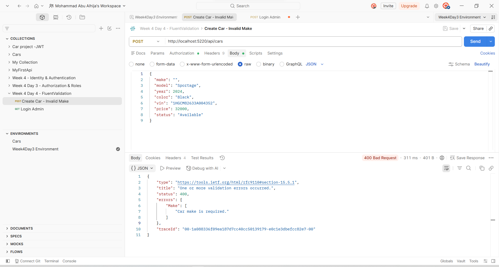
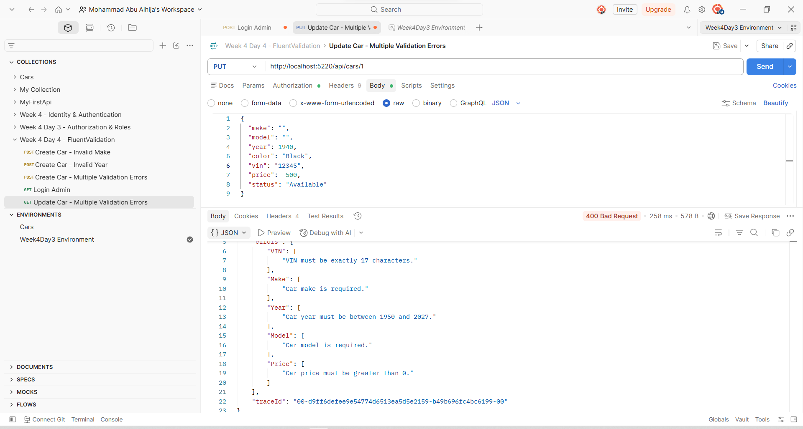
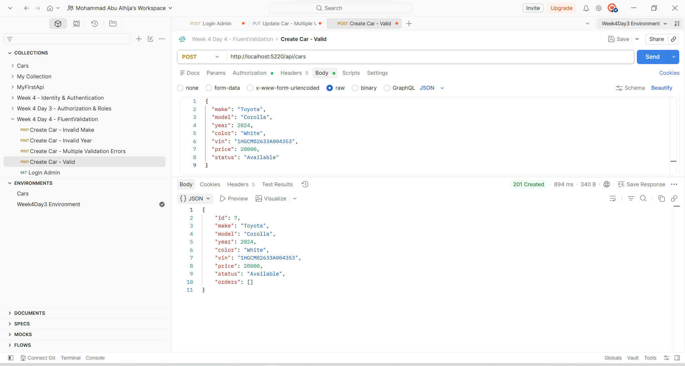

# Week 4 - Day 4: Input Validation with FluentValidation

## Overview

Today I continued working on the **Car Dealership API** from Day 3. Instead of starting a new project, I created a copy of the authorization project and named it:

```text
Car Project-FluentValidation
```

The previous days focused on authentication and authorization — identifying users, generating JWTs, and controlling which endpoints they are allowed to access.

Today the focus moved to **input validation**.

The main goal was to make sure that data reaching the API is not only technically valid, but also makes sense according to the application's business rules.

For example, a car price can technically be a valid decimal value while still being invalid for the application:

```json
{
  "price": -500
}
```

Instead of manually checking every property inside the controller, I introduced **FluentValidation** and moved the validation rules into dedicated validator classes.

The request flow became:

```text
Client sends request
        ↓
ASP.NET Core Model Binding
        ↓
FluentValidation
        ↓
   Is request valid?
      /        \
    No          Yes
    ↓            ↓
400 Bad Request  Controller
                 ↓
              Database
```

This keeps the controller focused on handling the request while validation is handled separately.

---

# DataAnnotations vs. FluentValidation

ASP.NET Core supports validation using attributes such as:

```csharp
[Required]
[MaxLength(100)]
```

This approach is useful for simple validation rules, but the rules are placed directly inside the model.

FluentValidation uses separate validator classes instead.

For example:

```csharp
RuleFor(x => x.Price)
    .GreaterThan(0)
    .WithMessage("Car price must be greater than 0.");
```

This makes validation easier to organize and allows the application to express more meaningful business rules.

Examples include:

```text
Price must be greater than 0.

VIN must contain exactly 17 characters.

Car year must be within a realistic range.
```

Instead of only asking:

```text
Was a value provided?
```

the validation can also ask:

```text
Does this value actually make sense for the application?
```

---

# Hands-On Lab

## Task 1 - Install FluentValidation

The first step was adding FluentValidation to the existing project.

I installed the FluentValidation package and the ASP.NET Core integration package.

The project uses:

```text
FluentValidation 11.11.0
FluentValidation.AspNetCore 11.3.1
```

During setup, I also encountered a package vulnerability warning related to an older version of `Microsoft.OpenApi`.

I updated it to:

```text
Microsoft.OpenApi 2.7.5
```

After updating the packages, I verified the project with:

```bash
dotnet restore
dotnet build
```

The project successfully built without the previous package warning.

---

# Task 2 - Create a Request Model

Previously, the Create endpoint accepted the database entity directly:

```csharp
public async Task<IActionResult> Create(Car car)
```

For validation, I introduced a dedicated request model instead.

I created:

```text
DTOs/
└── CreateCarRequest.cs
```

The request model contains only the information the client should provide when creating a car:

```csharp
public class CreateCarRequest
{
    public string Make { get; set; } = string.Empty;

    public string Model { get; set; } = string.Empty;

    public int Year { get; set; }

    public string Color { get; set; } = string.Empty;

    public string VIN { get; set; } = string.Empty;

    public decimal Price { get; set; }

    public string Status { get; set; } = string.Empty;
}
```

This separates the API request from the database entity.

For example, the client does not need to provide the database-generated `Id` when creating a car.

The separation became:

```text
HTTP Request
     ↓
CreateCarRequest
     ↓
Validation
     ↓
Car Entity
     ↓
Database
```

---

# Creating `CreateCarValidator`

I created a separate `Validators` folder:

```text
Validators/
└── CreateCarValidator.cs
```

The validator inherits from:

```csharp
AbstractValidator<CreateCarRequest>
```

which tells FluentValidation that this validator is responsible for validating `CreateCarRequest`.

The validator contains several rules:

```csharp
public class CreateCarValidator : AbstractValidator<CreateCarRequest>
{
    public CreateCarValidator()
    {
        RuleFor(x => x.Make)
            .NotEmpty()
            .WithMessage("Car make is required.");

        RuleFor(x => x.Model)
            .NotEmpty()
            .WithMessage("Car model is required.");

        RuleFor(x => x.Year)
            .InclusiveBetween(1950, DateTime.Now.Year + 1)
            .WithMessage(
                $"Car year must be between 1950 and {DateTime.Now.Year + 1}.");

        RuleFor(x => x.VIN)
            .NotEmpty()
            .WithMessage("VIN is required.")
            .Length(17)
            .WithMessage("VIN must be exactly 17 characters.");

        RuleFor(x => x.Price)
            .GreaterThan(0)
            .WithMessage("Car price must be greater than 0.");
    }
}
```

These rules validate more than just the data types.

They also enforce actual application rules.

| Property | Validation Rule                    |
| -------- | ---------------------------------- |
| `Make`   | Must not be empty                  |
| `Model`  | Must not be empty                  |
| `Year`   | Must be between 1950 and next year |
| `VIN`    | Required and exactly 17 characters |
| `Price`  | Must be greater than 0             |

For example:

```json
{
  "price": -500
}
```

is technically a valid decimal value, but it is not a valid car price.

The validator catches this before the controller processes the request.

---

# Removing Manual Validation from the Controller

Before FluentValidation, the Create endpoint contained validation directly inside the controller:

```csharp
if (string.IsNullOrWhiteSpace(car.Make) ||
    string.IsNullOrWhiteSpace(car.Model) ||
    string.IsNullOrWhiteSpace(car.VIN) ||
    car.Year <= 0 ||
    car.Price <= 0)
{
    return BadRequest(new
    {
        message = "Invalid car data."
    });
}
```

This worked, but all validation logic was mixed with the controller logic.

After introducing FluentValidation, I removed these checks.

The endpoint now receives:

```csharp
CreateCarRequest request
```

and converts it into a `Car` entity:

```csharp
[Authorize(Policy = "CanManageCars")]
[HttpPost]
public async Task<IActionResult> Create(CreateCarRequest request)
{
    // Convert the request data into a Car entity.
    var car = new Car
    {
        Make = request.Make,
        Model = request.Model,
        Year = request.Year,
        Color = request.Color,
        VIN = request.VIN,
        Price = request.Price,
        Status = request.Status
    };

    // Add the car to the database.
    _context.Cars.Add(car);
    await _context.SaveChangesAsync();

    // Return the created car.
    return CreatedAtAction(
        nameof(GetById),
        new { id = car.Id },
        car
    );
}
```

The controller is now responsible for creating the car, while the validator is responsible for deciding whether the request is valid.

---

# Task 3 - Register FluentValidation

Creating a validator class alone is not enough.

The validator also needs to be registered with ASP.NET Core.

I added the required namespaces:

```csharp
using FluentValidation;
using FluentValidation.AspNetCore;
using MyFirstApi.Validators;
```

Then I enabled automatic validation in `Program.cs`:

```csharp
builder.Services.AddControllers();

// Enable automatic FluentValidation validation.
builder.Services.AddFluentValidationAutoValidation();

// Register validators from this project.
builder.Services.AddValidatorsFromAssemblyContaining<CreateCarValidator>();

builder.Services.AddOpenApi();
```

The first registration:

```csharp
AddFluentValidationAutoValidation()
```

allows FluentValidation to participate automatically in ASP.NET Core validation.

The second:

```csharp
AddValidatorsFromAssemblyContaining<CreateCarValidator>()
```

registers the validators found in the project assembly.

This means I do not have to manually create a validator inside every controller action.

---

# Automatic Validation Flow

After registration, an invalid Create request follows this flow:

```text
POST /api/cars
       ↓
CreateCarRequest
       ↓
CreateCarValidator
       ↓
Check Make
Check Model
Check Year
Check VIN
Check Price
       ↓
Validation failed
       ↓
400 Bad Request
```

The controller does not need to contain repetitive validation conditions.

---

# Structured Validation Errors

One of the main improvements was the error response.

Previously, invalid data returned a generic message:

```json
{
  "message": "Invalid car data."
}
```

The client knew that something was wrong, but not which field caused the problem.

With FluentValidation, the API returns structured errors.

For example, sending an empty `Make` returned:

```json
{
  "title": "One or more validation errors occurred.",
  "status": 400,
  "errors": {
    "Make": [
      "Car make is required."
    ]
  }
}
```

This is much more useful to a client application because each message is associated with the property that failed validation.

### Individual Make Validation Test



This test confirmed that invalid input automatically returned:

```text
400 Bad Request
```

without manually returning `BadRequest()` from the Create action.

---

# Testing Multiple Validation Errors

I also tested several invalid properties in a single request.

Example:

```json
{
  "make": "",
  "model": "",
  "year": 1940,
  "color": "Black",
  "vin": "12345",
  "price": -500,
  "status": "Available"
}
```

This request violates several rules at the same time:

```text
Make  → Empty
Model → Empty
Year  → Outside the allowed range
VIN   → Incorrect length
Price → Negative
```

Instead of returning only one generic error, the response contains the validation errors for the individual fields.

### Multiple Create Validation Errors


This demonstrated why structured validation responses are more useful than a single `"Invalid car data"` message.

---

# Task 4 - Add Validation to Update Requests

The next requirement was to add validation to the Update endpoint.

Just like the Create operation, the Update endpoint previously accepted the `Car` entity directly.

I created another request model:

```text
DTOs/
└── UpdateCarRequest.cs
```

The model contains:

```csharp
public class UpdateCarRequest
{
    public string Make { get; set; } = string.Empty;

    public string Model { get; set; } = string.Empty;

    public int Year { get; set; }

    public string Color { get; set; } = string.Empty;

    public string VIN { get; set; } = string.Empty;

    public decimal Price { get; set; }

    public string Status { get; set; } = string.Empty;
}
```

Even though the Create and Update models currently contain similar properties, keeping them separate makes it possible to give them different validation rules later without changing the database entity.

---

# Creating `UpdateCarValidator`

I created:

```text
Validators/
└── UpdateCarValidator.cs
```

The validator inherits from:

```csharp
AbstractValidator<UpdateCarRequest>
```

and contains the Update rules:

```csharp
public class UpdateCarValidator : AbstractValidator<UpdateCarRequest>
{
    public UpdateCarValidator()
    {
        // Make must not be empty.
        RuleFor(x => x.Make)
            .NotEmpty()
            .WithMessage("Car make is required.");

        // Model must not be empty.
        RuleFor(x => x.Model)
            .NotEmpty()
            .WithMessage("Car model is required.");

        // Year must be within a realistic range.
        RuleFor(x => x.Year)
            .InclusiveBetween(1950, DateTime.Now.Year + 1)
            .WithMessage(
                $"Car year must be between 1950 and {DateTime.Now.Year + 1}.");

        // VIN must be exactly 17 characters.
        RuleFor(x => x.VIN)
            .NotEmpty()
            .WithMessage("VIN is required.")
            .Length(17)
            .WithMessage("VIN must be exactly 17 characters.");

        // Price must be positive.
        RuleFor(x => x.Price)
            .GreaterThan(0)
            .WithMessage("Car price must be greater than 0.");
    }
}
```

Because validators are registered from the assembly, the new `UpdateCarValidator` is discovered along with the Create validator.

---

# Updating the PUT Endpoint

I changed the Update endpoint from receiving a `Car` entity to receiving:

```csharp
UpdateCarRequest request
```

The manual validation block was removed.

The endpoint now looks like:

```csharp
[HttpPut("{id}")]
public async Task<IActionResult> Update(int id, UpdateCarRequest request)
{
    // Find the existing car.
    var car = await _context.Cars.FirstOrDefaultAsync(c => c.Id == id);

    if (car == null)
    {
        return NotFound(new
        {
            message = $"Car with ID {id} was not found."
        });
    }

    // Update the car data from the request.
    car.Make = request.Make;
    car.Model = request.Model;
    car.Year = request.Year;
    car.Color = request.Color;
    car.VIN = request.VIN;
    car.Price = request.Price;
    car.Status = request.Status;

    // Save the changes.
    await _context.SaveChangesAsync();

    return NoContent();
}
```

The responsibilities are now clearer:

```text
UpdateCarValidator
        ↓
Is the request valid?
        ↓
       Yes
        ↓
CarsController.Update()
        ↓
Find existing car
        ↓
Update properties
        ↓
SaveChangesAsync()
```

---

# Testing Update Validation

I tested the Update validator using Postman with multiple invalid values.

The request included invalid values for:

```text
Make
Model
Year
VIN
Price
```

The API automatically rejected the request with:

```text
400 Bad Request
```

and returned the corresponding validation errors.

### Multiple Update Validation Errors



This confirmed that validation works consistently for both Create and Update operations.

---

# Testing a Valid Request

Validation should reject invalid requests, but it should not interfere with valid requests.

To confirm this, I sent a valid Create request:

```json
{
  "make": "Toyota",
  "model": "Corolla",
  "year": 2024,
  "color": "White",
  "vin": "1HGCM82633A004353",
  "price": 28000,
  "status": "Available"
}
```

All FluentValidation rules passed.

The request continued to the Create controller action, the car was saved, and the API returned:

```text
201 Created
```

### Valid Create Request



This completed both sides of the validation test:

```text
Invalid request → 400 Bad Request

Valid request   → Controller → Database → 201 Created
```

---

# Postman Authentication

The Cars controller remains protected by the authentication and authorization work from Day 3.

The Create endpoint still requires:

```csharp
[Authorize(Policy = "CanManageCars")]
```

For this reason, I logged in using the Admin test account before running the validation tests.

The login request returned a JWT, which was stored in the existing Postman environment variable:

```text
{{token}}
```

Protected requests use:

```text
Authorization
    ↓
Bearer Token
    ↓
{{token}}
```

This allowed the validation tests to reach the protected endpoints without hardcoding a JWT into each request.

The request flow therefore includes both security and validation:

```text
Request
   ↓
JWT Authentication
   ↓
Authorization
   ↓
Model Binding
   ↓
FluentValidation
   ↓
Controller
   ↓
Database
```

---

# Postman Test Summary

I created a separate Postman collection for the Day 4 validation work.

The exported collection is stored in the `postman` folder as:

```text
Week 4 Day 4 - FluentValidation.postman_collection.json
```

The main validation scenarios tested during the lab were:

| Test                                | Validation           | Result            |
| ----------------------------------- | -------------------- | ----------------- |
| Create with empty Make              | `NotEmpty()`         | `400 Bad Request` |
| Create with invalid Year            | `InclusiveBetween()` | `400 Bad Request` |
| Create with multiple invalid fields | Multiple rules       | `400 Bad Request` |
| Update with multiple invalid fields | `UpdateCarValidator` | `400 Bad Request` |
| Create with valid data              | All rules pass       | `201 Created`     |

The validation responses identify the specific property and error message instead of returning one generic failure message.

The exported collection does not require a hardcoded JWT because protected requests can use:

```text
{{token}}
```

from the selected Postman environment.

---

# Before and After FluentValidation

The biggest code improvement can be seen by comparing the controller before and after validation was separated.

### Before

```text
Controller
   ↓
Check Make
Check Model
Check VIN
Check Year
Check Price
   ↓
Create Car
   ↓
Save
```

The controller was responsible for both validation and application logic.

### After

```text
Request
   ↓
FluentValidation
   ↓
Valid?
  /    \
 No     Yes
 ↓       ↓
400   Controller
         ↓
      Save Car
```

The controller is smaller, and validation rules have a clear place of their own.

---

# Project Organization

For Day 4, I kept the FluentValidation work separate from the previous authorization project.

The main structure is:

```text
Week4Day4/
│
└── Car Project-FluentValidation/
    │
    ├── Controllers/
    │   └── CarsController.cs
    │
    ├── Data/
    │
    ├── DTOs/
    │   ├── CreateCarRequest.cs
    │   └── UpdateCarRequest.cs
    │
    ├── Models/
    │
    ├── Validators/
    │   ├── CreateCarValidator.cs
    │   └── UpdateCarValidator.cs
    │
    ├── postman/
    │   └── Week 4 Day 4 - FluentValidation.postman_collection.json
    │
    ├── screenshots/
    │   ├── create-car-invalid-make.png
    │   ├── create-multiple-validation-errors.png
    │   ├── update-multiple-validation-errors.png
    │   └── create-car-valid.png
    │
    ├── Program.cs
    └── README.md
```

The project was copied from Day 3 so the existing JWT authentication, roles, permissions, and authorization policies could remain in place while adding input validation.

---

# Tools and Technologies Used

The main technologies used during today's lab were:

```text
ASP.NET Core
FluentValidation
FluentValidation.AspNetCore
Entity Framework Core
SQL Server
ASP.NET Core Identity
JWT Bearer Authentication
Postman
```

The main validation concepts used were:

```text
AbstractValidator<T>
RuleFor()
NotEmpty()
InclusiveBetween()
Length()
GreaterThan()
WithMessage()
Automatic Validation
ValidationProblemDetails
DTO / Request Models
```

---

# What I Learned

The main thing I understood from today's work is that validation is not only about checking whether a value exists.

A request can contain values of the correct data type and still be invalid for the application.

For example:

```text
Price = -500
```

is still a valid decimal, but it does not make sense as the price of a car.

The same applies to:

```text
Year = 1940
VIN = "12345"
Make = ""
```

This helped me understand the difference between simply accepting data and actually validating it against the rules of the system.

I also saw why keeping validation outside the controller is useful.

Previously, the controller contained conditions such as:

```csharp
if (string.IsNullOrWhiteSpace(...))
```

for several properties.

That approach works for a small endpoint, but it becomes harder to maintain as the number of rules increases.

With FluentValidation, the responsibilities became clearer:

```text
Request Model → Defines the incoming data

Validator → Defines what valid data means

Controller → Handles the operation

Entity → Represents stored data
```

Creating separate `CreateCarRequest` and `UpdateCarRequest` models also helped me understand why an API does not always need to expose its database entities directly.

The request models represent what the client is allowed to send, while the `Car` entity represents how the application stores the data.

Finally, testing the validation responses in Postman made the benefit of structured errors clear.

Instead of receiving:

```text
Invalid car data.
```

the client can receive something specific such as:

```text
Make  → Car make is required.

Year  → Car year must be between 1950 and 2027.

VIN   → VIN must be exactly 17 characters.

Price → Car price must be greater than 0.
```

This would make it much easier for a frontend application to display the correct error beside each input field.

---

# Final Result

By the end of Day 4, I successfully:

* Continued working on the existing Car Dealership API from Day 3.
* Created a separate `Car Project-FluentValidation` project for today's work.
* Installed and configured FluentValidation.
* Resolved the package version setup used by the project.
* Updated the vulnerable `Microsoft.OpenApi` package used by the project.
* Created `CreateCarRequest` instead of accepting the database entity directly.
* Created `CreateCarValidator`.
* Added validation rules for `Make`, `Model`, `Year`, `VIN`, and `Price`.
* Used meaningful custom validation messages.
* Removed manual Create validation from `CarsController`.
* Registered FluentValidation with ASP.NET Core.
* Enabled automatic request validation.
* Confirmed invalid Create requests return structured `400 Bad Request` responses.
* Tested individual validation rules using Postman.
* Tested multiple validation failures in a single request.
* Created `UpdateCarRequest`.
* Created `UpdateCarValidator`.
* Removed manual Update validation from the controller.
* Confirmed invalid Update requests return structured validation errors.
* Confirmed a valid Create request passes validation and returns `201 Created`.
* Reused the Admin JWT through the Postman `{{token}}` environment variable.
* Created and exported a separate Day 4 Postman collection.
* Saved screenshots of the validation tests for documentation.

The final API now has a clearer separation of responsibilities:

```text
Authentication → Who is the user?

Authorization  → What is the user allowed to do?

Validation     → Is the data the user sent acceptable?

Controller     → Perform the requested operation

Database       → Persist the result
```

This completed the **Input Validation with FluentValidation** lab while building directly on the authentication and authorization work from the previous days.
