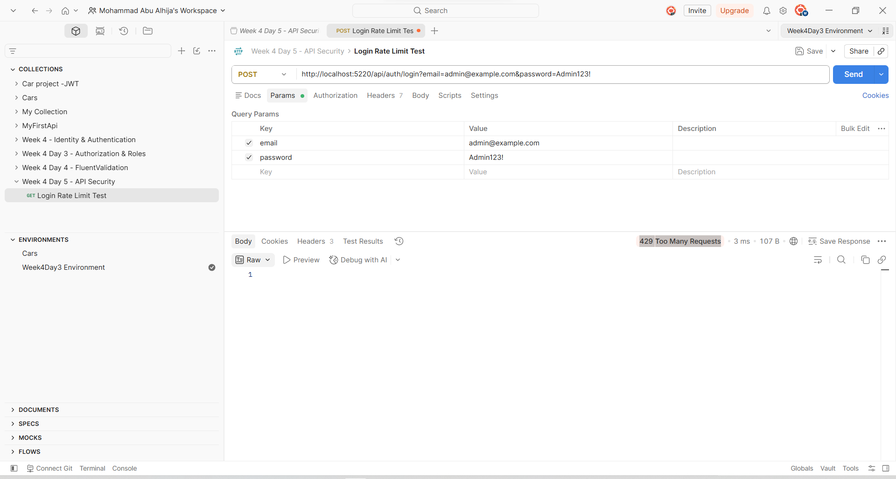
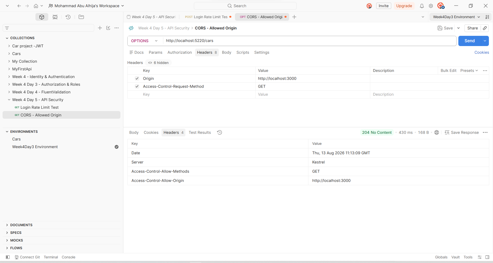
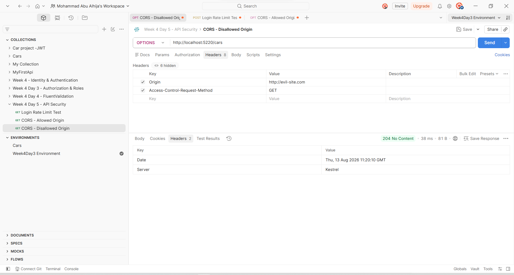

# Week 4 - Day 5: Securing the API with Rate Limiting, CORS & Security Headers

## Overview

Today I continued working on the **Car Dealership API** from Day 4.

Instead of starting a new project, I created a copy of the FluentValidation project and continued the security work in:

```text
Car Project-Day5Week4
```

During the previous days, the API gained several important layers:

```text
Identity
   ↓
JWT Authentication
   ↓
Authorization & Roles
   ↓
FluentValidation
```

Today the focus moved to **API hardening**.

The goal was not to add another business feature, but to make the existing API safer when receiving requests from clients.

The main security areas covered were:

```text
Rate Limiting
CORS
HTTPS Redirection
HSTS
SQL Injection Review
```

After today's work, the request flow became more complete:

```text
Client Request
      ↓
HTTPS
      ↓
CORS Policy
      ↓
Rate Limiting
      ↓
Authentication
      ↓
Authorization
      ↓
FluentValidation
      ↓
Controller
      ↓
Entity Framework Core
      ↓
Database
```

Each layer handles a different part of API security.

---

# Why API Hardening Matters

Authentication and authorization are important, but they do not protect an API from every type of problem.

For example, even a public Login endpoint can be abused by sending a large number of requests repeatedly.

A frontend from an unexpected origin might also attempt to communicate with the API through a browser.

The API should therefore control more than just:

```text
Who is the user?
```

It should also consider:

```text
How frequently can requests be sent?

Which frontend origins are allowed?

Should communication use HTTPS?

Are database queries safely parameterized?
```

Today's work added these additional protections.

---

# Hands-On Lab

## Task 1 - Configure Rate Limiting

The first task was adding rate limiting to the API.

Rate limiting controls how many requests a client can make during a specific period.

I used the built-in ASP.NET Core rate limiting functionality:

```csharp
using Microsoft.AspNetCore.RateLimiting;
using System.Threading.RateLimiting;
```

Then I registered the rate limiter in `Program.cs`.

Two policies were created:

```text
general → 20 requests per minute

login   → 5 requests per minute
```

The configuration is:

```csharp
builder.Services.AddRateLimiter(options =>
{
    options.RejectionStatusCode =
        StatusCodes.Status429TooManyRequests;

    options.AddFixedWindowLimiter("general", limiterOptions =>
    {
        limiterOptions.PermitLimit = 20;
        limiterOptions.Window = TimeSpan.FromMinutes(1);
        limiterOptions.QueueLimit = 0;
    });

    options.AddFixedWindowLimiter("login", limiterOptions =>
    {
        limiterOptions.PermitLimit = 5;
        limiterOptions.Window = TimeSpan.FromMinutes(1);
        limiterOptions.QueueLimit = 0;
    });
});
```

The rate limiting middleware was then enabled:

```csharp
app.UseRateLimiter();
```

This allows endpoints to use the named policies defined by the application.

---

# General Rate Limit

The general policy allows:

```text
20 requests
     ↓
within
     ↓
1 minute
```

It uses a fixed time window:

```csharp
options.AddFixedWindowLimiter("general", limiterOptions =>
{
    limiterOptions.PermitLimit = 20;
    limiterOptions.Window = TimeSpan.FromMinutes(1);
    limiterOptions.QueueLimit = 0;
});
```

I applied the policy to the sample endpoints using:

```csharp
.RequireRateLimiting("general");
```

For example:

```csharp
app.MapGet("/cars", () =>
{
    var cars = new List<string>
    {
        "BMW",
        "Kia",
        "Toyota"
    };

    return cars;
})
.RequireRateLimiting("general");
```

This gives general API endpoints a basic protection against excessive request traffic.

---

# Stricter Login Rate Limit

The Login endpoint requires stronger protection than normal endpoints.

Login endpoints can be targeted by repeated authentication attempts, so I created a stricter policy:

```text
General API
20 requests / minute

Login
5 requests / minute
```

The Login action uses:

```csharp
[HttpPost("login")]
[EnableRateLimiting("login")]
public async Task<IActionResult> Login(
    string email,
    string password)
```

This means Login has its own stricter rate limit instead of using the general API limit.

The flow becomes:

```text
POST /api/auth/login
         ↓
Login Rate Limiter
         ↓
Requests within limit?
       /       \
     Yes        No
      ↓          ↓
Login logic   429 Too Many Requests
```

---

# Returning 429 Too Many Requests

During testing, I also configured the response returned when the rate limit is exceeded.

The configuration is:

```csharp
options.RejectionStatusCode =
    StatusCodes.Status429TooManyRequests;
```

This means a client exceeding the allowed request count receives:

```text
429 Too Many Requests
```

instead of continuing to the endpoint.

### Login Rate Limit Test



I repeatedly sent requests to the Login endpoint using Postman.

After exceeding the configured limit of:

```text
5 requests per minute
```

the API returned:

```text
429 Too Many Requests
```

This confirmed that the stricter Login rate limiting policy was working correctly.

---

# Task 2 - Configure CORS

The next task was configuring **Cross-Origin Resource Sharing (CORS)**.

A browser frontend can run on a different origin from the API.

For example:

```text
Frontend
http://localhost:3000

API
http://localhost:5220
```

Because these are different origins, the API needs to explicitly decide whether the frontend is allowed to access it.

I created a named CORS policy:

```csharp
builder.Services.AddCors(options =>
{
    options.AddPolicy("AllowFrontend", policy =>
    {
        policy.WithOrigins("http://localhost:3000")
              .AllowAnyHeader()
              .AllowAnyMethod();
    });
});
```

The policy allows requests from:

```text
http://localhost:3000
```

and allows the frontend to use the required HTTP methods and headers.

The policy was enabled using:

```csharp
app.UseCors("AllowFrontend");
```

This means the API does not simply allow every browser origin.

Instead, the expected frontend origin is explicitly configured.

---

# Testing an Allowed Origin

I tested the CORS configuration in Postman using an `OPTIONS` request.

The request included:

```text
Origin: http://localhost:3000
Access-Control-Request-Method: GET
```

The API returned:

```text
204 No Content
```

and included:

```text
Access-Control-Allow-Origin: http://localhost:3000
```

in the response headers.

### Allowed CORS Origin



This confirmed that the configured frontend origin is recognized by the CORS policy.

---

# Testing a Disallowed Origin

I then tested an origin that was not included in the policy:

```text
Origin: http://evil-site.com
```

The API did not return:

```text
Access-Control-Allow-Origin
```

for this origin.

### Disallowed CORS Origin



Postman still displayed:

```text
204 No Content
```

for the preflight request.

However, CORS is enforced by browsers.

The important difference was that the response for the disallowed origin did **not** contain:

```text
Access-Control-Allow-Origin
```

Therefore, a browser would not allow frontend JavaScript from that origin to access the response.

The difference between the tests was:

| Origin | `Access-Control-Allow-Origin` | Browser Access |
| --- | --- | --- |
| `http://localhost:3000` | Present | Allowed |
| `http://evil-site.com` | Missing | Blocked |

This test helped demonstrate that CORS is based on response headers and browser enforcement rather than Postman blocking the request itself.

---

# Task 3 - HTTPS Redirection

The next security step was ensuring that the application redirects HTTP requests toward HTTPS.

The project already contained:

```csharp
app.UseHttpsRedirection();
```

HTTPS protects data while it travels between the client and server.

Without HTTPS, sensitive information could potentially travel over an unencrypted connection.

This is especially important for an API containing:

```text
Login credentials
JWT tokens
User information
Application data
```

The intended flow is:

```text
HTTP Request
     ↓
UseHttpsRedirection()
     ↓
HTTPS
     ↓
Continue processing request
```

This provides transport-level protection in addition to the authentication and authorization layers already implemented.

---

# Enabling HSTS

I also enabled **HTTP Strict Transport Security (HSTS)**.

The configuration was added outside the Development environment:

```csharp
if (app.Environment.IsDevelopment())
{
    app.MapOpenApi();

    app.UseSwaggerUI(options =>
    {
        options.SwaggerEndpoint(
            "/openapi/v1.json",
            "MyFirstApi"
        );
    });
}
else
{
    app.UseHsts();
}

app.UseHttpsRedirection();
```

HSTS tells supported browsers that the application should be accessed using HTTPS.

I kept HSTS outside Development because it is intended for production environments and browsers can cache HSTS instructions.

The environment behavior is therefore:

```text
Development
    ↓
Swagger / OpenAPI
    ↓
No HSTS

Production
    ↓
HSTS Enabled
    ↓
HTTPS
```

Together, these two middleware components provide:

```text
UseHttpsRedirection()
        +
UseHsts()
```

for stronger transport security.

---

# Task 4 - SQL Injection Review

The next task was reviewing the codebase for potentially unsafe raw SQL.

SQL injection can occur when user-controlled values are directly combined into SQL statements.

An unsafe pattern could look conceptually like:

```csharp
var sql =
    "SELECT * FROM Cars WHERE VIN = '" + userInput + "'";
```

The problem is that the input becomes part of the SQL command itself.

Instead of assuming that the project was safe, I searched the codebase for raw SQL APIs.

The review included searches for:

```text
FromSqlRaw

ExecuteSqlRaw

FromSqlInterpolated
```

No occurrences were found.

The Car Dealership API currently performs its database operations through Entity Framework Core and LINQ.

For example:

```csharp
var car = await _context.Cars
    .FirstOrDefaultAsync(c => c.Id == id);
```

and:

```csharp
var cars = await _context.Cars.ToListAsync();
```

These queries allow EF Core to generate the required database commands rather than manually constructing SQL strings containing user input.

The review therefore confirmed that the current codebase does not contain the searched raw SQL patterns or unparameterized SQL string construction.

---

# Why Parameterization Matters

The important security principle is to keep:

```text
SQL Command
```

separate from:

```text
User Input
```

Instead of constructing a command such as:

```text
SQL + User Input + More SQL
```

parameterized database access treats user input as data.

The current project primarily follows:

```text
Controller
    ↓
EF Core / LINQ
    ↓
Generated parameterized query
    ↓
SQL Server
```

This reduces the risk of SQL injection compared with manually building SQL statements from request values.

---

# Security Middleware Pipeline

After today's changes, several security-related middleware components are part of the application pipeline.

The relevant configuration is:

```csharp
if (!app.Environment.IsDevelopment())
{
    app.UseHsts();
}

app.UseHttpsRedirection();

app.UseCors("AllowFrontend");

app.UseRateLimiter();

app.UseAuthentication();

app.UseAuthorization();
```

Each component has a separate responsibility:

```text
HSTS
→ Encourage HTTPS-only browser communication in production

HTTPS Redirection
→ Redirect HTTP requests to HTTPS

CORS
→ Control which browser origins can access the API

Rate Limiting
→ Control excessive request traffic

Authentication
→ Determine who the user is

Authorization
→ Determine what the user can access
```

These protections work together rather than replacing each other.

---

# Security Layers Added During Week 4

Today's work also showed how the different Week 4 topics fit together.

The API now contains several layers:

```text
Request
   ↓
HTTPS / HSTS
   ↓
CORS
   ↓
Rate Limiting
   ↓
JWT Authentication
   ↓
Role / Permission Authorization
   ↓
FluentValidation
   ↓
Controller
   ↓
Entity Framework Core
   ↓
SQL Server
```

For example, a request to create a car may need to pass several checks:

```text
Is the request using the expected transport?
            ↓
Is the browser origin allowed?
            ↓
Is the request within the rate limit?
            ↓
Is the JWT valid?
            ↓
Does the user have ManageCars permission?
            ↓
Is the car data valid?
            ↓
Execute controller logic
            ↓
Save using EF Core
```

This made it clearer that API security is made of multiple independent layers.

---

# Postman Testing

I created a separate Postman collection for the Day 5 security tests:

```text
Week 4 Day 5 - API Security
```

The main scenarios tested were:

| Test | Expected Result | Result |
| --- | --- | --- |
| Login requests within limit | Login endpoint processes request | Passed |
| Login requests exceed limit | `429 Too Many Requests` | Passed |
| CORS allowed origin | `Access-Control-Allow-Origin` present | Passed |
| CORS disallowed origin | `Access-Control-Allow-Origin` missing | Passed |

These tests confirmed both the rate limiting and CORS behavior introduced during the lab.

---

# Project Organization

For Day 5, I continued from the Day 4 project so the existing FluentValidation, JWT authentication, roles, policies, and database configuration remained available.

The main project structure is:

```text
Week4Day5/
│
└── Car Project-Day5Week4/
    │
    ├── Controllers/
    │   ├── AuthController.cs
    │   └── CarsController.cs
    │
    ├── Data/
    │
    ├── DTOs/
    │
    ├── Models/
    │
    ├── Validators/
    │
    ├── postman/
    │   └── Week 4 Day 5 - API Security.postman_collection.json
    │
    ├── screenshots/
    │   ├── rate-limit-login-429.png
    │   ├── cors-allowed-origin.png
    │   └── cors-disallowed-origin.png
    │
    ├── Program.cs
    └── README.md
```

This allowed today's security hardening work to build directly on the previous Week 4 features.

---

# Tools and Technologies Used

The main technologies used during today's lab were:

```text
ASP.NET Core
ASP.NET Core Rate Limiting
ASP.NET Core CORS
HTTPS Redirection
HSTS
ASP.NET Core Identity
JWT Bearer Authentication
FluentValidation
Entity Framework Core
LINQ
SQL Server
Postman
```

The main security concepts used were:

```text
Fixed Window Rate Limiting
429 Too Many Requests
Named Rate Limiting Policies
CORS Policies
Allowed Origins
CORS Preflight Requests
HTTPS
HSTS
SQL Injection Prevention
Parameterized Database Access
```

---

# What I Learned

The main thing I understood from today's work is that securing an API requires more than authentication.

Before this lab, most of the security work focused on:

```text
Who is sending the request?

What is that user allowed to do?
```

Rate limiting introduced another question:

```text
How often should the client be allowed to send requests?
```

This was especially clear with the Login endpoint.

A general endpoint can allow more requests, while Login should have a stricter limit because repeated authentication attempts can represent abuse.

I also understood CORS better after testing it.

Initially, a disallowed request returning:

```text
204 No Content
```

could look like it was accepted.

However, the important part was the response headers.

The allowed origin received:

```text
Access-Control-Allow-Origin
```

while the disallowed origin did not.

This helped me understand that CORS is mainly enforced by the browser rather than Postman.

HTTPS and HSTS also showed a different type of security.

JWT protects authentication information at the application level, while HTTPS protects the communication channel itself.

The responsibilities can be viewed as:

```text
HTTPS / HSTS
→ Protect the connection

CORS
→ Control browser origins

Rate Limiting
→ Control request frequency

JWT
→ Authenticate the user

Roles / Policies
→ Authorize the user

FluentValidation
→ Validate request data

EF Core
→ Safely interact with the database
```

Finally, reviewing the project for raw SQL helped connect Entity Framework Core with database security.

I searched for:

```text
FromSqlRaw
ExecuteSqlRaw
FromSqlInterpolated
```

and found no occurrences.

The project currently relies on EF Core and LINQ for its normal database operations, which avoids manually inserting user input into SQL strings.

---

# Final Result

By the end of Day 5, I successfully:

- Continued working on the existing Car Dealership API from Day 4.
- Created a separate `Car Project-Day5Week4` project for today's work.
- Added ASP.NET Core built-in rate limiting.
- Created a general rate limit of 20 requests per minute.
- Created a stricter Login rate limit of 5 requests per minute.
- Applied the named Login rate limiting policy to the authentication endpoint.
- Configured rejected requests to return `429 Too Many Requests`.
- Tested the Login rate limit using Postman.
- Confirmed excessive Login requests are rejected.
- Created a named CORS policy.
- Allowed only the configured `http://localhost:3000` frontend origin.
- Tested an allowed CORS origin.
- Confirmed the allowed origin receives `Access-Control-Allow-Origin`.
- Tested a disallowed CORS origin.
- Confirmed the disallowed origin does not receive `Access-Control-Allow-Origin`.
- Confirmed HTTPS redirection is enabled.
- Added HSTS for non-development environments.
- Reviewed the project for raw SQL usage.
- Searched for `FromSqlRaw`, `ExecuteSqlRaw`, and `FromSqlInterpolated`.
- Confirmed none of these raw SQL patterns are currently used.
- Confirmed the project primarily uses Entity Framework Core and LINQ for database access.
- Kept the JWT authentication, authorization, and FluentValidation features from the previous days.
- Saved the Rate Limiting and CORS test screenshots for documentation.

The API now has multiple security layers working together:

```text
Transport Security
        ↓
HTTPS + HSTS
        ↓
Browser Access Control
        ↓
CORS
        ↓
Traffic Protection
        ↓
Rate Limiting
        ↓
User Identity
        ↓
JWT Authentication
        ↓
Access Control
        ↓
Roles + Policies
        ↓
Input Protection
        ↓
FluentValidation
        ↓
Application Logic
        ↓
EF Core + SQL Server
```

This completed the **Securing the API: Rate Limiting, CORS & Security Headers** part of the Day 5 lab while building directly on the authentication, authorization, and validation work completed earlier in Week 4.