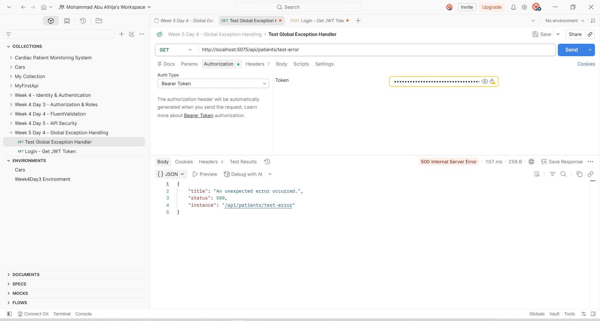
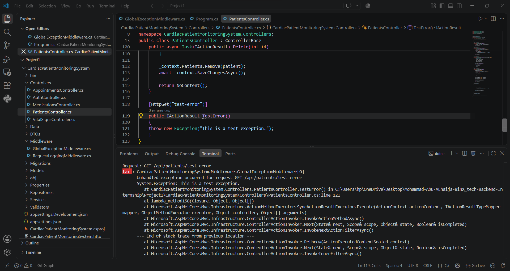

# Week 5 - Day 4: Global Exception Handling

## Overview

Today I improved the error handling in the **Cardiac Patient Monitoring System** by adding centralized exception handling.

Instead of handling unexpected exceptions separately in different endpoints, I added a global middleware that can catch unhandled exceptions in one place.

The main goal was to keep error responses consistent and avoid exposing sensitive exception details to the client.

---

## Global Exception Middleware

I created a new middleware:

```text
GlobalExceptionMiddleware.cs
```

The middleware wraps the request pipeline in a `try/catch`.

If an unexpected exception happens, it catches the exception and returns a safe `500 Internal Server Error` response.

```csharp
try
{
    await _next(context);
}
catch (Exception ex)
{
    // Log the exception and return a safe response
}
```

The middleware was registered early in the request pipeline so it can catch unhandled exceptions coming from later parts of the application.

---

## ProblemDetails Response

Instead of returning the actual exception message, the API now returns a standardized `ProblemDetails` response.

Example:

```json
{
  "title": "An unexpected error occurred.",
  "status": 500,
  "instance": "/api/patients/test-error"
}
```

The actual exception message and stack trace are not returned to the client.

---

## Structured Logging

I used `ILogger` to log the real exception on the server.

The log also includes useful request information such as the HTTP method and request path.

```csharp
_logger.LogError(
    ex,
    "Unhandled exception occurred for request {Method} {Path}",
    context.Request.Method,
    context.Request.Path
);
```

This keeps the client response safe while still giving the server enough information for debugging.

---

## Testing

To test the middleware, I temporarily created an endpoint that deliberately threw an exception.

The result was:

- API returned `500 Internal Server Error`.
- Client received a safe `ProblemDetails` response.
- Exception message and stack trace were not exposed to the client.
- Full exception details were logged in the server terminal.

After testing, the temporary endpoint was removed.

I also checked the project for redundant `try/catch` blocks. There were no unnecessary exception handlers inside the controllers that needed to be removed.

Finally, I verified the project again:

```text
Build succeeded
Tests: 10 passed, 0 failed
```

---

## Screenshots

### Global Exception Response



### Server Exception Log



---

## What I Learned

Today I learned how centralized exception handling makes an API cleaner and more consistent.

I also learned the importance of separating what the **client sees** from what the **server logs**. The client receives a safe and standardized error response, while the server keeps the detailed exception information needed for debugging.