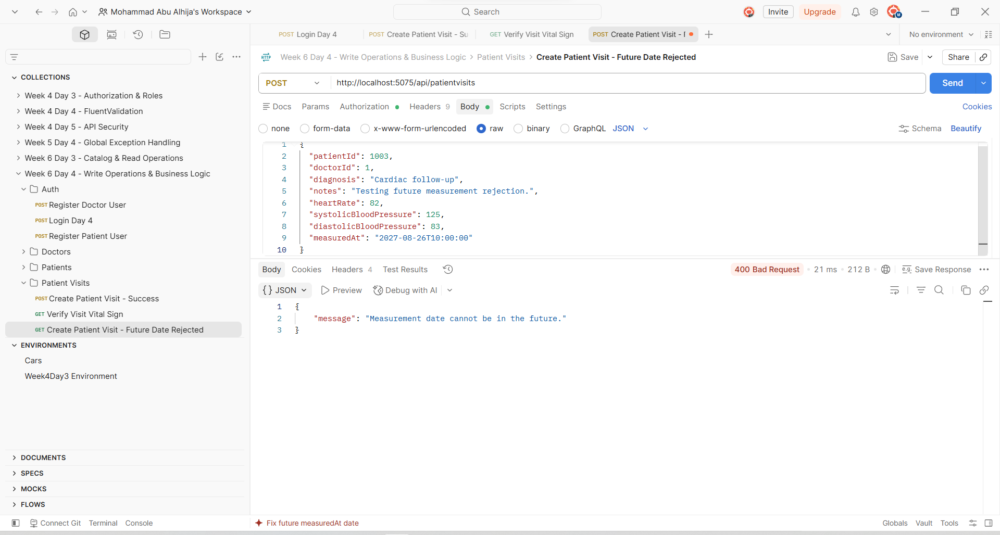
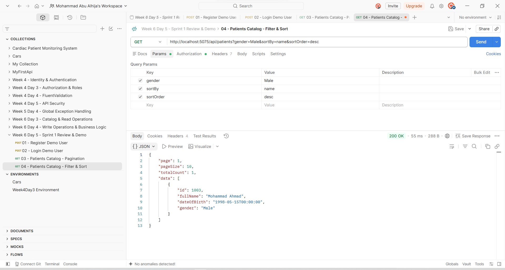
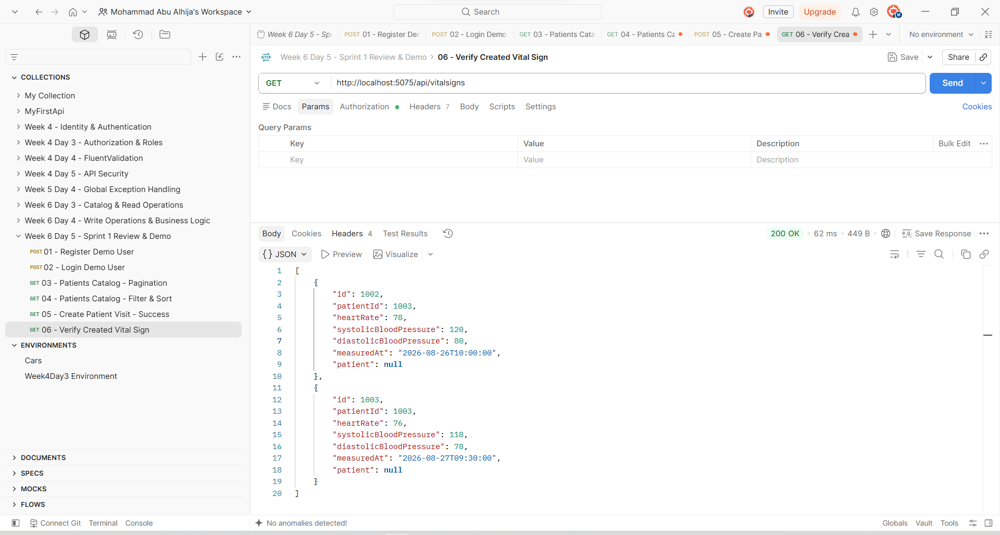
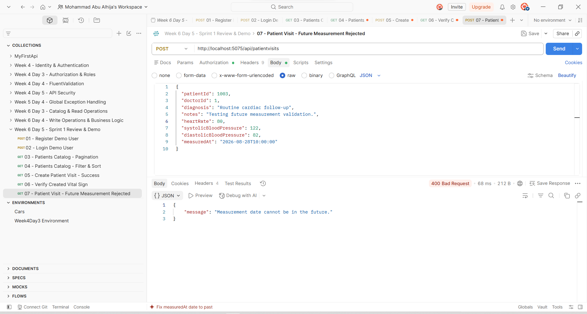

# Week 6 - Sprint 1 Summary

## Overview

Week 6 was the first complete sprint for **Version 2 of the Cardiac Patient Monitoring System**.

Instead of treating each day as a separate exercise, the work this week followed a sprint-based development process. I started by planning the sprint and redesigning the database, then moved into implementing the new EF Core model, improving read operations, adding a business-focused write operation, testing the updated system, and finally reviewing the sprint.

The main progression during the week was:

```text
Sprint Planning
      ↓
Database Design & ERD
      ↓
EF Core Model & Migration
      ↓
Catalog & Read Operations
      ↓
Business Logic & Transactions
      ↓
Testing & Pull Request
      ↓
Sprint Review & Retrospective
```

This made Week 6 different from the previous weeks because the focus was not only on learning individual backend concepts, but on applying them together inside one evolving project.

---

# Sprint 1 Goal

The goal of Sprint 1 was to establish a stronger foundation for Version 2 of the project by:

- Planning the sprint before implementation.
- Expanding and normalizing the database design.
- Implementing the new schema using Entity Framework Core.
- Improving API read operations.
- Introducing business logic outside the controller.
- Implementing a multi-step database write using a transaction.
- Testing the updated application.
- Using a feature branch and Pull Request for code review.
- Reviewing the sprint and documenting remaining work.

---

# Day 1 - Sprint Planning & Database Design

The sprint started with planning rather than immediately changing the code.

I created a Sprint 1 backlog in **Notion**, divided the work into manageable tasks, and tracked each task using:

- Not started
- In progress
- Done

This provided a clear view of the sprint throughout the week.

## Database Redesign

I reviewed the existing Cardiac Patient Monitoring System and expanded the database design to represent a more complete medical system.

The finalized design included:

- `Patients`
- `PatientPhones`
- `EmergencyContacts`
- `Doctors`
- `DoctorPhones`
- `Departments`
- `VitalSigns`
- `Medications`
- `PatientMedications`
- `Appointments`
- `MedicalRecords`
- ASP.NET Core Identity users

Patients and doctors were designed to connect to their Identity accounts through `UserId`.

The design also introduced relationships such as:

```text
AspNetUsers 1 ---- 0..1 Patient
AspNetUsers 1 ---- 0..1 Doctor

Patient 1 ---- * PatientPhone
Patient 1 ---- * EmergencyContact
Patient 1 ---- * VitalSign
Patient 1 ---- * PatientMedication
Patient 1 ---- * Appointment
Patient 1 ---- * MedicalRecord

Department 1 ---- * Doctor
Doctor 1 ---- * DoctorPhone
Doctor 1 ---- * Appointment
Doctor 1 ---- * MedicalRecord

Doctor (Supervisor) 1 ---- * Doctor

Medication 1 ---- * PatientMedication
```

## Normalization

The schema was reviewed with **1NF, 2NF, and 3NF** in mind.

Two important examples were:

### Phone Numbers

Instead of keeping a single phone number directly inside `Patient` or `Doctor`, phone numbers were moved into:

```text
PatientPhones
DoctorPhones
```

This allows one patient or doctor to have multiple phone numbers.

### Patient Medications

Medication information was separated into:

```text
Medications
PatientMedications
```

`Medications` stores the medication itself, while `PatientMedications` stores patient-specific information such as dosage, frequency, start date, and end date.

This reduces duplication and produces a cleaner relational model.

---

# Final ERD

The finalized schema was documented using **dbdiagram.io**.


The ERD became the main reference for implementing the Version 2 database model during the rest of the sprint.

---

# Day 2 - EF Core Data Model & Migrations

After finalizing the database design, the next step was translating the ERD into the actual application.

The existing project originally focused mainly on:

```text
Patients
Vital Signs
Medications
Appointments
```

The model layer was expanded to represent the full Version 2 design.

## EF Core Entities

The updated model included:

```text
Patient
Doctor
Department
Appointment
VitalSign
Medication
PatientMedication
PatientPhone
DoctorPhone
EmergencyContact
MedicalRecord
```

ASP.NET Core Identity remained part of the project through `AspNetUsers`.

Navigation properties were added so that the relationships from the ERD were represented directly in the C# model.

---

## Fluent API Relationships

Important relationships were explicitly configured inside `AppDbContext`.

For example:

```csharp
builder.Entity<Patient>()
    .HasMany(p => p.VitalSigns)
    .WithOne(v => v.Patient)
    .HasForeignKey(v => v.PatientId)
    .OnDelete(DeleteBehavior.Cascade);
```

For departments and doctors:

```csharp
builder.Entity<Department>()
    .HasMany(d => d.Doctors)
    .WithOne(d => d.Department)
    .HasForeignKey(d => d.DepartmentId)
    .OnDelete(DeleteBehavior.Restrict);
```

The project also introduced a self-referencing Doctor relationship:

```text
Doctor
   ↓
Supervisor
   ↓
Subordinate Doctors
```

Patients and doctors were also connected to their corresponding ASP.NET Identity users.

---

# Reference Seed Data

Initial reference data was added to the `Departments` table using `HasData()`.

| Id | Department |
|---|---|
| 1 | Cardiology |
| 2 | Emergency |
| 3 | Internal Medicine |

This ensures that the project starts with the basic departments required by the domain.

---

# Database Migration

After updating the model and verifying that the project built successfully, I generated:

```bash
dotnet ef migrations add BuildFullDataModel
```

The generated migration was reviewed before applying it.

Because the local database still contained old test data from the previous schema, the first update encountered a foreign-key conflict.

Since this was development-only test data, I recreated the local database and reapplied the migration history.

The resulting database was then verified using **SQL Server Management Studio**.

The expected V2 tables and the seeded department records were successfully created.

---

# Migration History

At the end of Sprint 1, I reviewed the complete migration history:

```text
20260814163131_InitialCreate
20260814203502_AddIdentity
20260815043443_AddSeedData
20260824090330_BuildFullDataModel
```

This shows the progression of the project from the original database, through Identity and seed data, to the expanded Version 2 model.

---

# Day 3 - Catalog & Read Operations

With the database foundation in place, Day 3 focused on improving how data is retrieved from the API.

The original:

```http
GET /api/patients
```

simply returned every patient.

During Sprint 1, this endpoint was improved to support:

- Pagination
- Name filtering
- Gender filtering
- Sorting
- Combined query parameters
- DTO projection
- Async EF Core queries

---

## Patient Response DTO

Instead of exposing the complete EF Core `Patient` entity, I introduced:

```text
PatientResponse
```

The response contains only:

```text
Id
FullName
DateOfBirth
Gender
```

This avoids exposing internal information such as `UserId` and keeps the API response separate from the database entity.

---

# Pagination

The endpoint now accepts:

```http
GET /api/patients?page=1&pageSize=2
```

and uses:

```csharp
.Skip((page - 1) * pageSize)
.Take(pageSize)
```

The response also contains `totalCount`, allowing the client to know how many matching records exist.

### Pagination Test


---

# Filtering

The same endpoint supports optional filters.

### Name

```http
GET /api/patients?name=Ahmad
```


### Gender

```http
GET /api/patients?gender=Male
```


Filters can also be combined with pagination.


---

# Sorting

Sorting was added through the same endpoint.

Supported options include:

```text
name_desc
birthdate_asc
birthdate_desc
```

### Name Sorting


### Birth Date Sorting


The final query is built using `IQueryable`, allowing filtering and sorting to be applied before pagination and execution.

The general flow became:

```text
Patients
   ↓
Build Query
   ↓
Apply Filters
   ↓
Count Matching Records
   ↓
Apply Sorting
   ↓
Apply Pagination
   ↓
Project to DTO
   ↓
Execute Query
```

---

# Day 4 - Write Operations, Business Logic & Transactions

Day 4 moved beyond simple CRUD operations.

Instead of using the generic order/stock example from the lesson, I adapted the same concept to the medical domain by implementing a **Patient Visit** operation.

A single visit records:

```text
MedicalRecord
+
VitalSign
```

as part of one business operation.

---

# Patient Visit Workflow

I created:

```text
CreatePatientVisitRequest
CreatePatientVisitValidator
PatientVisitService
PatientVisitsController
```

The request contains:

- Patient ID
- Doctor ID
- Diagnosis
- Notes
- Heart rate
- Systolic blood pressure
- Diastolic blood pressure
- Measurement date

The service verifies that:

1. The patient exists.
2. The doctor exists.
3. The measurement date is not in the future.

The complete workflow is:

```text
Create Patient Visit
        ↓
Check Patient
        ↓
Check Doctor
        ↓
Check Business Rules
        ↓
Begin Transaction
        ↓
Create MedicalRecord
        +
Create VitalSign
        ↓
Save Changes
        ↓
Commit
```

---

# EF Core Transaction

The two related database writes were wrapped in an explicit transaction:

```csharp
await using var transaction =
    await _context.Database.BeginTransactionAsync();

try
{
    _context.MedicalRecords.Add(medicalRecord);
    _context.VitalSigns.Add(vitalSign);

    await _context.SaveChangesAsync();

    await transaction.CommitAsync();
}
catch
{
    await transaction.RollbackAsync();
    throw;
}
```

This prevents the operation from leaving only part of the visit stored if an error occurs.

---

# Patient Visit Testing

A successful Patient Visit was tested through Postman.


Afterwards, I retrieved the patient's Vital Signs and confirmed that the new measurement was actually stored.


I also tested a business-rule failure by sending a future measurement date.

The API correctly returned:

```text
400 Bad Request
```

with:

```text
Measurement date cannot be in the future.
```



---

# Doctor API Support

The new Patient Visit workflow required a real Doctor record.

To support this, I introduced the initial Doctor API implementation using:

```text
DoctorsController
CreateDoctorRequest
CreateDoctorValidator
```

Before creating a doctor, the API verifies:

- The Identity user exists.
- The department exists.
- The supervisor exists when supplied.
- The Identity user has not already been assigned to another doctor.

This started closing the gap between the expanded V2 database model and its API layer.

---

# Authentication Improvement

The existing registration endpoint was also improved.

Registration now returns the generated Identity `userId`:

```json
{
  "message": "User registered successfully.",
  "userId": "..."
}
```

This makes it easier to connect Identity users with domain entities such as patients and doctors.

Further role-based registration and authorization remains an area for future V2 development.

---

# Automated Testing

Changes to the V2 domain model exposed an important issue in some older tests.

The tests still referenced fields from the previous Patient model, including:

```text
PhoneNumber
Address
```

The affected validator and integration tests were updated to match the normalized V2 model.

The integration-test database was also updated to seed the Patient required by the tests, keeping the tests isolated from the real SQL Server database.

The final result was:

```text
Total:     13
Succeeded: 13
Failed:    0
Skipped:   0
```


---

# Git Workflow & Pull Request

The Day 4 feature was developed on a separate branch:

```text
feature/patient-visit-business-logic
```

After implementation and testing:

```text
Feature Branch
      ↓
Commit
      ↓
Push
      ↓
Pull Request
      ↓
Mentor Review
      ↓
Merge into main
```

A Pull Request was opened for review.


The Pull Request was later reviewed and approved by the mentor and merged into `main`.

There was no unresolved code-review feedback remaining after the review.

---

# Day 5 - Sprint Review & API Demo

The final day focused on closing Sprint 1 rather than adding another large feature.

I prepared a Postman demo of the running Version 2 API.

The demonstration covered the workflow from authentication to the new business operation:

```text
Register
   ↓
Login / JWT
   ↓
Browse Patients
   ↓
Filter & Sort
   ↓
Create Patient Visit
   ↓
Verify Vital Sign
   ↓
Test Error Case
```

---

# Sprint 1 Postman Demo

## Patients Catalog

The updated catalog endpoint was demonstrated using pagination.


## Filtering & Sorting

The query functionality was also demonstrated using filtering and sorting.



## Patient Visit

A complete Patient Visit was created successfully.


The resulting Vital Sign was then verified through the API.



## Business Rule Error Case

The demo also included an invalid future measurement date to show that the business rule was being enforced.



---

# Sprint Backlog Review

At the end of the sprint, I reviewed each backlog task against the acceptance criteria.

Completed work was marked as **Done**.

Items that still require further implementation or verification were kept in the project backlog rather than being counted as completed.

The remaining areas include:

- Completing Doctor API functionality and authorization.
- Implementing Department API routes.
- Completing Appointment support for the Doctor relationship.
- Completing the Medication / PatientMedication API workflow.
- Expanding automated test coverage for the updated core routes.
- Performing another database/ERD consistency review after the remaining API work.

These are project backlog items and can be addressed as Version 2 continues to evolve.

---

# Additional V2 Improvements Identified

During Sprint 1, I also identified an important improvement for authentication and authorization.

The system should eventually provide clearer separation between:

```text
Admin
Doctor
Patient
```

Each authenticated account should be linked to the correct domain entity, and users should not be able to manually provide identity-related IDs that do not belong to their account.

This was identified as an additional V2 improvement rather than being treated as completed Sprint 1 functionality.

---

# Sprint Retrospective

## What Went Well

Sprint 1 introduced a much clearer development process for Version 2.

Instead of adding features randomly, the work started with planning and database design and then progressed gradually through implementation and testing.

Important successes included:

- Planning the sprint before implementation.
- Building a more complete and normalized database design.
- Using the ERD as the implementation reference.
- Expanding the complete EF Core model.
- Explicitly configuring important database relationships.
- Adding reference seed data.
- Improving the Patients read endpoint.
- Practicing `IQueryable`, filtering, sorting, pagination, and DTO projection.
- Moving business logic out of the controller.
- Implementing a real multi-write transaction.
- Testing both successful and rejected business operations.
- Updating older automated tests after the V2 model changes.
- Finishing with all 13 automated tests passing.
- Using a feature branch and Pull Request.
- Receiving mentor approval before merging the work.

---

## What Could Be Improved

One issue during the sprint was that some existing automated tests were not updated immediately after changes to the Patient model.

The older tests continued expecting fields such as:

```text
PhoneNumber
Address
```

even though the V2 model had changed.

This was discovered later when the complete test suite was executed.

Another area for improvement is keeping the API layer synchronized with the expanding database model. The database now represents more of the full project domain, while some of those resources still require complete API functionality.

---

# Concrete Action for the Next Sprint

One specific improvement from this retrospective is to test immediately after important structural changes.

The workflow I will follow is:

```text
Model / DTO / Relationship Change
              ↓
            Build
              ↓
     Run Automated Tests
              ↓
       Fix Any Failures
              ↓
     Continue Development
```

This should catch compatibility problems earlier instead of allowing them to accumulate while additional features are being developed.

---

# Sprint 1 Result

By the end of Week 6, Version 2 of the Cardiac Patient Monitoring System had progressed from a database redesign into a working and tested API foundation.

Sprint 1 delivered:

- A planned and tracked sprint backlog.
- A redesigned and normalized database.
- A finalized ERD.
- A complete expanded EF Core model.
- Explicit Fluent API relationships.
- Department seed data.
- A reviewed and applied V2 migration.
- SQL Server verification.
- Paginated Patient catalog.
- Name and gender filtering.
- Sorting.
- DTO projection.
- A Patient Visit business operation.
- Service-layer business logic.
- EF Core transaction handling.
- Initial Doctor API support.
- Improved Identity registration response.
- Postman verification.
- Automated integration and validation testing.
- **13/13 passing tests.**
- A feature branch and reviewed Pull Request.
- A successful merge into `main`.
- Sprint Review and API demo.
- Backlog review.
- Sprint Retrospective.
- A concrete improvement action for the next development cycle.

The biggest change this week was not one individual endpoint. It was moving toward a more structured development process where database design, API behavior, business rules, testing, Git workflow, and review all work together as part of the same sprint.

---

# Tools & Technologies Used

- C#
- ASP.NET Core Web API
- Entity Framework Core
- EF Core Code-First Migrations
- SQL Server LocalDB
- SQL Server Management Studio
- ASP.NET Core Identity
- JWT Authentication
- FluentValidation
- LINQ
- DTOs
- `IQueryable`
- EF Core Transactions
- xUnit
- ASP.NET Core Integration Testing
- Postman
- Git
- GitHub Pull Requests
- Notion
- dbdiagram.io

---

## Week 6 Status

**Sprint 1 completed and reviewed.**

The project now has a stronger Version 2 foundation and a documented backlog for the remaining development work.