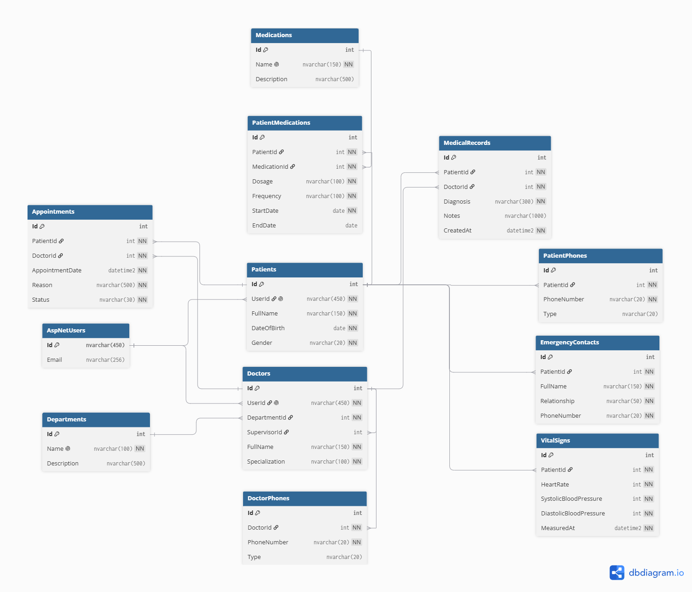

# Week 6 - Day 1: Sprint 1 Planning & Project Database Design

## Overview

Today I started **Sprint 1** for the **Cardiac Patient Monitoring System**.

The main focus was planning the sprint before starting implementation. I defined a clear sprint goal, organized the work into a backlog, and redesigned the database schema to create a more complete baseline for the project.

---

## Sprint Planning

I created a Sprint 1 backlog in **Notion** and divided the work into smaller tasks that can be completed in roughly half a day to one day.

The board uses three simple statuses:

* Not started
* In progress
* Done

This gives me a clear view of what has already been completed, what I am currently working on, and what is still left during the sprint.

### Sprint 1 Board

[View Sprint 1 Planning & Database Design on Notion](https://nasal-replace-1d7.notion.site/Sprint-1-Planning-Database-Design-3c5f843800de80d9808ceff00a82bb42?source=copy_link)

---

## Full Database Schema

I reviewed the existing project and expanded the database design to better represent the full system instead of focusing only on the current sprint.

The finalized design includes:

* `Patients`
* `PatientPhones`
* `EmergencyContacts`
* `Doctors`
* `DoctorPhones`
* `Departments`
* `VitalSigns`
* `Medications`
* `PatientMedications`
* `Appointments`
* `MedicalRecords`
* ASP.NET Core Identity users

Patients and doctors are linked to their Identity accounts using `UserId`. Their different permissions will later be handled through roles and authorization, such as **Patient**, **Doctor**, and **Admin**.

I also added a supervisor relationship between doctors, allowing one doctor to supervise other doctors within the system.

---

## Database Relationships

The main relationships in the finalized design are:

```text
AspNetUsers 1 ---- 0..1 Patient
AspNetUsers 1 ---- 0..1 Doctor

Patient 1 ---- * PatientPhone
Patient 1 ---- * EmergencyContact
Patient 1 ---- * VitalSign
Patient 1 ---- * PatientMedication
Patient 1 ---- * Appointment
Patient 1 ---- * MedicalRecord

Department 1 ---- * Doctor

Doctor 1 ---- * DoctorPhone
Doctor 1 ---- * Appointment
Doctor 1 ---- * MedicalRecord

Doctor (Supervisor) 1 ---- * Doctor

Medication 1 ---- * PatientMedication
```

---

## Normalization

I reviewed the schema using the normalization concepts from **Week 3**.

For example, patient and doctor phone numbers were moved into separate tables because each person can have multiple phone numbers.

I also separated `Medications` from `PatientMedications`. The `Medications` table stores the medication itself, while `PatientMedications` stores patient-specific information such as:

* Dosage
* Frequency
* Start Date
* End Date

This allows the same medication to be assigned to multiple patients without unnecessarily duplicating its main information.

The final schema was reviewed with **1NF, 2NF, and 3NF** in mind to keep the database organized and reduce data duplication.

---

## ERD

After finalizing the entities, keys, and relationships, I created an updated **Entity Relationship Diagram (ERD)** using **dbdiagram.io**.



This ERD will be kept updated during the upcoming sprints so that it continues to match the actual database structure.

---

## Day 1 Result

By the end of the day, I completed:

* Sprint 1 goal
* Sprint backlog and task sizing
* Full project entity planning
* Database schema design
* Relationship planning
* Normalization review
* Finalized ERD

Today was focused on **planning and database design**, so the new schema has not been implemented in the project yet.

The next step is to implement the finalized entities using **Entity Framework Core**, configure their relationships, add seed data, generate and review the migration, and then apply it to the database.
