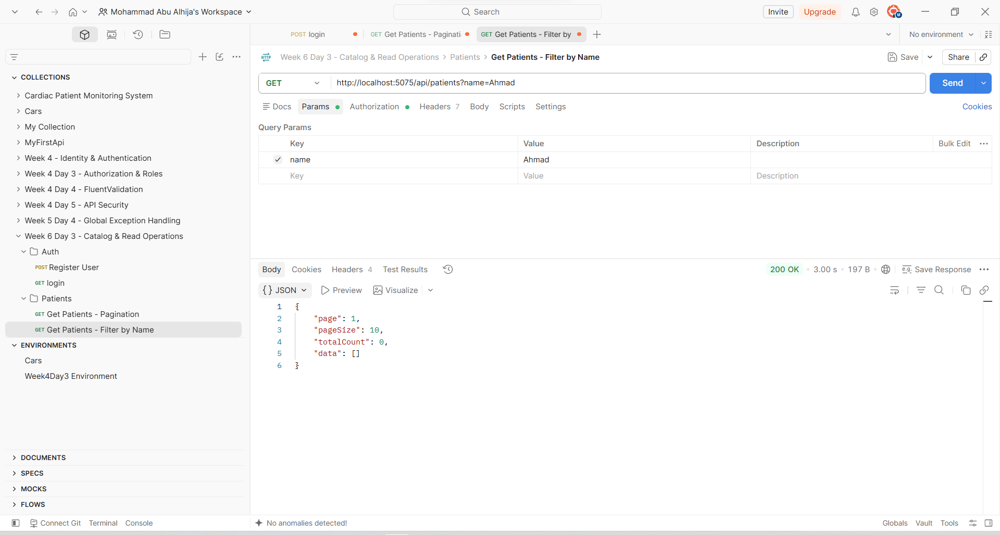
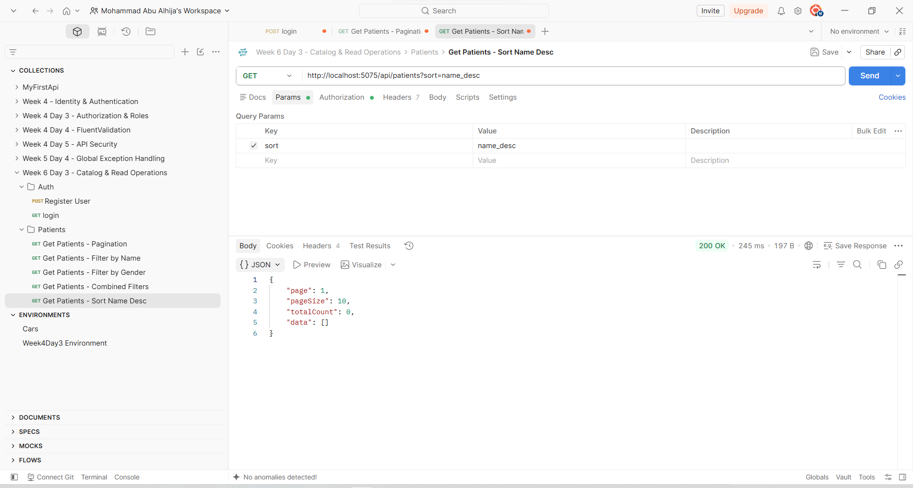

# Week 6 - Day 3: Catalog & Read Operations

## Overview

Today I continued working on the **Cardiac Patient Monitoring System**.

After spending the previous days designing the database and building the EF Core model, today's work moved back to the API layer. The main goal was to improve the way patient data is retrieved instead of simply returning every record from the database.

I used the existing `GET /api/patients` endpoint and gradually improved it by adding:

- Pagination
- Filtering by name and gender
- Sorting
- A response DTO
- DTO projection with LINQ
- More controlled data retrieval

I implemented and tested each part separately before moving to the next one, then saved the important Postman results as evidence of the work.

---

## 1. Improving the Patients List Endpoint

The original Patients endpoint was very simple:

```csharp
[HttpGet]
public async Task<IActionResult> GetAll()
{
    var patients = await _context.Patients.ToListAsync();

    return Ok(patients);
}
```

This worked fine while the project only had a small amount of test data, but it would not scale well.

If the database eventually contained thousands of patients, this endpoint would try to retrieve and return all of them in one request.

Instead of replacing it with several different endpoints, I kept the same route:

```http
GET /api/patients
```

and started adding optional query parameters to make it more flexible.

---

## 2. Creating a Patient Response DTO

Before working on the query itself, I created a response DTO:

```text
DTOs/PatientResponse.cs
```

```csharp
namespace CardiacPatientMonitoringSystem.DTOs;

public class PatientResponse
{
    public int Id { get; set; }

    public string FullName { get; set; } = string.Empty;

    public DateTime DateOfBirth { get; set; }

    public string Gender { get; set; } = string.Empty;
}
```

Previously, the list endpoint returned the EF Core `Patient` entity directly.

That meant the API response was tied directly to the database model. The `Patient` entity also contains internal information such as `UserId`, which is needed for the Identity relationship but does not need to be exposed when browsing patients.

Instead, I now explicitly select the fields I want to return:

```csharp
.Select(p => new PatientResponse
{
    Id = p.Id,
    FullName = p.FullName,
    DateOfBirth = p.DateOfBirth,
    Gender = p.Gender
})
```

This gives the endpoint a clearer public response and avoids exposing fields just because they exist in the database entity.

It also helped apply the idea of avoiding over-fetching by selecting the data needed for this response instead of treating the full entity as the API response.

---

## 3. Adding Pagination

The first feature I added to the endpoint was pagination.

The endpoint now accepts:

```csharp
int page = 1,
int pageSize = 10
```

and applies:

```csharp
.Skip((page - 1) * pageSize)
.Take(pageSize)
```

For example:

```http
GET /api/patients?page=1&pageSize=2
```

asks for the first page with a maximum of two patients.

I also added:

```csharp
var totalCount = await query.CountAsync();
```

so the response tells the client how many matching records exist in total.

The response is structured like this:

```json
{
  "page": 1,
  "pageSize": 2,
  "totalCount": 5,
  "data": [
    ...
  ]
}
```

This is much better than returning the whole Patients table because the client can request only the portion of data it currently needs.

### Testing Pagination

I tested the pagination through Postman using:

```http
GET /api/patients?page=1&pageSize=2
```

The request returned `200 OK` and confirmed that the response includes the pagination information together with the patient data.


---

## 4. Building the Query Dynamically

After pagination was working, I changed the query to start with:

```csharp
var query = _context.Patients.AsQueryable();
```

This allowed me to build the database query gradually.

Instead of immediately executing:

```csharp
ToListAsync()
```

I can now add filters and sorting first, then execute the final query only after all the requested options have been applied.

The general flow became:

```text
Patients
   ↓
Build Query
   ↓
Apply Filters
   ↓
Count Matching Records
   ↓
Apply Sorting
   ↓
Apply Pagination
   ↓
Project to DTO
   ↓
Execute Query
```

---

## 5. Filtering by Patient Name

The first optional filter I added was `name`.

```csharp
if (!string.IsNullOrWhiteSpace(name))
{
    query = query.Where(p => p.FullName.Contains(name));
}
```

Because the parameter is optional, the filter is only applied when the client actually provides a name.

For example:

```http
GET /api/patients?name=Ahmad
```

searches for patients whose `FullName` contains `Ahmad`.

Without the `name` parameter, the same endpoint continues normally without applying this `Where()` condition.

### Testing the Name Filter

I tested the new filter separately in Postman:

```http
GET /api/patients?name=Ahmad
```

This confirmed that the endpoint could narrow the patient list using the query parameter.



---

## 6. Filtering by Gender

The second optional filter was `gender`.

```csharp
if (!string.IsNullOrWhiteSpace(gender))
{
    query = query.Where(p => p.Gender == gender);
}
```

For example:

```http
GET /api/patients?gender=Male
```

returns patients matching that gender.

Again, the filter is only added when the parameter is supplied, so I did not need to create a separate endpoint just for gender filtering.

### Testing the Gender Filter

I tested it using:

```http
GET /api/patients?gender=Male
```

and verified the result through Postman.


---

## 7. Combining Filters with Pagination

One useful part of using query parameters is that they can work together.

After testing each filter separately, I combined both filters with pagination:

```http
GET /api/patients?page=1&pageSize=5&name=Ahmad&gender=Male
```

The endpoint applies the conditions before applying `Skip()` and `Take()`.

Another important detail is where `totalCount` is calculated:

```csharp
var totalCount = await query.CountAsync();
```

I calculate it **after filtering**, which means `totalCount` represents the number of patients matching the current filters rather than the number of every patient in the database.

### Testing Combined Filters

I tested the combination through Postman to make sure the same endpoint could handle several query parameters together.


---

## 8. Adding Sorting

Once pagination and filtering were working, I added a `sort` query parameter.

Instead of creating a separate route for every sorting option, I used a switch expression:

```csharp
query = sort switch
{
    "name_desc" => query.OrderByDescending(p => p.FullName),
    "birthdate_asc" => query.OrderBy(p => p.DateOfBirth),
    "birthdate_desc" => query.OrderByDescending(p => p.DateOfBirth),
    _ => query.OrderBy(p => p.FullName)
};
```

The endpoint now supports:

```text
name_desc
birthdate_asc
birthdate_desc
```

If no recognized sort option is provided, patients are ordered by name in ascending order by default.

This also gives pagination a consistent ordering instead of depending on whatever order SQL Server happens to return the records.

---

## 9. Sorting by Name

The first sorting option I tested was:

```http
GET /api/patients?sort=name_desc
```

This applies:

```csharp
query.OrderByDescending(p => p.FullName)
```

and returns patients in descending alphabetical order.

### Testing Name Sorting

The Postman test confirmed that the endpoint returned the patients using the requested name order.



---

## 10. Sorting by Birth Date

I also tested sorting using the patient's date of birth.

The request:

```http
GET /api/patients?sort=birthdate_asc
```

uses:

```csharp
query.OrderBy(p => p.DateOfBirth)
```

This gives the endpoint another sorting option without requiring another API route.

### Testing Birth Date Sorting

I tested the request in Postman and verified that the results followed the selected birth-date order.


---

## 11. Final Patients Catalog Endpoint

After putting everything together, the final list endpoint became:

```csharp
[HttpGet]
public async Task<IActionResult> GetAll(
    int page = 1,
    int pageSize = 10,
    string? name = null,
    string? gender = null,
    string? sort = null)
{
    var query = _context.Patients.AsQueryable();

    // Filtering
    if (!string.IsNullOrWhiteSpace(name))
    {
        query = query.Where(p => p.FullName.Contains(name));
    }

    if (!string.IsNullOrWhiteSpace(gender))
    {
        query = query.Where(p => p.Gender == gender);
    }

    var totalCount = await query.CountAsync();

    // Sorting
    query = sort switch
    {
        "name_desc" => query.OrderByDescending(p => p.FullName),
        "birthdate_asc" => query.OrderBy(p => p.DateOfBirth),
        "birthdate_desc" => query.OrderByDescending(p => p.DateOfBirth),
        _ => query.OrderBy(p => p.FullName)
    };

    // Pagination + DTO Projection
    var patients = await query
        .Skip((page - 1) * pageSize)
        .Take(pageSize)
        .Select(p => new PatientResponse
        {
            Id = p.Id,
            FullName = p.FullName,
            DateOfBirth = p.DateOfBirth,
            Gender = p.Gender
        })
        .ToListAsync();

    return Ok(new
    {
        page,
        pageSize,
        totalCount,
        data = patients
    });
}
```

The same endpoint can now be used in several ways:

```http
GET /api/patients
```

```http
GET /api/patients?page=1&pageSize=5
```

```http
GET /api/patients?name=Ahmad
```

```http
GET /api/patients?gender=Male
```

```http
GET /api/patients?sort=name_desc
```

```http
GET /api/patients?page=1&pageSize=5&name=Ahmad&gender=Male
```

This keeps the API simple while still giving the client much more control over the returned data.

---

## 12. Build and Postman Verification

I did not wait until the end to test everything at once.

I built and tested the project while working through the endpoint so that each major change could be checked before moving on to the next one.

The project was verified using:

```bash
dotnet build
```

and compiled successfully.

For the API tests, I created a new Postman collection for today's work:

```text
Week 6 Day 3 - Catalog & Read Operations
```

I organized it into:

```text
Auth
Patients
```

The existing Register/Login flow was only used to get a JWT for the protected Patients routes. The actual testing and screenshots focused on the new Day 3 functionality.

The Patients requests covered:

- Pagination
- Name filtering
- Gender filtering
- Combined filtering and pagination
- Name sorting
- Birth-date sorting

---

## What I Learned Today

Today's work was a good step forward from a basic CRUD endpoint.

Instead of thinking of `GET /api/patients` as simply "get everything", I worked on making the endpoint behave more like a real catalog/read API.

I practiced how to build an EF Core query gradually with `IQueryable`, apply optional `Where()` conditions, order the results, paginate them with `Skip()` and `Take()`, and finally project the result into a response DTO before executing the query.

The biggest improvement was that all of this still happens through one clean endpoint rather than creating a different route for every filter or sorting option.

---

## Final Result

By the end of Day 3, `GET /api/patients` had changed from a basic list endpoint into a more flexible read endpoint supporting:

- Paginated results
- `name` filtering
- `gender` filtering
- Multiple sorting options
- Combined query parameters
- `PatientResponse` DTO projection
- Controlled response fields
- Async EF Core queries

All of the main behaviors were tested through Postman and the important results were documented with screenshots next to the feature they demonstrate.

---

## Tools Used

- ASP.NET Core Web API
- Entity Framework Core
- LINQ
- DTOs
- Postman
- JWT Authentication