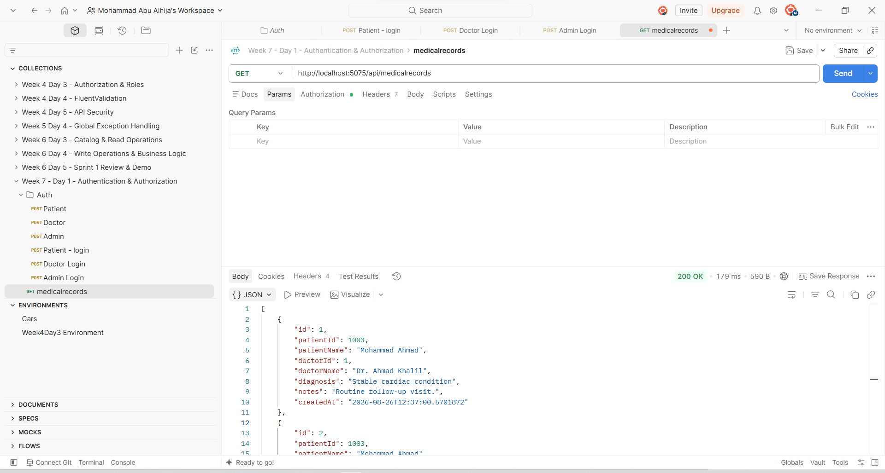
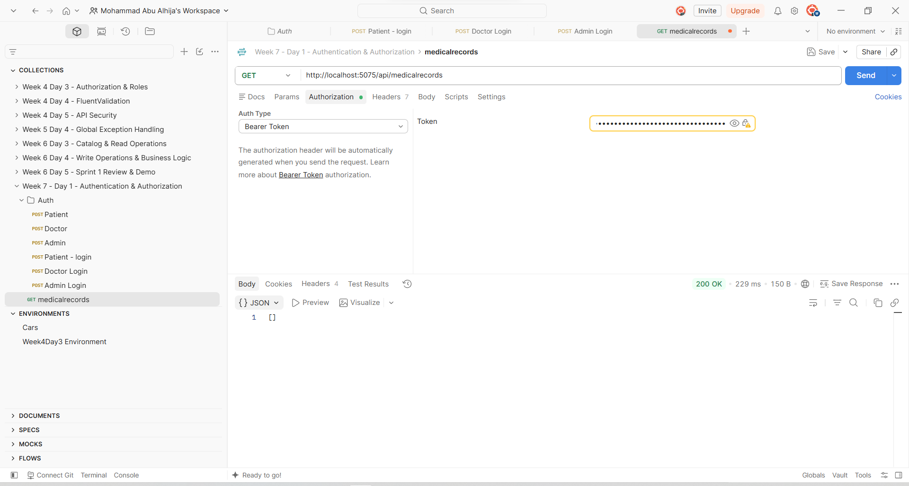
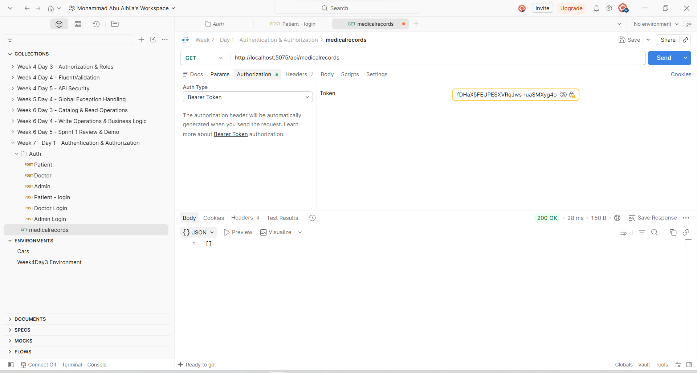

# Week 7 - Sprint 2 Summary

## Overview

Week 7 was the second complete sprint for the **Cardiac Patient Monitoring System**.

The main focus of Sprint 2 was strengthening the authentication and authorization foundation of the system and making access control more realistic.

The work built directly on the authentication foundation established in the previous sprint. Instead of rebuilding Identity and JWT authentication, I extended the existing implementation with:

* Role-Based Access Control (RBAC)
* Patient ownership checks
* Patient-specific JWT claims
* Secure Patient registration
* Identity-to-domain entity relationships
* Transactional Patient registration
* Centralized request logging
* Global exception handling
* ProblemDetails responses
* Postman authorization testing
* Middleware pipeline verification

The main progression during the week was:

```text
Existing Authentication Foundation
              ↓
      RBAC & Authorization
              ↓
   Patient Registration & JWT
              ↓
     Ownership Enforcement
              ↓
 Middleware & Request Pipeline
              ↓
      Sprint Review & Demo
              ↓
         Retrospective
```

This made Week 7 different from Sprint 1 because the main focus was no longer only on database and API functionality. The sprint concentrated on making the existing API more secure by controlling **who can access what data**.

---

# Sprint 2 Goal

The goal of Sprint 2 was to strengthen the security and authorization model of the Cardiac Patient Monitoring System by:

* Reviewing and extending the existing authentication system.
* Implementing realistic roles for Admin, Doctor, and Patient.
* Applying role-based authorization to API endpoints.
* Connecting authenticated users to their domain entities.
* Adding the `PatientId` claim to Patient JWT tokens.
* Implementing ownership checks for Patient data.
* Preventing Patients from accessing other Patients' records.
* Preventing unauthorized roles from performing administrative operations.
* Making Patient registration create both Identity and domain records consistently.
* Using a database transaction during Patient registration.
* Adding centralized request logging.
* Adding centralized global exception handling.
* Returning safe `ProblemDetails` responses for unexpected errors.
* Verifying the complete authentication and authorization flow through Postman.
* Reviewing the sprint and defining a concrete improvement for the next development cycle.

---

# Day 1 - Sprint 2 Development & RBAC

Sprint 2 started by extending the authentication and authorization foundation already implemented in the project.

The existing system already contained:

```text
ASP.NET Core Identity
        ↓
JWT Authentication
        ↓
Login
        ↓
[Authorize]
```

Instead of rebuilding these components, I focused on making authorization more realistic for the medical domain.

---

## Application Roles

The system uses three main roles:

```text
Admin
Doctor
Patient
```

Each role has different responsibilities and access levels.

### Admin

The Admin has overall administrative access to the system.

Depending on the endpoint, the Admin can access and manage:

* Patients
* Doctors
* Appointments
* Medical Records
* Medications
* Vital Signs

Administrative create, update, and delete operations are restricted to the appropriate endpoints.

### Doctor

Doctors have access to resources related to their work.

A Doctor can access permitted information for connected Patients, including relevant:

* Patient information
* Medical Records
* Appointments
* Vital Signs

Doctor access is not unrestricted. The relationship between the Doctor and Patient is considered when accessing sensitive resources.

### Patient

Patients are restricted to their own information.

A Patient can access permitted:

* Profile information
* Appointments
* Vital Signs
* Medical Records
* Medication information

A Patient must not be able to access another Patient's private data.

---

# Role-Based Authorization

Role-based authorization was implemented using ASP.NET Core authorization attributes.

Examples include:

```csharp
[Authorize(Roles = "Admin,Doctor,Patient")]
```

and:

```csharp
[Authorize(Roles = "Admin")]
```

This creates two levels of protection:

```text
Authentication
      ↓
Is the user logged in?
      ↓
Role Authorization
      ↓
Is the user allowed to perform this operation?
```

For example, administrative operations can require:

```csharp
[Authorize(Roles = "Admin")]
```

while read operations can allow multiple roles.

---

# Data-Level Authorization

Role checks alone are not enough for a medical system.

A Patient may have a valid Patient JWT and still must not be allowed to access another Patient's information.

Therefore, Sprint 2 also introduced **data-level authorization**.

The authorization model became:

```text
Authentication
      ↓
Role Check
      ↓
Ownership / Relationship Check
      ↓
Allow or Reject Request
```

Medical Records were used as an important example because they contain sensitive Patient information.

The expected access model is:

| Role    | Medical Records Access |
| ------- | ---------------------- |
| Admin   | All permitted records  |
| Doctor  | Connected Patients     |
| Patient | Own records only       |

---

# Medical Records Authorization Testing

The Medical Records endpoint was tested using the three main roles.

```http
GET /api/medicalrecords
```

The endpoint was tested with:

* Admin token
* Doctor token
* Patient token

The authorization behavior was verified for each role.

### Admin Access



### Doctor Access



### Patient Access



---

# Day 1 Result

By the end of Day 1:

* Admin, Doctor, and Patient roles were clearly defined.
* Existing JWT authentication was extended rather than rebuilt.
* Role-based authorization was applied to protected endpoints.
* Data-level authorization was introduced.
* Doctors were restricted according to their Patient relationships.
* Patients were restricted to their own data.
* Medical Records authorization was tested with all three roles.

The main lesson from this day was the difference between **authentication**, **authorization**, and **data ownership**.

---

# Day 2 - JWT Login & Registration

Day 2 focused on improving the connection between ASP.NET Core Identity users and the application's domain entities.

The authentication foundation already existed, including:

* ASP.NET Core Identity
* JWT authentication
* Login
* Roles
* Patient and Doctor relationships

The goal was to make Patient registration more consistent and ensure that the generated JWT contains the information required for ownership checks.

---

# Patient and Identity Relationship

The `Patient` entity is connected to its Identity user through `UserId`.

The relationship is represented as:

```csharp
public string UserId { get; set; } = string.Empty;

public IdentityUser User { get; set; } = null!;
```

The relationship is configured in `AppDbContext`:

```csharp
builder.Entity<Patient>()
    .HasOne(p => p.User)
    .WithOne()
    .HasForeignKey<Patient>(p => p.UserId)
    .OnDelete(DeleteBehavior.Restrict);
```

This creates the relationship:

```text
AspNetUsers
     │
     │ UserId
     ↓
  Patient
```

---

# Transactional Patient Registration

Patient registration now creates both:

```text
Identity User
      +
Patient Domain Record
```

The operation is handled inside a database transaction.

The general flow is:

```text
Register Patient
      ↓
Begin Transaction
      ↓
Create Identity User
      ↓
Assign Patient Role
      ↓
Create Patient Record
      ↓
Save Changes
      ↓
Commit Transaction
```

If an error occurs:

```text
Error
  ↓
Rollback Transaction
```

This prevents the application from ending up with an Identity user without the corresponding Patient record.

---

# Patient Registration Test

The registration endpoint was tested through Postman:

```http
POST /api/Auth/register/patient
```

The registration request creates the Identity account and the corresponding Patient domain record.


---

# JWT Login

After registration, the Patient can log in through:

```http
POST /api/Auth/login
```

The API validates the credentials using ASP.NET Core Identity and generates a JWT.


The authentication flow became:

```text
Patient Registration
        ↓
Identity User + Patient
        ↓
Login
        ↓
Generate JWT
        ↓
PatientId Claim
        ↓
Bearer Token
        ↓
Protected Patient Endpoint
```

---

# PatientId JWT Claim

The JWT previously contained information such as:

```text
User ID
Email
Role
```

For Patient accounts, the token was extended to include:

```text
PatientId
```

The resulting token conceptually contains:

```text
sub       → Identity User ID
email     → User Email
role      → Patient
PatientId → Patient Domain ID
```

This allows the API to identify not only the authenticated Identity user, but also the corresponding Patient domain record.

---

# Protected Patient Endpoint

The generated JWT was then used to access a protected Patient endpoint.


This confirmed the complete flow:

```text
Register
   ↓
Login
   ↓
JWT with PatientId
   ↓
Bearer Authentication
   ↓
Protected Endpoint
   ↓
Authenticated Patient
```

---

# Day 2 Result

By the end of Day 2:

* Patient registration created an Identity user.
* A corresponding Patient domain record was created.
* The Identity-to-Patient relationship was established through `UserId`.
* Registration was protected by a database transaction.
* The Patient role was assigned during registration.
* Login generated a JWT.
* The JWT included the Patient identity information and `PatientId`.
* The protected Patient endpoint was successfully accessed using the generated token.

---

# Day 3 - RBAC & Ownership Checks

Day 3 focused on verifying the authorization model across the existing API and implementing ownership checks where role authorization alone was not sufficient.

The existing authentication system already provided:

```text
ASP.NET Core Identity
JWT
Login
Roles
[Authorize]
```

The focus of this day was therefore on **verification and ownership enforcement** rather than rebuilding authentication.

---

# Role Assignment

The application uses:

```text
Admin
Doctor
Patient
```

Roles are created when required during application startup.

Patient registration automatically assigns the:

```text
Patient
```

role.

Doctor registration assigns the:

```text
Doctor
```

role.

The role is not accepted as a free value from a public registration request.

This prevents a user from simply submitting:

```text
role = Admin
```

during normal registration.

Administrative access is handled separately.

---

# Authorization Examples

Different endpoints require different roles.

For example, the `DoctorPhonesController` allows:

```text
Read:
Admin, Doctor
```

while create, update, and delete operations are restricted to:

```text
Admin
```

The `PatientMedicationsController` allows permitted read operations for:

```text
Admin, Doctor, Patient
```

while create, update, and delete operations are restricted to:

```text
Admin
```

This demonstrates that authorization is applied according to the sensitivity and responsibility of each operation.

---

# Admin Authorization Test

An Admin login was tested to confirm that an administrative JWT could access protected administrative functionality.


---

# Patient Attempting an Admin-Only Operation

A Patient token was used to attempt an operation restricted to Admin users.

### Create Medication

The Patient attempted to create a medication record.

The API correctly returned:

```text
403 Forbidden
```


### Delete Medication

The Patient also attempted to delete a medication record.

The API again returned:

```text
403 Forbidden
```


This confirms that the Patient was authenticated but did not have the required role authorization.

---

# Patient Ownership Check

Role authorization is not enough when the resource belongs to a specific Patient.

The Patient ID is extracted from the JWT:

```csharp
User.FindFirstValue("PatientId");
```

For Patient requests, the API filters the query using the Patient ID from the authenticated user's token.

The logic is conceptually:

```text
Patient Request
      ↓
Read PatientId from JWT
      ↓
Filter resources by PatientId
      ↓
Return only owned resources
```

For example:

```csharp
if (User.IsInRole("Patient"))
{
    var patientIdClaim =
        User.FindFirstValue("PatientId");

    if (!int.TryParse(patientIdClaim, out var patientId))
    {
        return Forbid();
    }

    patientMedicationsQuery =
        patientMedicationsQuery
            .Where(pm => pm.PatientId == patientId);
}
```

This prevents a Patient from retrieving medication records belonging to another Patient.

---

# Patient A Accessing Patient B Data

To verify the ownership rule, a second Patient was used.

The test data represented another Patient:

```json
{
  "id": 1008,
  "fullName": "Patient B",
  "dateOfBirth": "1999-05-15T00:00:00",
  "gender": "Female"
}
```

A medication record was associated with Patient B:

```json
{
  "id": 1,
  "patientId": 1008,
  "medicationId": 1002,
  "dosage": "100mg",
  "frequency": "Once Daily",
  "startDate": "2026-09-01T00:00:00",
  "endDate": "2026-09-30T00:00:00"
}
```

Patient A then attempted to access Patient B's medication.

The API correctly rejected the request:

```text
403 Forbidden
```


This confirmed that a valid Patient JWT does not automatically provide access to every Patient's data.

---

# Authentication vs Authorization vs Ownership

The implementation made the distinction clearer:

```text
Authentication
Who are you?
      ↓
Authorization
What are you allowed to do?
      ↓
Ownership
Does this specific resource belong to you?
```

A user can therefore be:

```text
Authenticated
      +
Correct Role
      +
Wrong Resource Owner
      ↓
403 Forbidden
```

This is especially important for resources containing medical information.

---

# Day 3 Result

By the end of Day 3:

* Patient role assignment was verified.
* Admin, Doctor, and Patient roles were enforced.
* Public registration could not be used to assign the Admin role.
* Admin-only endpoints rejected Patient requests.
* Patient medication access was restricted to the authenticated Patient.
* A Patient was prevented from accessing another Patient's medication.
* Ownership checks were implemented using the `PatientId` JWT claim.

---

# Day 4 - Middleware & Request Pipeline

Day 4 focused on the ASP.NET Core request pipeline.

Two custom middleware components were used:

```text
GlobalExceptionMiddleware
RequestLoggingMiddleware
```

The goal was to centralize unexpected exception handling and request logging instead of placing this behavior repeatedly inside individual controllers.

---

# Global Exception Middleware

The `GlobalExceptionMiddleware` catches unhandled exceptions that reach the request pipeline.

Its responsibilities are:

* Catch unexpected exceptions.
* Log the exception using `ILogger`.
* Return HTTP `500 Internal Server Error`.
* Return a standardized `ProblemDetails` response.
* Avoid exposing internal exception details to the client.

The general flow is:

```text
Request
   ↓
Global Exception Middleware
   ↓
Request Logging Middleware
   ↓
Authentication
   ↓
Authorization
   ↓
Controller
   ↓
Service / Database
   ↓
Response
```

If an unexpected exception occurs:

```text
Exception
    ↓
Bubble through pipeline
    ↓
GlobalExceptionMiddleware
    ↓
Log Exception
    ↓
Return Safe 500 Response
```

---

# ProblemDetails Response

Unexpected errors are returned using the standardized `ProblemDetails` format.

An example response is:

```json
{
  "title": "An unexpected error occurred.",
  "status": 500,
  "instance": "/api/..."
}
```

The client receives:

```text
500 Internal Server Error
```

without receiving the internal exception message or stack trace.

This keeps the response safe while allowing the real exception to remain available in the server logs.

---

# Exception Propagation

The Patient Visit service implemented in Sprint 1 uses transaction rollback and then rethrows the exception:

```csharp
catch
{
    await transaction.RollbackAsync();
    throw;
}
```

The exception can therefore continue through the request pipeline until it reaches the global exception middleware.

The flow is:

```text
Service
  ↓
Exception
  ↓
Rollback
  ↓
throw
  ↓
Request Pipeline
  ↓
Global Exception Middleware
  ↓
ILogger
  ↓
ProblemDetails
  ↓
500 Response
```

This keeps unexpected exception handling centralized.

---

# Request Logging Middleware

A separate `RequestLoggingMiddleware` was added to log request information and the resulting response status.

The middleware records:

```text
HTTP Method
Request Path
Response Status Code
```

An example log is:

```text
Request: GET /api/patients
Response Status: 200
```

The middleware uses `ILogger` and operates around the next component in the request pipeline.

---

# Middleware Ordering

The middleware was registered in `Program.cs` in the following order:

```csharp
app.UseHttpsRedirection();

app.UseMiddleware<
    CardiacPatientMonitoringSystem.Middleware.GlobalExceptionMiddleware>();

app.UseMiddleware<
    CardiacPatientMonitoringSystem.Middleware.RequestLoggingMiddleware>();

app.UseAuthentication();

app.UseAuthorization();

app.MapControllers();
```

The global exception middleware is placed early in the pipeline so that exceptions thrown by later components can reach it.

The resulting pipeline is:

```text
HTTPS Redirection
       ↓
Global Exception Middleware
       ↓
Request Logging Middleware
       ↓
Authentication
       ↓
Authorization
       ↓
Controllers
```

---

# Request Logging Test

A protected Patient request was sent through Postman:

```http
GET /api/patients
```

The request completed successfully with:

```text
200 OK
```

The server log showed:

```text
Request: GET /api/patients
Response Status: 200
```


---

# Authentication Integration

The middleware changes were verified together with the existing authentication system.

The complete request flow is now:

```text
Client / Postman
       ↓
Global Exception Middleware
       ↓
Request Logging Middleware
       ↓
JWT Authentication
       ↓
Role Authorization
       ↓
Ownership Checks
       ↓
Controller
       ↓
Service
       ↓
Entity Framework Core
       ↓
SQL Server
       ↓
HTTP Response
```

This demonstrated how the different backend concepts learned throughout the internship connect inside the same application.

---

# Build Verification

After completing the middleware changes, the application was rebuilt.

The result was:

```text
Restore complete
CardiacPatientMonitoringSystem net10.0 succeeded

Build succeeded
```

This confirmed that the middleware and request-pipeline changes were integrated successfully with the existing application.

---

# Day 4 Result

By the end of Day 4:

* A global exception-handling middleware was implemented.
* Unexpected exceptions are handled centrally.
* Exceptions are logged using `ILogger`.
* Safe `ProblemDetails` responses are returned.
* Internal exception details are not exposed to API clients.
* Request logging middleware was implemented.
* HTTP method, request path, and response status are logged.
* Middleware ordering was reviewed.
* Exception propagation through the pipeline was verified.
* The application build completed successfully.

---

# Day 5 - Sprint Review, Postman Demo & Retrospective

The final day focused on reviewing Sprint 2 and demonstrating the completed authentication and authorization flow.

The demo was based on the Postman testing performed during the sprint.

The main demonstration flow was:

```text
Patient Registration
        ↓
Patient Login
        ↓
JWT with PatientId
        ↓
Protected Patient Request
        ↓
Role Authorization
        ↓
Ownership Check
        ↓
Deliberate Rejection Cases
        ↓
Middleware Verification
```

---

# Demo — Sprint 2

## Authentication Flow

The first part of the demo demonstrates the complete Patient authentication flow.

```text
Register Patient
      ↓
Create Identity User
      ↓
Create Patient Record
      ↓
Login
      ↓
Generate JWT
      ↓
JWT contains PatientId
      ↓
Access Protected Endpoint
```

The registration and login flow was successfully demonstrated through Postman.


---

# RBAC Demo

The authorization model was demonstrated using the three application roles:

```text
Admin
Doctor
Patient
```

Medical Records access was tested using different roles.


---

# Deliberate Rejection Case 1 - Patient Performing Admin Operation

A Patient token was used to attempt an Admin-only medication operation.

The API correctly returned:

```text
403 Forbidden
```


The same authorization behavior was confirmed for the delete operation.


---

# Deliberate Rejection Case 2 - Patient Accessing Another Patient's Data

A Patient was also tested against a resource belonging to another Patient.

The ownership check correctly rejected the request with:

```text
403 Forbidden
```


This demonstrates that the system verifies both:

```text
Role
+
Resource Ownership
```

before allowing access to Patient-specific data.

---

# Middleware Demo

The final part of the demo showed the request logging middleware.

A successful request produced:

```text
Request: GET /api/patients
Response Status: 200
```


This confirmed that the request passed through the custom middleware pipeline successfully.

---

# Sprint Review

The Sprint 2 review focused on checking the completed work against the intended sprint objectives.

The completed areas included:

* RBAC for Admin, Doctor, and Patient.
* Data-level authorization.
* Patient ownership checks.
* Patient-specific JWT claims.
* Transactional Patient registration.
* Identity-to-Patient relationship.
* Protected Patient endpoints.
* Admin-only operations.
* Postman authorization testing.
* Request logging middleware.
* Global exception middleware.
* Safe `ProblemDetails` responses.
* Middleware pipeline ordering.
* Build verification.

The Sprint Review also reinforced an important principle:

```text
Incomplete work should remain backlog work
rather than being counted as completed.
```

Any future authorization improvements can therefore be addressed during a later development cycle without treating them as completed Sprint 2 functionality.

---

# Sprint 2 Retrospective

## What Went Well

Sprint 2 successfully extended the authentication foundation from the previous sprint into a more realistic authorization model.

Important successes included:

* Building on the existing Identity and JWT implementation instead of rebuilding it.
* Defining clear Admin, Doctor, and Patient responsibilities.
* Applying role-based authorization to protected endpoints.
* Preventing public registration from assigning the Admin role.
* Linking Identity users with domain Patient records.
* Adding `PatientId` to Patient JWT tokens.
* Creating Patient registration as a transactional operation.
* Separating authentication from domain data.
* Implementing ownership checks for Patient-specific resources.
* Verifying that Patients cannot access another Patient's data.
* Testing deliberate `403 Forbidden` scenarios.
* Applying authorization to sensitive Medical Records.
* Adding centralized request logging.
* Adding centralized global exception handling.
* Returning safe `ProblemDetails` responses.
* Reviewing middleware ordering and exception propagation.
* Verifying the final application build.
* Completing the sprint with an end-to-end Postman demonstration.

---

# What Could Be Improved

One important improvement area is making ownership verification a consistent part of the development process.

When adding a new Patient-related resource, it is important to consider not only:

```text
Is the user authenticated?
```

and:

```text
Does the user have the correct role?
```

but also:

```text
Does this resource actually belong to this Patient?
```

This should be considered during the implementation and testing of every new resource endpoint that exposes Patient-specific information.

---

# Concrete Action for the Next Sprint

A concrete action for the next development cycle is:

```text
For every new resource endpoint:

Authentication Check
        ↓
Role Check
        ↓
Ownership / Relationship Check
        ↓
Automated or API Test
```

In particular, every new Patient-related endpoint should include an explicit ownership-check test where applicable.

This will make ownership authorization part of the normal development workflow rather than something checked only after an endpoint has already been implemented.

---

# Sprint 2 Result

By the end of Week 7, Sprint 2 successfully strengthened the security model of the Cardiac Patient Monitoring System.

Sprint 2 delivered:

* Admin, Doctor, and Patient roles.
* Role-Based Access Control.
* Data-level authorization.
* Medical Records authorization.
* Patient ownership checks.
* Patient-specific JWT `PatientId` claims.
* Identity-to-Patient relationship.
* Transactional Patient registration.
* Patient registration and login verification.
* Protected Patient endpoint verification.
* Admin-only endpoint restrictions.
* Deliberate `403 Forbidden` authorization tests.
* Cross-Patient ownership rejection.
* Request logging middleware.
* Global exception-handling middleware.
* Centralized exception logging.
* Safe `ProblemDetails` responses.
* Middleware pipeline ordering.
* Postman authentication and authorization demonstration.
* Successful build verification.
* Sprint Review.
* Sprint Retrospective.
* A concrete ownership-testing improvement for the next development cycle.

The biggest change during Sprint 2 was strengthening the difference between **authentication, authorization, and ownership**.

The system no longer only checks whether a user is logged in. It also checks:

```text
Who is the user?
      ↓
What role does the user have?
      ↓
Is the user allowed to perform this operation?
      ↓
Does the requested resource belong to the user
or fall within the user's allowed relationship?
```

This provides a stronger and more realistic authorization model for a medical backend API.

---

# Key Authorization Model

The final authorization model developed during Sprint 2 can be summarized as:

```text
                Request
                   ↓
          JWT Authentication
                   ↓
             Identify User
                   ↓
             Check Role
                   ↓
       Check Ownership / Relationship
                   ↓
          ┌────────┴────────┐
          ↓                 ↓
       Allowed           Rejected
          ↓                 ↓
     Controller        403 Forbidden
          ↓
       Service
          ↓
      Database
```

This model is now used as the foundation for securing Patient-specific resources.

---

# Tools & Technologies Used

* C#
* ASP.NET Core Web API
* ASP.NET Core Identity
* JWT Authentication
* Role-Based Authorization
* Entity Framework Core
* SQL Server
* EF Core Transactions
* `ILogger`
* Custom Middleware
* `ProblemDetails`
* DTOs
* Postman
* Swagger
* Git
* GitHub
* Visual Studio / .NET CLI

---

## Week 7 Status

**Sprint 2 completed and reviewed.**

The Cardiac Patient Monitoring System now has a stronger authentication and authorization foundation with role-based access control, Patient ownership enforcement, transactional registration, centralized request logging, and global exception handling.
