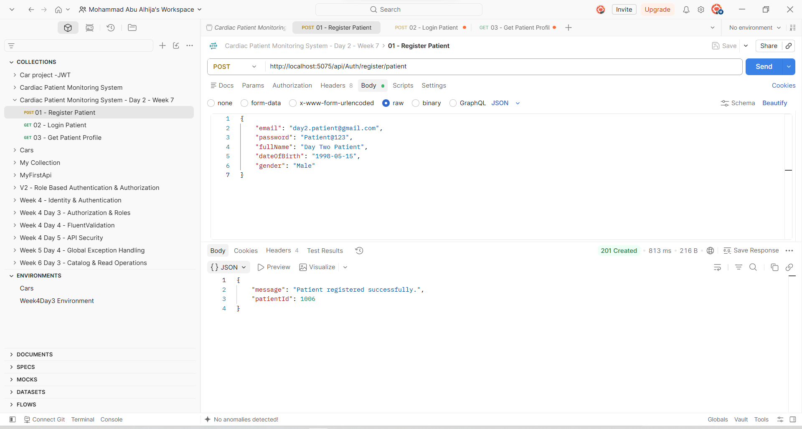
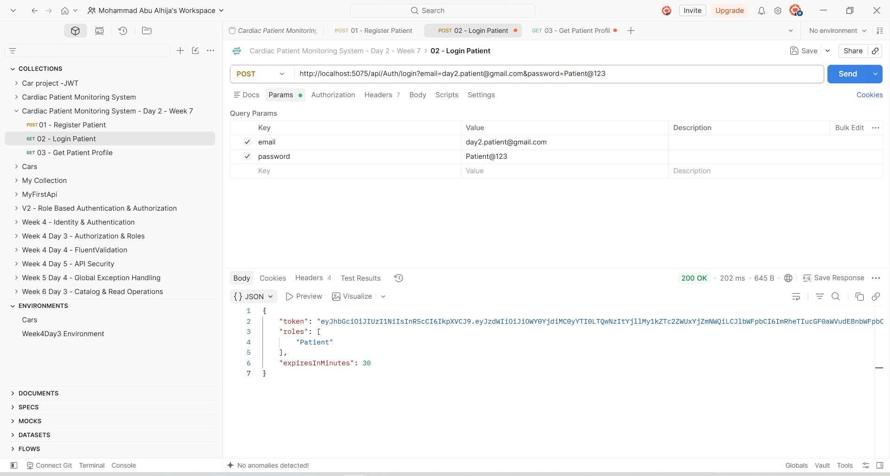

# Week 7 — Day 2

## JWT Login & Registration for the Cardiac Patient Monitoring System

### Overview

Today, I continued working on the **Cardiac Patient Monitoring System** as part of the Week 7 backend training.

Unlike starting authentication from scratch, a large part of the authentication foundation had already been implemented during the previous work on the project. The system already had **ASP.NET Core Identity, JWT authentication, roles, patient-user relationships, and registration/login endpoints**.

Therefore, the focus of today was not simply to rebuild authentication, but to **review the existing implementation, improve it to match the new requirements, and make the registration-to-login flow more consistent and reliable**.

The main goal was to connect the authentication layer more closely with the project's actual domain by making sure that a Patient account is properly linked to its Patient record and that the generated JWT can identify the authenticated Patient.

---

## Learning Objectives

Today's work focused on:

* Linking the `Patient` domain entity with its corresponding `IdentityUser`.
* Ensuring Patient registration creates both the Identity account and Patient record consistently.
* Using a database transaction to prevent inconsistent registration states.
* Issuing JWTs containing information relevant to the Patient domain.
* Adding the Patient's own ID as a claim inside the JWT.
* Testing the complete registration and authentication flow using Postman.

---

## Work Completed Before Today

The project already contained an authentication foundation from the previous implementation.

This included:

* ASP.NET Core Identity.
* `IdentityUser` and `IdentityRole`.
* JWT Bearer Authentication.
* Authentication and authorization middleware.
* Role-based authorization.
* `Patient`, `Doctor`, and `Admin` roles.
* Patient registration.
* Doctor registration.
* Admin registration.
* Patient-to-IdentityUser relationship.
* Login endpoint that generates JWTs.
* Swagger JWT authentication configuration.

The `Patient` entity was already connected to the Identity user through `UserId`.

This allowed today's work to focus on **improving and completing the existing implementation instead of duplicating functionality that was already working**.

---

## What Was Required Today

The training requirements for today were centered around the complete registration and login flow:

### 1. Link the Domain Entity to Identity

The `Patient` entity needs to know which Identity account belongs to it.

The project already had this relationship:

```csharp
public string UserId { get; set; } = string.Empty;
public IdentityUser User { get; set; } = null!;
```

The relationship was also configured in `AppDbContext`:

```csharp
builder.Entity<Patient>()
    .HasOne(p => p.User)
    .WithOne()
    .HasForeignKey<Patient>(p => p.UserId)
    .OnDelete(DeleteBehavior.Restrict);
```

This keeps authentication data and medical/domain data separated while still maintaining a clear relationship between them.

---

## 2. Improve Patient Registration with a Transaction

The existing registration flow was already creating both:

1. An `IdentityUser`.
2. A `Patient` record.

However, the previous implementation relied on manually deleting the Identity user if creating the Patient failed.

For today's requirement, this was improved by using a **database transaction**.

The registration process now follows this flow:

```text
Begin Transaction
       ↓
Create IdentityUser
       ↓
Assign Patient Role
       ↓
Create Patient
       ↓
Save Changes
       ↓
Commit Transaction
```

If an error occurs during the process:

```text
Error
  ↓
Rollback Transaction
```

This provides a safer registration flow and prevents the database from being left with an Identity account that has no corresponding Patient record.

---

## 3. Add a Domain-Specific Claim to the JWT

The existing JWT already contained standard authentication information such as:

* User ID
* Email
* Role

Today's requirement was to make the token more useful to the application's own domain.

For Patient accounts, the JWT now also contains:

```text
PatientId
```

For example:

```text
sub        → Identity User ID
email      → Patient email
role       → Patient
PatientId  → Patient record ID
```

This means an authenticated request can identify the Patient's domain record directly from the JWT.

For example:

```text
IdentityUser
      │
      │ UserId
      ↓
Patient
      │
      │ PatientId
      ↓
JWT Claim
```

This creates a clear connection between authentication and the Patient domain.

---

# Postman Testing

After implementing the changes, I tested the authentication flow using **Postman**.

The testing followed the same sequence discussed during the training:

```text
Register Patient
       ↓
Create Identity User
       ↓
Create Patient
       ↓
Login
       ↓
Receive JWT
       ↓
Use JWT with Patient endpoint
```

---

## 1. Patient Registration

A new Patient account was registered through:

```text
POST http://localhost:5075/api/Auth/register/patient
```

The request was tested successfully and returned the newly created Patient ID.

### Screenshot



---

## 2. Patient Login

After registration, the same credentials were used to test the login endpoint:

```text
POST http://localhost:5075/api/Auth/login
```

The endpoint successfully authenticated the Patient and returned a JWT.

The token can then be used to access protected API endpoints.

### Screenshot



---

## 3. Accessing the Patient Endpoint

The generated JWT was then used with a protected Patient endpoint to verify that the authentication flow works beyond the login request itself.

This helped confirm that the issued token could successfully be used for authenticated API requests.

### Screenshot


---

# Day 2 Result

By the end of today's work, the authentication flow of the **Cardiac Patient Monitoring System** was more closely connected to the application's domain.

The final flow became:

```text
Patient Registration
        ↓
IdentityUser Created
        ↓
Patient Created
        ↓
Both Protected by Transaction
        ↓
Patient Login
        ↓
JWT Generated
        ↓
PatientId Added to JWT
        ↓
Authenticated Patient Request
```

This completed the main requirements of **Week 7 — Day 2** while building on the authentication work that had already been implemented earlier in the project.

---

## Key Takeaways

Today's work reinforced several important backend concepts:

* Authentication data and domain data should remain logically separated.
* Domain entities can be linked to Identity users through foreign keys.
* Related account/profile creation should be handled consistently.
* Transactions help protect data integrity when multiple database operations belong to one logical action.
* JWTs can contain domain-specific claims when the application needs to identify the authenticated domain entity.
* End-to-end Postman testing is important because it verifies that the different parts of the authentication system work together rather than only working individually.

Overall, today's work was mainly about **taking the authentication foundation that was already built and making it more complete, consistent, and connected to the Patient domain of the project**.
