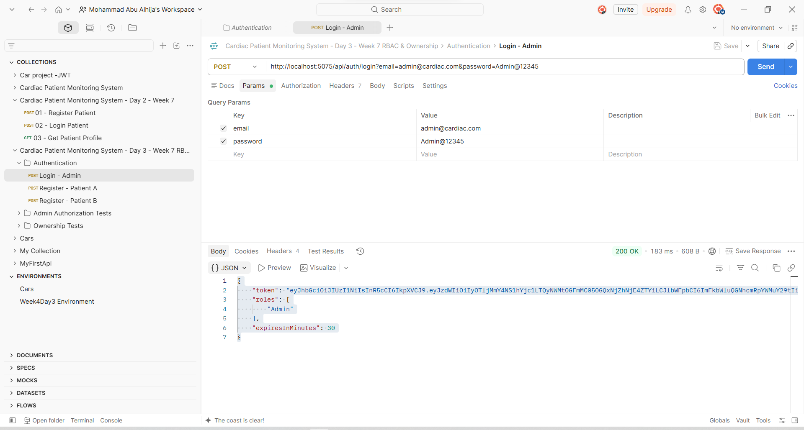
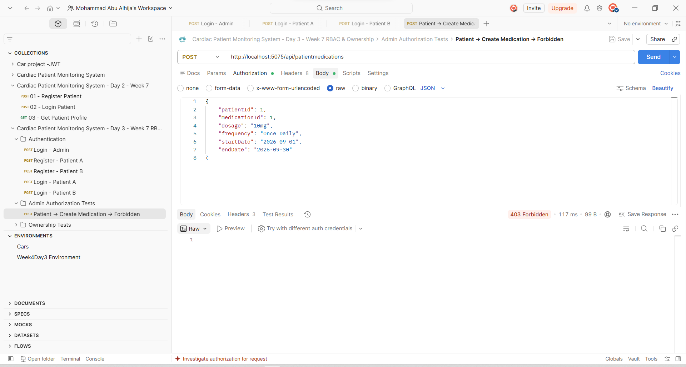
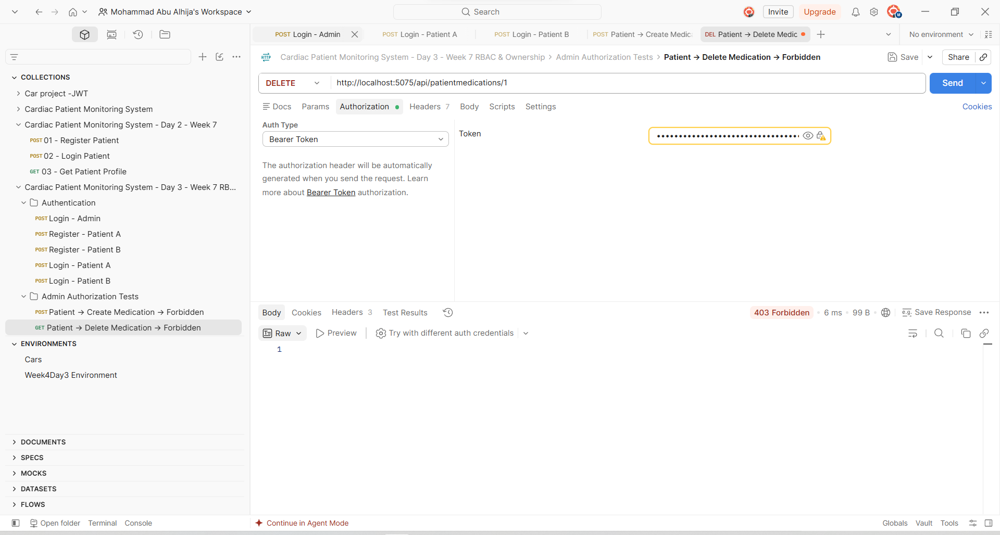
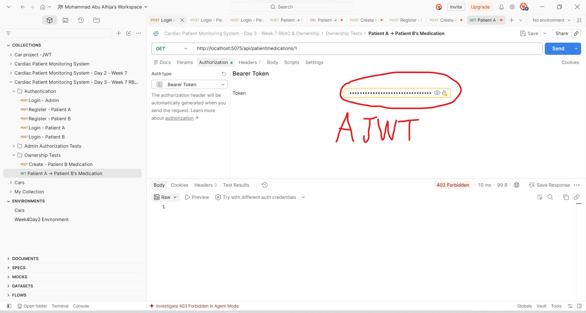

# Week 7 — Day 3

## RBAC & Ownership Checks

### What I worked on today

Today I worked on **Role-Based Access Control (RBAC)** and **Ownership Checks** in the Cardiac Patient Monitoring System.

Most of the authentication part was already implemented in the previous days, including:

* ASP.NET Core Identity
* JWT Authentication
* Login
* User Roles
* `[Authorize]`
* Role-based authorization

So I did not rebuild these parts again. Instead, I reviewed what was already implemented and continued from there to make sure the API was handling roles and patient data correctly.

---

## 1. Roles

The project already has three roles:

```text
Admin
Doctor
Patient
```

These roles are created when the application starts if they do not already exist.

For Patient registration, the user is automatically assigned the `Patient` role.

For Doctor registration, the user is automatically assigned the `Doctor` role.

The user does not send the role in the registration request, so a normal user cannot simply register themselves as an Admin.

The Admin account is handled separately as part of the existing authentication setup.

---

## 2. Checking the API Authorization

After that, I went through the authorization already applied to the controllers and checked that the endpoints have the correct role requirements.

For example, in `DoctorPhonesController`:

```csharp
[Authorize(Roles = "Admin,Doctor")]
```

is used for reading doctor phone records.

While creating, updating, and deleting doctor phone records requires:

```csharp
[Authorize(Roles = "Admin")]
```

The same idea is used in the other controllers.

For example, in `PatientMedicationsController`, Patients, Doctors, and Admins can access the read endpoints, while creating, updating, and deleting medication records is restricted to Admins.

Since this authorization was already implemented in previous work, I mainly verified that it matched the requirements for today's task.

---

## 3. PatientId in the JWT

For the ownership part, I used the `PatientId` claim that was already added to the Patient JWT during login.

When a Patient logs in, the API finds the patient's database record and adds:

```text
PatientId
```

to the JWT.

The controller can then get the Patient ID using:

```csharp
User.FindFirstValue("PatientId");
```

This gives me a way to know which Patient is making the request without trusting a Patient ID sent from the client.

---

## 4. Ownership Check for Patient Medications

I then added the ownership check to `PatientMedicationsController`.

For `GET /api/patientmedications`, Admins and Doctors can see the records they are allowed to access, while a Patient is filtered to only their own medication records.

The important part is:

```csharp
if (User.IsInRole("Patient"))
{
    var patientIdClaim =
        User.FindFirstValue("PatientId");

    if (!int.TryParse(patientIdClaim, out var patientId))
    {
        return Forbid();
    }

    patientMedicationsQuery =
        patientMedicationsQuery
            .Where(pm => pm.PatientId == patientId);
}
```

So if the logged-in user is a Patient, the API automatically filters the results using the Patient ID from the JWT.

This prevents a Patient from getting the medication records of other Patients.

---

## 5. Ownership Check for a Specific Medication

I also applied the same idea to:

```text
GET /api/patientmedications/{id}
```

After finding the requested record, I compare its `PatientId` with the Patient ID from the JWT.

```csharp
if (patientMedication.PatientId != patientId)
{
    return Forbid();
}
```

If they do not match, the API returns:

```text
403 Forbidden
```

This means that having a valid Patient token is not enough. The requested record must also belong to that Patient.

---

## 6. Testing the Authorization

I used Postman to test the authorization behavior.

First, I logged in using the Admin account and used the returned JWT for the Admin requests.



I also tested the opposite case by using a Patient token against Admin-only endpoints.

The API correctly rejected the requests with:

```text
403 Forbidden
```

For example, a Patient tried to create a patient medication record, but the endpoint is restricted to Admins.



I also tested deleting a medication record using a Patient token. The request was rejected because the endpoint is Admin-only.



These tests confirm that a Patient can be authenticated successfully but still cannot perform Admin-only operations.

---

## 7. Testing Ownership

For the ownership test, I created test data for another Patient.

The test Patient was:

```json
{
    "id": 1008,
    "fullName": "Patient B",
    "dateOfBirth": "1999-05-15T00:00:00",
    "gender": "Female"
}
```

I then created a medication record belonging to this Patient.

The result was:

```json
{
    "id": 1,
    "patientId": 1008,
    "medicationId": 1002,
    "dosage": "100mg",
    "frequency": "Once Daily",
    "startDate": "2026-09-01T00:00:00",
    "endDate": "2026-09-30T00:00:00"
}
```

After that, I used another Patient's token and tried to access this medication.

The API returned:

```text
403 Forbidden
```



This was the main ownership test for today.

It confirms that Patient A cannot access a specific medication record that belongs to Patient B.

---

## 8. What I learned from this

The main thing I focused on today was the difference between authentication, authorization, and ownership.

Having a valid JWT only means that the user is authenticated.

Then the role determines whether the user is allowed to perform a specific operation.

For patient-specific data, I also need to check that the requested record actually belongs to the logged-in Patient.

For example:

```text
Patient A
    ↓
Valid JWT
    ↓
Patient role
    ↓
Requests Patient B's medication
    ↓
PatientId does not match
    ↓
403 Forbidden
```

This is important because simply putting `[Authorize]` on an endpoint would not be enough to protect patient-specific data.

---

## 9. Day 3 Result

By the end of today, I verified that:

* Patient users receive the Patient role during registration.
* Admin, Doctor, and Patient roles are already configured in the project.
* The existing endpoints have the appropriate role restrictions.
* Admin-only endpoints reject Patient tokens.
* Patient medication results are filtered based on the logged-in Patient.
* A Patient cannot access another Patient's specific medication.
* The authorization behavior was tested using Postman.

The important part for me today was that I **continued from the authentication and authorization work I had already done in the previous days**, instead of rebuilding the same functionality again.

The main new part was making the Patient-specific endpoints actually check **ownership of the requested data**, not just whether the user was logged in.
