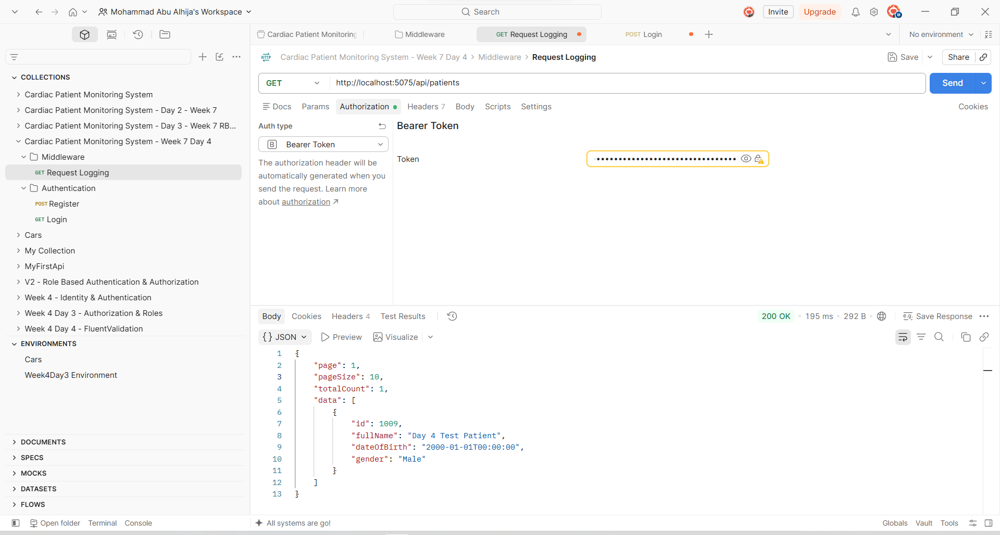

# Week 7 — Day 4

## Middleware & Request Pipeline

### Overview

Today I focused on **Middleware and the ASP.NET Core request pipeline** in the Cardiac Patient Monitoring System.

The main goal was to add centralized handling for unexpected exceptions and request logging, while keeping the application pipeline organized and easy to maintain.

The middleware work included:

* Global Exception Handling
* Request Logging
* Middleware registration and ordering
* Testing the request logging middleware
* Verifying the global exception handling flow

---

## 1. Global Exception Middleware

Implemented a custom `GlobalExceptionMiddleware` to provide centralized handling for unhandled exceptions.

Instead of allowing unexpected exceptions to propagate directly to the client, the middleware:

* Catches unhandled exceptions.
* Logs the exception using `ILogger`.
* Returns HTTP `500 Internal Server Error`.
* Uses the `application/problem+json` content type.
* Returns a `ProblemDetails` response to the client.
* Includes the request path in the `Instance` property.

### Response Structure

When an unexpected exception occurs, the API returns a standardized response similar to:

```json
{
  "title": "An unexpected error occurred.",
  "status": 500,
  "instance": "/api/..."
}
```

This provides a consistent error response while keeping internal exception details out of the API response.

---

## 2. Request Logging Middleware

Implemented a custom `RequestLoggingMiddleware` to log incoming requests and their resulting response status codes.

The middleware logs:

* HTTP method
* Request path
* Response status code

Example:

```text
Request: GET /api/patients
Response Status: 200
```

The middleware uses ASP.NET Core's `ILogger` instead of writing directly to the console, making the logging system more consistent with the application's existing logging infrastructure.

---

## 3. Middleware Registration

Both custom middleware components were registered in `Program.cs`.

The middleware pipeline is configured as follows:

```csharp
app.UseHttpsRedirection();

app.UseMiddleware<CardiacPatientMonitoringSystem.Middleware.GlobalExceptionMiddleware>();
app.UseMiddleware<CardiacPatientMonitoringSystem.Middleware.RequestLoggingMiddleware>();

app.UseAuthentication();
app.UseAuthorization();

app.MapControllers();
```

The ordering is important because middleware executes according to its position in the request pipeline.

The global exception middleware is placed before the application's other middleware and controllers so that exceptions occurring later in the pipeline can be caught and handled centrally.

---

## 4. Testing

### Request Logging Middleware

The request logging middleware was tested using Postman.

### Request

```http
GET /api/patients
```

The request was authenticated using a valid JWT token.

### Result

The API returned:

```text
200 OK
```

The application logs showed:

```text
Request: GET /api/patients
Response Status: 200
```

### Screenshot



---

## 5. Global Exception Handling Verification

The `GlobalExceptionMiddleware` was reviewed together with the service layer to verify the exception flow.

The `PatientVisitService` contains a transaction block where database-related exceptions are rolled back and then re-thrown:

```csharp
catch
{
    await transaction.RollbackAsync();
    throw;
}
```

The `throw;` allows the exception to continue up the request pipeline, where it can be handled by `GlobalExceptionMiddleware`.

The middleware then:

1. Logs the exception.
2. Sets the response status to `500`.
3. Sets the response content type to `application/problem+json`.
4. Returns a standardized `ProblemDetails` response.

No temporary or artificial endpoint was added only for the purpose of generating an exception.

---

## 6. Authentication Testing

Authentication was also verified as part of the Day 4 testing flow.

A test Patient account was registered and successfully logged in using the existing authentication endpoints.

The login response returned a JWT containing the authenticated user's role and Patient ID.

This token was then used to access the protected Patient API endpoint during middleware testing.

---

## 7. Build Verification

After implementing and registering the middleware, the project was built successfully.

```text
Restore complete

CardiacPatientMonitoringSystem net10.0 succeeded

Build succeeded
```

This confirmed that the middleware implementation and its registration in the request pipeline did not introduce compilation errors.

---

## 8. What I Learned

Today I learned how ASP.NET Core middleware participates in the HTTP request pipeline and how custom middleware can be used to handle cross-cutting concerns.

Key concepts covered:

* Custom middleware
* `RequestDelegate`
* `HttpContext`
* `ILogger`
* Centralized exception handling
* `ProblemDetails`
* HTTP 500 responses
* Request/response logging
* Middleware execution order
* Exception propagation through the request pipeline
* Integration of middleware with authentication and authorization

---

## Conclusion

Day 4 focused on improving the application's request pipeline through custom middleware.

The Cardiac Patient Monitoring System now has centralized exception handling and request logging, providing a cleaner and more maintainable approach to handling common cross-cutting concerns.

The middleware was successfully integrated with the existing authentication and authorization pipeline, and the project builds successfully.
