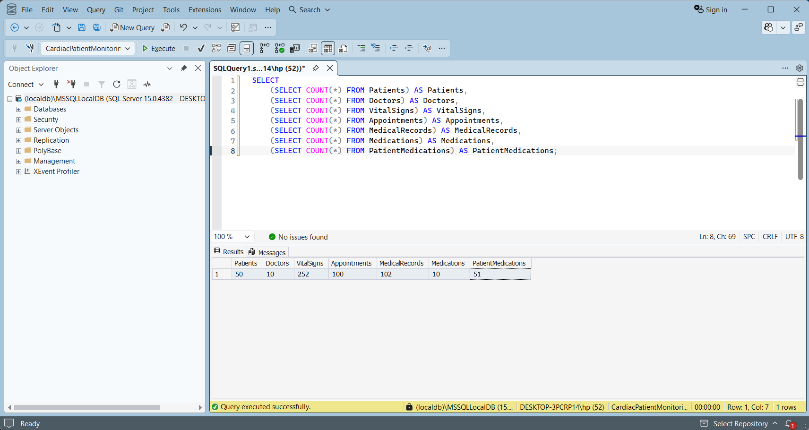

# Week 8 — Sprint 3 — Day 1

## Sprint 3 Planning & Diagnosing the N+1 Problem

### Overview

Day 1 of **Sprint 3** focused on establishing the performance goals for the next development phase and understanding one of the most common database performance problems in Entity Framework Core: the **N+1 Query Problem**.

After completing Sprint 2, the focus moved from security and authorization toward **database performance and query efficiency**.

The main goal for today was not simply to make the API work, but to understand how the application communicates with the database and how the number of generated SQL queries can affect performance as the amount of data increases.

The work completed today included:

* Sprint 3 planning.
* Defining a measurable performance target.
* Understanding the N+1 query problem.
* Reviewing endpoints that access database relationships.
* Enabling EF Core SQL query logging.
* Preparing realistic development test data.
* Running important list endpoints.
* Inspecting the generated SQL statements.
* Measuring the number of database queries generated by each endpoint.
* Reviewing the project for potential N+1 query patterns.
* Documenting the performance findings and creating a direction for the next Sprint tasks.

---

# Sprint 3 Goal

The main goal of Sprint 3 is:

> **Improve database access efficiency and prevent unnecessary database queries, especially N+1 query patterns, while keeping API performance predictable as the dataset grows.**

The Sprint 2 retrospective highlighted the importance of moving beyond functional correctness and paying more attention to how the application behaves internally.

Therefore, Sprint 3 introduces a performance-oriented mindset.

Instead of only asking:

> "Does the endpoint return the correct response?"

the focus becomes:

> "How many database queries does this endpoint execute to produce that response?"

---

# Performance Target

A measurable target was defined for Sprint 3:

```text
Reduce unnecessary database queries and keep
query count predictable as the number of returned
records increases.
```

For list endpoints, the target is to use **set-based database queries** instead of executing additional queries for every returned entity.

For example:

```text
Good:

1 query → retrieve the required dataset

or

1 query → retrieve related data using JOIN / Include
```

Instead of:

```text
1 query → retrieve the list

+ N queries → retrieve related data for every record
```

This target will be used as a reference when reviewing and optimizing the API.

---

# Understanding the N+1 Query Problem

## What is N+1?

The **N+1 Query Problem** occurs when an application first executes one query to retrieve a collection of records and then executes an additional query for each record in that collection.

For example, suppose the API retrieves 50 appointments:

```text
1 query

    ↓

Retrieve 50 appointments

50 additional queries

    ↓

Retrieve related information for each appointment

Total = 51 queries
```

The problem can be represented as:

```text
1 + N = N+1 queries
```

Where:

* `1` = the initial query that retrieves the collection.
* `N` = one additional query for each returned record.

---

# Why N+1 Is a Problem

The issue is not usually noticeable with a small development database.

For example:

```text
5 records
→ 6 queries
```

The application may still appear fast.

However, as the dataset grows:

```text
10 records
→ 11 queries

50 records
→ 51 queries

500 records
→ 501 queries

5,000 records
→ 5,001 queries
```

This creates unnecessary:

* Database round trips.
* Network communication.
* Query execution overhead.
* CPU usage.
* Database load.
* API response time.

Therefore, an endpoint that appears efficient during development can become significantly slower when used with larger datasets.

---

# Example of an N+1 Pattern

A typical problematic pattern can look like this:

```csharp
var appointments = await _context.Appointments.ToListAsync();

foreach (var appointment in appointments)
{
    var patient = await _context.Patients
        .FirstOrDefaultAsync(p => p.Id == appointment.PatientId);
}
```

The first statement retrieves all appointments:

```text
1 query
```

Then every iteration performs another database query:

```text
Appointment 1 → 1 query
Appointment 2 → 1 query
Appointment 3 → 1 query
...
Appointment N → 1 query
```

Therefore:

```text
Total = 1 + N
```

For 50 appointments:

```text
1 + 50 = 51 queries
```

---

# Preferred Set-Based Approach

Instead of querying the database repeatedly, related data can be retrieved as part of the database operation.

For example:

```csharp
var appointments = await _context.Appointments
    .Include(a => a.Patient)
    .ToListAsync();
```

This allows Entity Framework Core to retrieve the required related data as part of the database operation rather than repeatedly querying the database inside a loop.

Conceptually:

```text
Application

     │

     ▼

One database operation

     │

     ▼

Appointments + related Patient data
```

The important principle is:

> **Retrieve related data as part of the database query instead of repeatedly querying the database inside a loop.**

---

# Enabling EF Core Query Logging

To diagnose database query behavior, EF Core logging was enabled in `Program.cs`.

The DbContext configuration was updated to log generated SQL commands:

```csharp
builder.Services.AddDbContext<AppDbContext>(options =>
    options
        .UseSqlServer(
            builder.Configuration.GetConnectionString("DefaultConnection")
        )
        .LogTo(Console.WriteLine, LogLevel.Information)
        .EnableSensitiveDataLogging()
);
```

The important part is:

```csharp
.LogTo(Console.WriteLine, LogLevel.Information)
```

This allows generated SQL statements to appear in the application console.

This makes it possible to inspect what EF Core is actually sending to SQL Server instead of assuming how the ORM is behaving.

---

# Sensitive Data Logging

The following configuration was also used during development:

```csharp
.EnableSensitiveDataLogging()
```

This provides additional information about parameter values while debugging database queries.

Because this can expose sensitive information, it should only be enabled in a controlled development environment and should not be enabled indiscriminately in production.

The purpose during this sprint was diagnostic visibility rather than production logging configuration.

---

# Development Test Data

To make the query investigation more realistic, the development database was populated with a larger set of test data.

The seeded development data included:

| Entity             | Records |
| ------------------ | ------: |
| Patients           |      50 |
| Doctors            |      10 |
| VitalSigns         |     252 |
| Appointments       |     100 |
| MedicalRecords     |     102 |
| Medications        |      10 |
| PatientMedications |      51 |

This dataset provided enough records to observe whether database query behavior changed according to the number of returned entities.



---

# Query Investigation Process

The investigation followed this process:

```text
Start API

    ↓

Enable EF Core SQL logging

    ↓

Authenticate test user

    ↓

Use realistic development test data

    ↓

Call important list endpoints

    ↓

Observe generated SQL

    ↓

Count actual database queries

    ↓

Check whether query count grows with records

    ↓

Review code for N+1 patterns

    ↓

Document the findings
```

This approach makes database behavior measurable instead of relying only on assumptions.

---

# Endpoint Analysis

Several important endpoints were reviewed as part of the investigation.

## 1. GET /api/patients

The endpoint was executed using an authenticated development test user.

EF Core generated two database operations:

```text
1. Count the records.

2. Retrieve the paginated patient data.
```

The observed query structure was:

```sql
SELECT COUNT(*)
FROM [Patients] AS [p]
WHERE [p].[UserId] = @currentUserId;
```

followed by the query retrieving the patient records:

```sql
SELECT [p].[Id],
       [p].[FullName],
       [p].[DateOfBirth],
       [p].[Gender]
FROM [Patients] AS [p]
WHERE [p].[UserId] = @currentUserId
ORDER BY [p].[FullName]
OFFSET @p ROWS
FETCH NEXT @p2 ROWS ONLY;
```

### Result

```text
Queries: 2

N+1: No
```

The two queries are expected because one is used for the count and the other retrieves the paginated data.

The query count does not increase once for every returned patient.

---

# 2. GET /api/appointments

The appointments endpoint was also investigated.

The first database operation retrieves the authenticated patient's information:

```sql
SELECT TOP(1)
       [p].[Id],
       [p].[DateOfBirth],
       [p].[FullName],
       [p].[Gender],
       [p].[UserId]
FROM [Patients] AS [p]
WHERE [p].[UserId] = @currentUserId;
```

The appointments are then retrieved using the patient's ID:

```sql
SELECT [a].[Id],
       [a].[PatientId],
       [a].[DoctorId],
       [a].[AppointmentDate],
       [a].[Reason],
       [a].[Status]
FROM [Appointments] AS [a]
WHERE [a].[PatientId] = @patient_Id;
```

### Result

```text
Queries: 2

N+1: No
```

The endpoint performs one query to identify the authenticated patient and one query to retrieve the appointments.

It does **not** execute an additional query for every appointment returned.

---

# 3. GET /api/vitalsigns

The vital signs endpoint generated a single SQL query using a relationship between `VitalSigns` and `Patients`.

The generated SQL included an `INNER JOIN`:

```sql
SELECT [v].[Id],
       [v].[PatientId],
       [v].[HeartRate],
       [v].[SystolicBloodPressure],
       [v].[DiastolicBloodPressure],
       [v].[MeasuredAt]
FROM [VitalSigns] AS [v]
INNER JOIN [Patients] AS [p]
    ON [v].[PatientId] = [p].[Id]
WHERE [p].[UserId] = @currentUserId;
```

### Result

```text
Queries: 1

N+1: No
```

This is a good example of using a database-level relationship instead of repeatedly querying related entities.

---

# Query Measurement Summary

| Endpoint                | Database Queries | N+1 Detected |
| ----------------------- | ---------------: | ------------ |
| `GET /api/patients`     |                2 | ❌ No         |
| `GET /api/appointments` |                2 | ❌ No         |
| `GET /api/vitalsigns`   |                1 | ❌ No         |

The investigation showed that the tested endpoints use a predictable number of database queries and **no genuine N+1 query problem was identified in the tested endpoints**.

The duplicated SQL log lines observed during testing were treated as logging output duplication rather than additional database operations. Query counts were based on the actual SQL commands executed per request.

---

# N+1 Investigation Result

After reviewing the tested list endpoints and inspecting their generated SQL, **no genuine N+1 query pattern was found in the current implementation**.

This is an important finding rather than a missing requirement.

The investigation confirmed that:

* `GET /api/patients` uses two predictable queries.
* `GET /api/appointments` uses two predictable queries.
* `GET /api/vitalsigns` uses one query.
* No tested endpoint performs one additional database query per returned record.
* The current implementation already uses set-based queries and projections in the investigated endpoints.

Therefore, **no artificial N+1 problem was introduced into the project simply to satisfy the exercise**.

The purpose of the investigation was to identify an actual performance problem, and the current measurements did not provide evidence of one.

---

# Scaling Perspective

Although the current development dataset is relatively small, the investigation was performed with scalability in mind.

The important distinction is between:

### Query count depending on endpoint

```text
1–2 queries
```

and:

### Query count depending on number of records

```text
1 + N queries
```

The second pattern is the actual concern.

For example:

```text
100 records

Efficient:
1–2 queries

N+1:
101 queries
```

The objective of Sprint 3 is to ensure that database access remains predictable as the number of records increases.

The current measurements provide a baseline for future optimization work.

---

# N+1 Detection Checklist

The following checklist was established for future endpoint reviews.

### 1. Retrieve the collection

Check whether an endpoint first loads a list:

```csharp
.ToListAsync()
```

### 2. Inspect loops

Look for database operations inside:

```csharp
foreach
```

or other iteration constructs.

### 3. Inspect navigation properties

Check whether related entities are accessed individually after the main query.

### 4. Inspect repeated database calls

Look for methods such as:

```csharp
FirstOrDefaultAsync()

FindAsync()

SingleOrDefaultAsync()

ToListAsync()
```

being executed repeatedly for individual records.

### 5. Verify generated SQL

Do not rely only on code inspection.

Enable EF Core logging and confirm the actual number of SQL commands executed.

---

# Performance Investigation Flow

The complete investigation can be summarized as:

```text
                 API Request

                     │

                     ▼

              Controller / Service

                     │

                     ▼

                   EF Core

                     │

             ┌───────┴───────┐

             │               │

             ▼               ▼

       Efficient Query    N+1 Pattern

             │               │

             ▼               ▼

        1–2 Queries       1 + N Queries

             │               │

             ▼               ▼

        Predictable       Scales Poorly

         Performance
```

The current tested endpoints remained on the efficient side of this model.

---

# Development Environment

The application was executed in the development environment and EF Core SQL logging was monitored through the application console.

The API was successfully started and the relevant authenticated endpoints were tested through the existing API testing workflow.

The development environment was used specifically because SQL logging and sensitive-data diagnostics are intended for controlled development/debugging scenarios.

---

# What Was Completed Today

The following Sprint 3 Day 1 tasks were completed:

* [x] Defined Sprint 3 performance goal.
* [x] Defined a measurable database query target.
* [x] Studied the N+1 query problem.
* [x] Reviewed the scalability impact of N+1.
* [x] Enabled EF Core SQL logging.
* [x] Started the API successfully with database logging enabled.
* [x] Prepared realistic development test data.
* [x] Authenticated using development test credentials.
* [x] Tested important list endpoints.
* [x] Inspected generated SQL queries.
* [x] Counted database queries per endpoint.
* [x] Compared endpoint behavior against N+1 characteristics.
* [x] Confirmed that no genuine N+1 problem was found in the tested endpoints.
* [x] Documented the performance findings.
* [x] Established a checklist for identifying N+1 patterns in future endpoints.

---

# Day Result

Day 1 successfully established the foundation for **Sprint 3's performance work**.

The most important outcome was gaining visibility into the actual SQL generated by Entity Framework Core.

Instead of treating EF Core as a black box, the application can now be inspected at the database-query level.

The tested endpoints showed predictable query behavior:

```text
GET /api/patients

→ 2 queries

GET /api/appointments

→ 2 queries

GET /api/vitalsigns

→ 1 query
```

No genuine N+1 behavior was detected in these tested endpoints.

Rather than introducing an artificial N+1 problem, the investigation documented the actual state of the application and established a measurable baseline for future performance work.

---

# Key Learning

The main lesson from today was:

> **Correct API behavior does not automatically mean efficient database behavior.**

An endpoint can return the correct response while still generating an excessive number of database queries.

EF Core query logging provides the visibility needed to detect these problems early.

The difference between:

```text
1–2 database queries
```

and:

```text
1 + N database queries
```

can become significant when the application scales.

Therefore, query behavior should be considered part of API performance and not only an implementation detail.

Another important lesson from today's investigation was that **performance testing should be evidence-based**. A suspected N+1 problem should be confirmed through actual SQL query behavior rather than assumed to exist.

---

# Sprint 3 Backlog Direction

Based on today's investigation, the next Sprint tasks will focus on:

```text
Review remaining relationship-heavy endpoints

        ↓

Identify queries that can benefit from explicit loading strategies

        ↓

Evaluate Include / ThenInclude where appropriate

        ↓

Evaluate projection for lean list responses

        ↓

Consider split queries for multiple collection relationships

        ↓

Compare SQL before/after optimization

        ↓

Verify that query count and response performance remain predictable
```

Since no genuine N+1 problem was identified in today's tested endpoints, the next step is **query optimization and loading-strategy evaluation rather than fixing a fabricated N+1 issue**.

---

# Tools & Technologies Used

* **C#**
* **.NET 10**
* **ASP.NET Core Web API**
* **Entity Framework Core**
* **SQL Server**
* **EF Core Query Logging**
* **Swagger**
* **Postman**
* **Visual Studio Code / Terminal**
* **Git & GitHub**

---

# Week 8 Status

### Sprint 3 — Day 1

**Status: Completed ✅**

The project successfully moved from a primarily feature-focused development stage toward database-performance analysis.

EF Core SQL logging was enabled, realistic development test data was prepared, and important list endpoints were measured.

The investigation confirmed that the tested endpoints currently have predictable database query behavior and that **no genuine N+1 query problem was identified in those endpoints**.

The foundation for detecting, measuring, and optimizing inefficient database access patterns has now been established, and Sprint 3 can continue with deeper query analysis and loading-strategy optimization.
