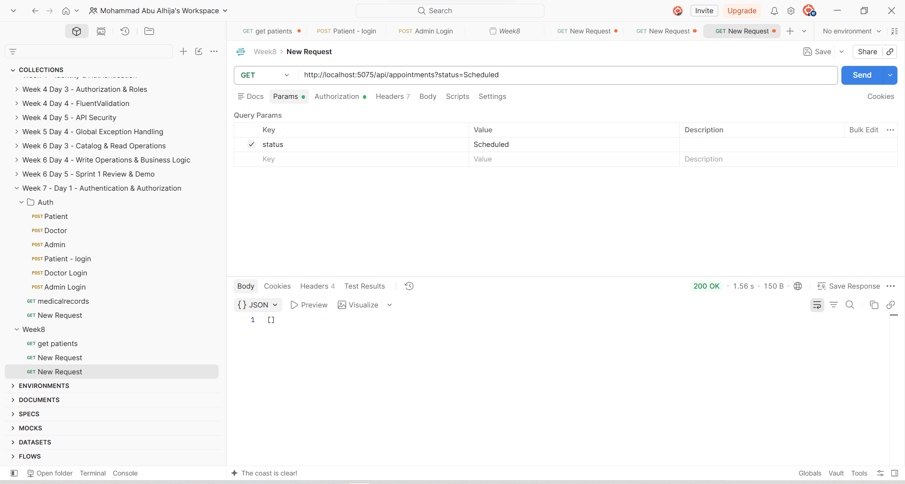

# Week 8 — Sprint 3 — Day 4

## Database Indexing & Performance Profiling

### Overview

Day 4 of **Sprint 3** focused on understanding when database indexes are genuinely useful and applying a composite index to improve the performance of a frequently filtered query.

The main goal was not to add indexes randomly, but to identify an actual query pattern in the application and create an index that matches the columns used together in the filtering conditions.

The performance of the selected query was measured before and after adding the index using EF Core SQL query logging.

---

## Learning Objectives

* Understand when a database index is needed.
* Identify columns that are frequently used for filtering.
* Understand the importance of composite indexes.
* Add a composite index using EF Core Fluent API.
* Create and apply an EF Core migration.
* Measure query performance before and after indexing.
* Document the performance results based on actual measurements.

---

## 1. Identifying the Index Candidate

The `Appointments` endpoint was selected because patient appointment queries frequently filter appointments using both:

* `PatientId`
* `Status`

The relevant query in `AppointmentsController` applies these filters:

```csharp
query = query.Where(a => a.PatientId == patient.Id);

if (!string.IsNullOrWhiteSpace(status))
    query = query.Where(a => a.Status == status);
```

This results in SQL similar to:

```sql
SELECT [a].[Id],
       [a].[PatientId],
       [a].[DoctorId],
       [a].[AppointmentDate],
       [a].[Reason],
       [a].[Status]
FROM [Appointments] AS [a]
WHERE [a].[PatientId] = @patient_Id
  AND [a].[Status] = @status
```

Since the query filters on both columns together, a composite index on `(PatientId, Status)` was selected.

---

## 2. Composite Index Implementation

The composite index was added to `AppDbContext` using EF Core Fluent API:

```csharp
builder.Entity<Appointment>()
    .HasIndex(a => new { a.PatientId, a.Status })
    .HasDatabaseName("IX_Appointments_PatientId_Status");
```

This creates the following database index:

```text
IX_Appointments_PatientId_Status
```

The index was specifically designed around the actual filtering pattern used by the appointments endpoint.

---

## 3. Database Migration

A new EF Core migration was created:

```bash
dotnet ef migrations add AddAppointmentPatientStatusIndex
```

The migration was then applied to the database:

```bash
dotnet ef database update
```

The migration successfully created the composite index:

```text
IX_Appointments_PatientId_Status
```

The migration also replaced the previous single-column `PatientId` index with the new composite index, avoiding unnecessary duplicate indexing for the same query pattern.

---

## 4. Performance Profiling

The following endpoint was used for testing:

```http
GET /api/appointments?status=Scheduled
```

The same request and filtering conditions were used for both measurements.

### Before Adding the Composite Index

EF Core logging showed that the appointment query took:

```text
54ms
```

The executed query was:

```sql
SELECT [a].[Id], [a].[PatientId], [a].[DoctorId],
       [a].[AppointmentDate], [a].[Reason], [a].[Status]
FROM [Appointments] AS [a]
WHERE [a].[PatientId] = @patient_Id
  AND [a].[Status] = @status
```

### After Adding the Composite Index

After applying the migration and running the same request again, EF Core logging showed:

```text
18ms
```

The same query was executed using the indexed columns.

### Performance Comparison

| Measurement  | Query Time |
| ------------ | ---------: |
| Before Index |       54ms |
| After Index  |       18ms |
| Difference   |       36ms |
| Improvement  |     ~66.7% |

The measured result represents approximately a **66.7% reduction in the recorded query execution time** for this test run.

Because the test was performed locally with a relatively small dataset, the exact timing can vary between executions. Therefore, the measurement is treated as evidence from this specific profiling run rather than a guaranteed performance improvement under all workloads.

---

## 5. Testing Evidence

The endpoint was tested successfully through Postman:

```http
GET http://localhost:5075/api/appointments?status=Scheduled
```

The request returned:

```text
200 OK
```

The EF Core logs also confirmed that the query filters using both:

```text
PatientId
Status
```

### After Index Test



The screenshot shows the successful appointment request after applying the composite index.

---

## 6. Indexing Decision

The composite index was added because the application has a real query that repeatedly filters appointments using the combination of `PatientId` and `Status`.

The decision was based on the actual query pattern rather than adding indexes arbitrarily.

Other commonly used columns were also considered:

* `Appointments.PatientId` already had an index before this work.
* `VitalSigns.PatientId` already has an index because it is frequently used for patient-related queries.
* `Patients.UserId` already has a unique index because it is used to associate application users with patients.

Therefore, no unnecessary additional indexes were introduced.

---

## Conclusion

Day 4 successfully introduced database indexing and performance profiling into the project.

A composite index was added to the `Appointments` table:

```text
IX_Appointments_PatientId_Status
```

The index matches the filtering pattern used by the appointments endpoint and was implemented through EF Core Fluent API and an EF Core migration.

The measured query execution time decreased from **54ms before indexing to 18ms after indexing**, representing an approximately **66.7% improvement in the recorded test run**.

This exercise reinforced the importance of choosing indexes based on actual query patterns and validating their impact through performance measurements rather than adding indexes without evidence.
