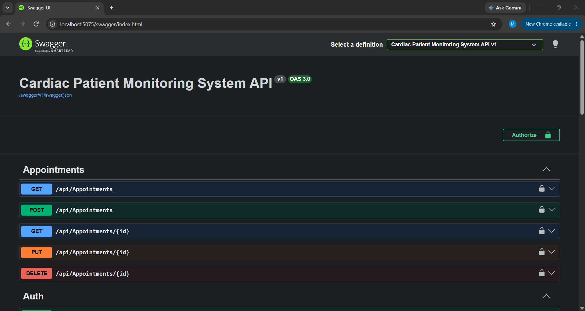
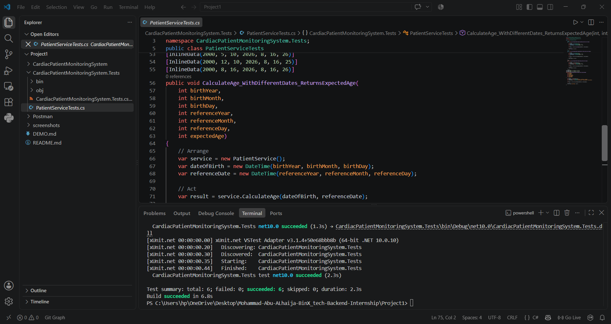
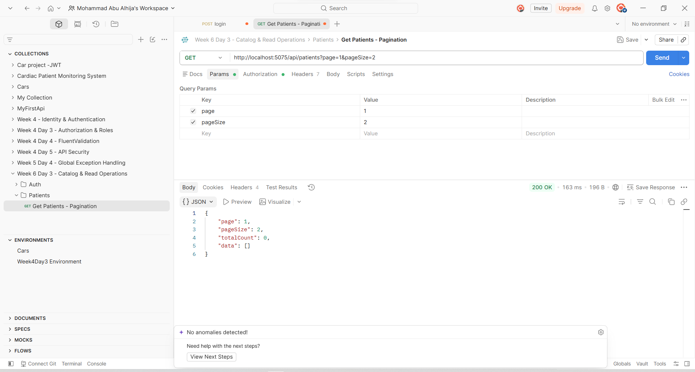
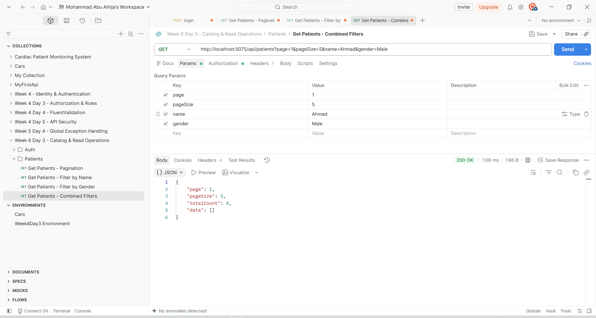
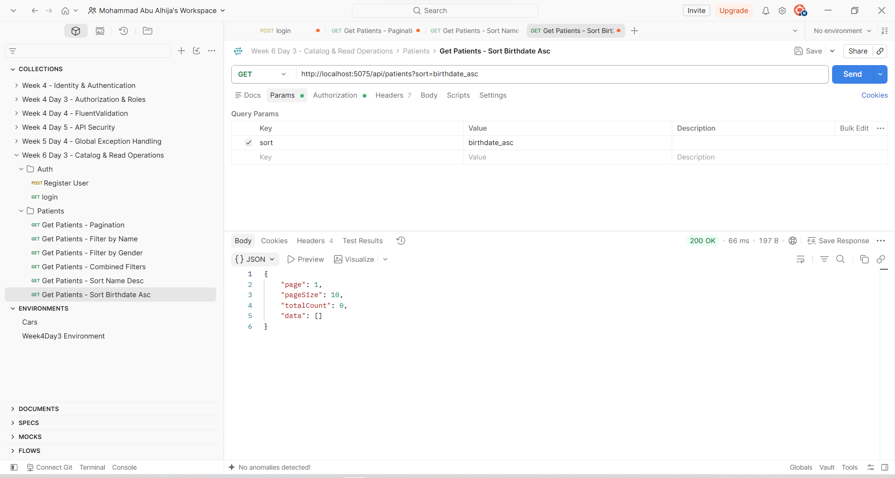
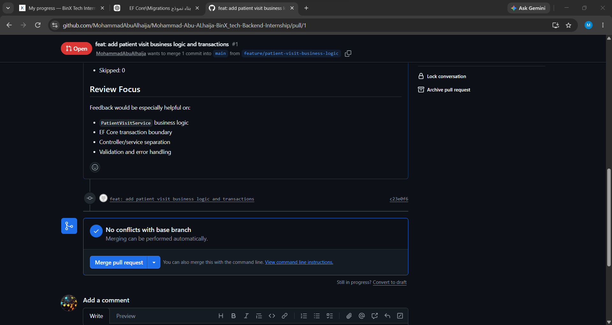

# Cardiac Patient Monitoring System — V2

## Overview

The **Cardiac Patient Monitoring System** is an ASP.NET Core Web API project built to practice backend development through a realistic healthcare domain.

The project started with **Version 1**, where I built the main API foundation and applied the concepts I learned during the first phase of my backend training.

**Version 2** continues from that foundation.

Instead of rebuilding the project from scratch, I am gradually improving the existing system as I learn and apply more advanced backend concepts. The main focus is now on improving the database design, making the API more scalable, and evolving the project into a more complete backend system.

This README will continue to grow as new features and improvements are added to V2.

---

# From V1 to V2

## What Was Already Built in V1?

Version 1 established the main backend foundation of the project.

The first version included four main resources:

- Patients
- Vital Signs
- Medications
- Appointments

The API supported asynchronous CRUD operations using ASP.NET Core and Entity Framework Core with SQL Server.

V1 also included:

- Entity Framework Core Code-First
- SQL Server LocalDB
- ASP.NET Core Identity
- JWT Authentication
- Protected API routes
- FluentValidation
- LINQ filtering
- Swagger / OpenAPI
- Postman testing
- Global exception handling
- Request logging middleware
- xUnit tests
- Moq tests
- Validator tests
- Integration tests

By the end of V1, the project had **13 automated tests passing**, including unit, validator, and integration tests.

### V1 API Overview

Swagger was used to review and test the available API endpoints.



### Authentication

The project already supported registration, login, JWT generation, and protected API routes.


A valid JWT could then be used to access protected endpoints:


### Validation & Error Handling

FluentValidation was used to reject invalid requests before they reached the main application logic.


The project also included centralized exception handling:


### Automated Testing

The testing layer grew gradually throughout V1.

xUnit tests:



Moq-based tests:


Integration tests:


These features became the starting point for Version 2.

Instead of replacing them, V2 builds on top of them and improves the project step by step.

---

# Version 2 Development

## Sprint-Based Development

One of the first changes in V2 was how I approached the project itself.

Instead of immediately adding features, I started **Sprint 1** by planning the work first.

I created a sprint backlog in Notion and divided the work into smaller tasks that could realistically be completed within roughly half a day to one day.

The board uses:

- Not started
- In progress
- Done

This gives me a clearer view of what has already been completed, what I am currently working on, and what still needs to be implemented.

The goal is to keep the development process organized while continuing to improve the project throughout the sprint.

---

# Database Redesign

## Expanding the Original Model

The original version mainly revolved around:

```text
Patient
├── VitalSigns
├── Medications
└── Appointments
```

That structure was enough for the first version of the project, but V2 needed a more complete representation of the system.

I redesigned the database around the full project instead of only the features that were already implemented.

The new design includes:

```text
Patients
PatientPhones
EmergencyContacts

Doctors
DoctorPhones
Departments

VitalSigns

Medications
PatientMedications

Appointments

MedicalRecords

ASP.NET Core Identity Users
```

This was an important change because the database is now being designed as the foundation for future project features rather than only reflecting the controllers that currently exist.

---

## Updated Entity Relationship Diagram

I created a new ERD for V2 using **dbdiagram.io**.


The diagram represents the current target database structure for the project.

Some of the main relationships are:

```text
AspNetUsers 1 ---- 0..1 Patient
AspNetUsers 1 ---- 0..1 Doctor

Patient 1 ---- * PatientPhone
Patient 1 ---- * EmergencyContact
Patient 1 ---- * VitalSign
Patient 1 ---- * PatientMedication
Patient 1 ---- * Appointment
Patient 1 ---- * MedicalRecord

Department 1 ---- * Doctor

Doctor 1 ---- * DoctorPhone
Doctor 1 ---- * Appointment
Doctor 1 ---- * MedicalRecord

Doctor 1 ---- * Doctor
        Supervisor relationship

Medication 1 ---- * PatientMedication
```

Patients and doctors are also connected to their ASP.NET Core Identity accounts through `UserId`.

This prepares the project for future authorization rules where users can have different responsibilities such as:

```text
Patient
Doctor
Admin
```

---

# Database Normalization Improvements

While redesigning the database, I reviewed the structure using the normalization concepts I learned earlier.

The goal was to reduce unnecessary duplication and keep each table responsible for one clear type of information.

## Patient and Doctor Phone Numbers

Instead of keeping one phone number directly inside a Patient or Doctor record, phone numbers now have their own tables:

```text
PatientPhones
DoctorPhones
```

This allows one person to have multiple phone numbers without adding repeated columns such as:

```text
Phone1
Phone2
Phone3
```

---

## Medication Redesign

The medication structure also changed significantly.

In V1, the `Medication` entity contained both medication information and patient-specific information such as:

```text
PatientId
Dosage
Frequency
StartDate
EndDate
```

In V2, those responsibilities are separated.

`Medication` now represents the medication itself:

```text
Medication
├── Id
├── Name
└── Description
```

while the relationship between a patient and a medication is stored in:

```text
PatientMedication
├── PatientId
├── MedicationId
├── Dosage
├── Frequency
├── StartDate
└── EndDate
```

This means the same medication can be assigned to multiple patients without duplicating its main information.

---

# Building the Full EF Core Model

Once the ERD was finalized, I moved from database planning into implementation.

The existing model layer was expanded to include:

```text
Patient
Doctor
Department
Appointment
VitalSign
Medication
PatientMedication
PatientPhone
DoctorPhone
EmergencyContact
MedicalRecord
```

ASP.NET Core Identity remains part of the system through the existing Identity tables.

Navigation properties were added so that the relationships from the ERD are represented directly in C#.

For example:

```csharp
public ICollection<VitalSign> VitalSigns { get; set; }
    = new List<VitalSign>();
```

and each vital sign references its patient:

```csharp
public int PatientId { get; set; }

public Patient Patient { get; set; } = null!;
```

The same approach was used throughout the rest of the model.

---

# Updating Existing Models

Moving to the new database design also meant that some parts of V1 had to change.

Rather than keeping old properties only to avoid modifying the existing code, I updated the affected DTOs, controllers, and validators to follow the new design.

## Patients

The old Patient model contained:

```text
PhoneNumber
Address
```

`PhoneNumber` is no longer stored directly on the Patient because patient phone numbers now have their own `PatientPhones` table.

`UserId` was also introduced so a Patient can be connected to an ASP.NET Core Identity user.

---

## Appointments

V1 stored the doctor's name directly inside an appointment:

```text
DoctorName
```

V2 replaces this with:

```text
DoctorId
```

The appointment now references a real Doctor record.

Conceptually, the relationship became:

```text
Patient
   \
    Appointment
   /
Doctor
```

The API logic was also updated to check that the requested patient and doctor exist before creating or updating an appointment.

---

## Medications

The old medication model mixed medication information with the patient's prescription information.

After normalization, `Medication` became reference data:

```text
Name
Description
```

while patient-specific prescription information belongs to `PatientMedication`.

---

## Vital Signs

The existing Vital Sign structure already matched the new database design.

Because of that, I kept the existing model, DTOs, controller logic, and validation rules instead of changing code unnecessarily.

---

# Fluent API Relationships

Several important relationships were explicitly configured inside `AppDbContext`.

For example, the Patient → Vital Signs relationship:

```csharp
builder.Entity<Patient>()
    .HasMany(p => p.VitalSigns)
    .WithOne(v => v.Patient)
    .HasForeignKey(v => v.PatientId)
    .OnDelete(DeleteBehavior.Cascade);
```

In this case, `Cascade` makes sense because a Vital Sign record belongs to a specific patient.

The Department → Doctors relationship uses:

```csharp
.OnDelete(DeleteBehavior.Restrict);
```

This prevents a department from being deleted while doctors are still assigned to it.

The Doctor model also contains a self-referencing relationship:

```text
Doctor
   ↓
Supervisor
   ↓
Other Doctors
```

This allows one doctor to supervise multiple doctors.

Patient and Doctor relationships with ASP.NET Core Identity were also configured explicitly through `UserId`.

---

# Reference Seed Data

V2 also introduced reference seed data for Departments using EF Core `HasData()`.

The initial departments are:

| Id | Department |
|---:|---|
| 1 | Cardiology |
| 2 | Emergency |
| 3 | Internal Medicine |

This ensures that basic department data exists automatically when the database is created through migrations.

---

# Database Migration

After updating:

- Entities
- Navigation properties
- DTOs
- Controllers
- Validators
- `AppDbContext`

I verified the project using:

```bash
dotnet build
```

Once the project compiled successfully, I generated the migration:

```bash
dotnet ef migrations add BuildFullDataModel
```

Because this project already had migration history from V1, I kept that history rather than starting over.

I also reviewed the generated migration before applying it.

The migration included the expected:

- Tables
- Columns
- Foreign keys
- Indexes
- Relationships
- Department seed data
- Removal of fields from the previous model

---

## Rebuilding the Development Database

The existing local database contained test data created while developing V1.

Some of those records no longer matched the new relationships. For example, older appointments existed before `DoctorId` became part of the model.

Since this was development/test data rather than production data, I removed the old local database:

```bash
dotnet ef database drop
```

and recreated it from the migration history:

```bash
dotnet ef database update
```

The final schema was then verified directly using **SQL Server Management Studio (SSMS)**.

At this stage, the database model matched the redesigned ERD and the Department seed data was successfully inserted.

The new entities are currently part of the EF Core model. Their controllers will be introduced when upcoming project requirements require API operations for those resources.

---

# Improving Read Operations

After completing the database work, I moved back to the API layer.

One of the first endpoints improved in V2 was:

```http
GET /api/patients
```

In V1, the endpoint simply returned every patient:

```csharp
var patients = await _context.Patients.ToListAsync();
```

That works with a small development database, but it becomes inefficient when the amount of data grows.

The V2 endpoint was redesigned to support:

- Pagination
- Filtering
- Sorting
- DTO projection
- More controlled database queries

---

# Patient Response DTO

Instead of returning the full `Patient` entity from the list endpoint, I created:

```text
PatientResponse
```

with only the fields needed by the client:

```csharp
public class PatientResponse
{
    public int Id { get; set; }

    public string FullName { get; set; } = string.Empty;

    public DateTime DateOfBirth { get; set; }

    public string Gender { get; set; } = string.Empty;
}
```

The query then projects directly to this DTO:

```csharp
.Select(p => new PatientResponse
{
    Id = p.Id,
    FullName = p.FullName,
    DateOfBirth = p.DateOfBirth,
    Gender = p.Gender
})
```

This keeps the public API response separate from the internal database entity and avoids returning fields such as `UserId` when they are not needed.

---

# Pagination

The Patients endpoint now supports:

```text
page
pageSize
```

Example:

```http
GET /api/patients?page=1&pageSize=2
```

The EF Core query uses:

```csharp
.Skip((page - 1) * pageSize)
.Take(pageSize)
```

and also calculates:

```csharp
var totalCount = await query.CountAsync();
```

The API can therefore return both the requested page and information about the number of matching records.

### Postman Verification

The pagination behavior was tested through Postman:



---

# Dynamic Filtering

Instead of creating separate endpoints for different searches, the Patients endpoint now starts from:

```csharp
var query = _context.Patients.AsQueryable();
```

Optional conditions are then added before the query is executed.

This makes it possible to build the final database query based on the parameters provided by the client.

---

## Filtering by Name

The first optional filter is:

```text
name
```

Example:

```http
GET /api/patients?name=Ahmad
```

The condition is only applied when a value is supplied:

```csharp
if (!string.IsNullOrWhiteSpace(name))
{
    query = query.Where(p => p.FullName.Contains(name));
}
```

### Postman Verification


---

## Filtering by Gender

The second optional filter is:

```text
gender
```

Example:

```http
GET /api/patients?gender=Male
```

implemented using:

```csharp
if (!string.IsNullOrWhiteSpace(gender))
{
    query = query.Where(p => p.Gender == gender);
}
```

### Postman Verification


---

## Combining Query Parameters

The query parameters can also work together.

For example:

```http
GET /api/patients?page=1&pageSize=5&name=Ahmad&gender=Male
```

The filters are applied before pagination.

`totalCount` is also calculated after filtering:

```csharp
var totalCount = await query.CountAsync();
```

so it represents the number of matching patients rather than the number of all patients in the database.

### Postman Verification



---

# Sorting

The Patients endpoint also supports sorting through the `sort` query parameter.

```csharp
query = sort switch
{
    "name_desc" => query.OrderByDescending(p => p.FullName),
    "birthdate_asc" => query.OrderBy(p => p.DateOfBirth),
    "birthdate_desc" => query.OrderByDescending(p => p.DateOfBirth),
    _ => query.OrderBy(p => p.FullName)
};
```

If no sort option is supplied, patients are ordered by name by default.

---

## Sort by Name

Example:

```http
GET /api/patients?sort=name_desc
```

### Postman Verification


---

## Sort by Birth Date

Example:

```http
GET /api/patients?sort=birthdate_asc
```

### Postman Verification



---

# Current Patient Query Flow

The improved list endpoint now follows a much clearer query flow:

```text
Patients
   │
   ▼
Build IQueryable
   │
   ▼
Apply Optional Filters
   │
   ▼
Count Matching Records
   │
   ▼
Apply Sorting
   │
   ▼
Apply Pagination
   │
   ▼
Project to PatientResponse DTO
   │
   ▼
Execute with ToListAsync()
   │
   ▼
Return Response
```

This means the API no longer needs to retrieve the full Patients table before deciding what the client actually needs.

---

# Current Patients Catalog Endpoint

The endpoint currently supports combinations such as:

```http
GET /api/patients
```

```http
GET /api/patients?page=1&pageSize=5
```

```http
GET /api/patients?name=Ahmad
```

```http
GET /api/patients?gender=Male
```

```http
GET /api/patients?sort=name_desc
```

```http
GET /api/patients?page=1&pageSize=5&name=Ahmad&gender=Male&sort=name_desc
```

The same route can therefore handle browsing, filtering, sorting, and pagination without creating separate endpoints for every combination.

---

# Business Logic & Transactional Write Operations

After improving the read side of the API, the next step in V2 was to move beyond simple CRUD operations and introduce a write operation with real business logic.

Instead of using the generic order and stock example from the lesson, I adapted the same concept to the healthcare domain of the project by implementing a **Patient Visit** workflow.

A patient visit now combines clinical information that needs to be stored across more than one part of the system.

---

## Patient Visit Request

I created a dedicated request DTO:

```text
CreatePatientVisitRequest
```

The request contains:

- Patient ID
- Doctor ID
- Diagnosis
- Notes
- Heart rate
- Systolic blood pressure
- Diastolic blood pressure
- Measurement date

A dedicated `CreatePatientVisitValidator` was also added to validate the basic request data before the business operation is executed.

This keeps the API contract separate from the database entities and gives the patient visit operation its own clear input model.

---

# Patient Visit Service

The main business logic was moved into:

```text
PatientVisitService
```

Instead of placing the entire operation inside a controller, the service handles the workflow and database interaction.

Before creating anything, it checks that:

- The Patient exists
- The Doctor exists
- The vital-sign measurement is not dated in the future

The workflow follows this structure:

```text
Create Patient Visit
        │
        ▼
Check Patient
        │
        ▼
Check Doctor
        │
        ▼
Apply Business Rules
        │
        ▼
Begin Transaction
        │
        ├── Create MedicalRecord
        │
        └── Create VitalSign
        │
        ▼
Save Changes
        │
        ▼
Commit
```

If an exception occurs while processing the database operation, the transaction is rolled back.

This keeps the write operation consistent instead of allowing part of the visit to be saved while another part fails.

---

# EF Core Transaction

The patient visit operation performs multiple related database writes.

One request creates both:

```text
MedicalRecord
VitalSign
```

These changes are wrapped inside an explicit EF Core transaction:

```csharp
await using var transaction =
    await _context.Database.BeginTransactionAsync();

try
{
    _context.MedicalRecords.Add(medicalRecord);
    _context.VitalSigns.Add(vitalSign);

    await _context.SaveChangesAsync();

    await transaction.CommitAsync();
}
catch
{
    await transaction.RollbackAsync();
    throw;
}
```

This introduced a clear transaction boundary around the patient visit workflow and provided practical experience with multi-step write operations.

---

# Patient Visits API

A new controller was introduced:

```text
PatientVisitsController
```

with the endpoint:

```http
POST /api/patientvisits
```

The controller remains small and delegates the main work to `PatientVisitService`.

Conceptually, the request now follows:

```text
HTTP Request
     │
     ▼
PatientVisitsController
     │
     ▼
PatientVisitService
     │
     ▼
Business Rules
     │
     ▼
EF Core Transaction
     │
     ├── MedicalRecord
     └── VitalSign
```

This is an important improvement over putting database and business logic directly inside the controller.

---

## Successful Patient Visit

The new operation was tested through Postman with an existing Patient and Doctor.

The request successfully completed the visit workflow and returned:

```text
200 OK
```


---

## Verifying the Database Write

After the visit was created, the Vital Signs API was used to verify that the measurements supplied in the patient visit request were actually stored.

The created record contained the expected heart rate and blood pressure values.


This confirmed that the successful response represented an actual database write.

---

# Business Rule Verification

The patient visit operation also includes business logic that prevents a vital-sign measurement from being recorded with a future date.

A request containing a future `MeasuredAt` value was tested through Postman.

The API correctly rejected the operation with:

```text
400 Bad Request
```

and returned:

```text
Measurement date cannot be in the future.
```


This demonstrates that the new endpoint performs domain-related checks rather than simply mapping incoming fields to database entities.

---

# Initial Doctor API Support

The expanded V2 database already included the `Doctor` entity, but the API layer did not yet provide a way to create doctors.

To support the new patient visit workflow, I introduced:

```text
DoctorsController
CreateDoctorRequest
CreateDoctorValidator
```

Doctor creation checks that:

- The Identity user exists
- The Department exists
- The Supervisor exists when one is provided
- The same Identity user is not already assigned to another Doctor record

The existing seeded `Cardiology` department was used while preparing the doctor required for the patient visit tests.

This is also the first step toward bringing the API layer in line with the larger V2 domain model.

---

# Identity Registration Improvement

The existing registration endpoint was slightly improved for the expanded V2 model.

Previously, successful registration returned only a message.

It now also returns the generated Identity user ID:

```json
{
  "message": "User registered successfully.",
  "userId": "..."
}
```

This makes it easier to connect newly registered Identity users to domain records such as Patients and Doctors.

---

# Updating Automated Tests for V2

Before preparing the new work for code review, I ran the existing automated test suite.

Some tests were still based on the older V1 Patient model and referenced fields such as:

```text
PhoneNumber
Address
```

Those tests were updated to match the normalized V2 model.

The integration-test setup was also updated so that its isolated in-memory database explicitly creates the Patient required by `PatientsApiTests`.

This keeps the tests independent from the real development database and gives them predictable data.

---

## Final Automated Test Result

After updating the affected tests, the complete test suite was executed again.

The final result was:

```text
Total: 13
Succeeded: 13
Failed: 0
Skipped: 0
```


This confirmed that the existing automated testing layer remained successful after the new V2 changes.

---

# Pull Request & Code Review

After completing the Patient Visit implementation and verifying the project locally, I pushed the feature branch to GitHub and opened a Pull Request into `main`.

The work was developed on:

```text
feature/patient-visit-business-logic
```

Before opening the Pull Request, the automated test suite was executed successfully with:

```text
Total: 13
Succeeded: 13
Failed: 0
Skipped: 0
```

The Pull Request summarizes the V2 changes and highlights the main areas where code-review feedback would be useful:

- `PatientVisitService` business logic
- EF Core transaction boundary
- Controller/service separation
- Validation and error handling

## Pull Request



The Pull Request was intentionally left open for review rather than being merged immediately.

---

# V2 Progress So Far

Version 2 currently builds on the original project in several important areas.

### Database

- Redesigned the project database
- Expanded the system beyond the original four entities
- Applied normalization concepts
- Added Doctors and Departments
- Added Patient and Doctor phone tables
- Added Emergency Contacts
- Added Medical Records
- Added PatientMedications
- Added Doctor supervision
- Connected Patients and Doctors to Identity users

### Entity Framework Core

- Expanded the EF Core model
- Added navigation properties
- Added DbSets for the new entities
- Configured important relationships with Fluent API
- Defined delete behaviors
- Added Department seed data
- Generated and reviewed `BuildFullDataModel`
- Recreated and verified the development database

### API

- Introduced a dedicated Patient response DTO
- Added pagination
- Added optional filtering
- Added sorting
- Used `IQueryable` to build queries dynamically
- Added DTO projection
- Reduced unnecessary data retrieval
- Added the Patient Visits business operation
- Added `PatientVisitService`
- Added the initial Doctors API
- Added business-rule validation for patient visits
- Added multi-step database writes
- Added EF Core transaction handling
- Improved Identity registration to return the generated User ID

### Verification

- Continued using `dotnet build` while making structural changes
- Verified the database through SSMS
- Tested API behavior through Postman
- Saved screenshots for the important V2 changes
- Tested successful patient visit creation
- Tested business-rule rejection
- Verified the created Vital Sign
- Updated older tests to match the V2 model
- Verified all 13 automated tests pass


---

# Project Structure

The V2 project currently follows the existing ASP.NET Core structure while adding the new database entities:

```text
Project - V2/
│
├── CardiacPatientMonitoringSystem/
│   │
│   ├── Controllers/
│   ├── Data/
│   ├── DTOs/
│   ├── Middleware/
│   ├── Migrations/
│   ├── Models/
│   ├── Services/
│   ├── Validators/
│   │
│   ├── Program.cs
│   └── appsettings.json
│
├── CardiacPatientMonitoringSystem.Tests/
│
├── Postman/
│
├── Screenshots/
│
└── README.md
```

The project still keeps the testing, middleware, authentication, validation, and API foundation developed in V1 while the domain model and API behavior continue to evolve in V2.

---

# Technologies Used

- C#
- .NET 10
- ASP.NET Core Web API
- Entity Framework Core
- SQL Server LocalDB
- SQL Server Management Studio
- ASP.NET Core Identity
- JWT Authentication
- FluentValidation
- LINQ
- xUnit
- Moq
- ASP.NET Core Integration Testing
- Swagger / OpenAPI
- Postman
- dbdiagram.io
- Git & GitHub

---

# Current Status

**Version 2 is still under active development.**

The project is intentionally being improved incrementally rather than implementing every planned feature at once.

So far, V2 has moved the project from the simpler V1 database model into a more complete normalized domain model, improved read operations with pagination, filtering, sorting, and DTO projection, and has now started introducing more structured write operations with dedicated services, business rules, and database transactions.

The Patient Visit workflow is the first V2 operation that coordinates multiple database changes as one business process.

The API layer is also gradually being expanded to support the larger V2 domain model, starting with Doctors and Patient Visits.

The next sections of this README will continue to be added as new V2 features are implemented, tested, and reviewed.