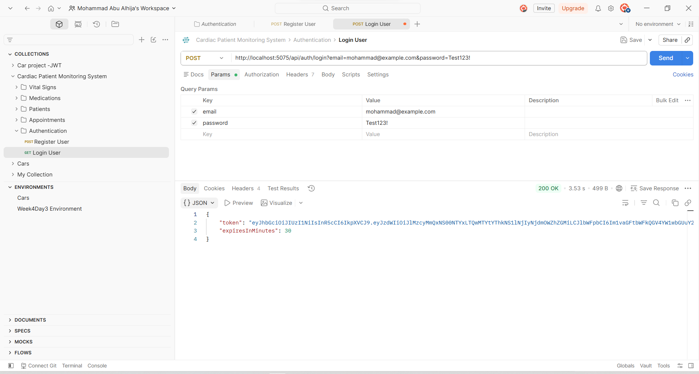
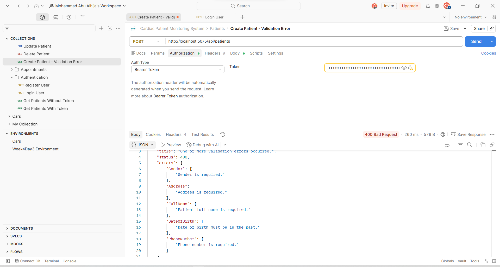
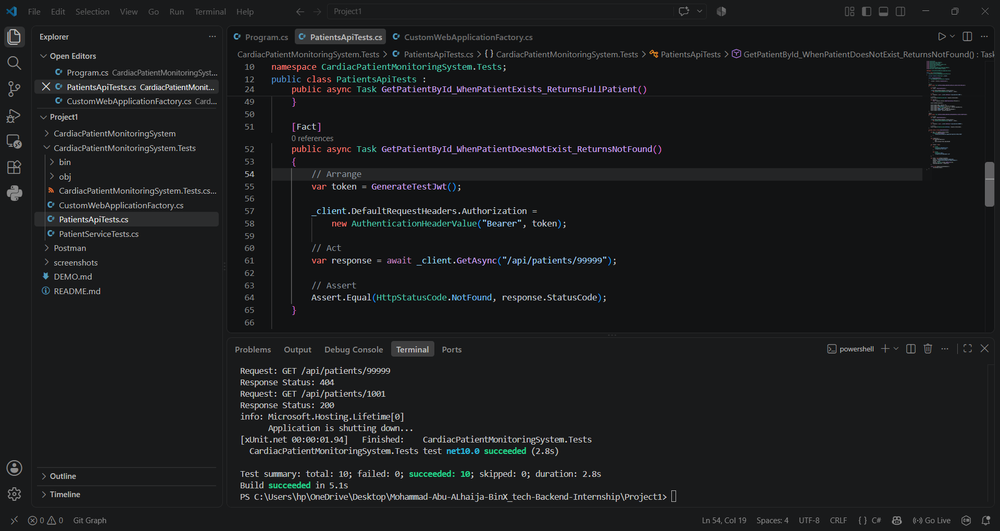
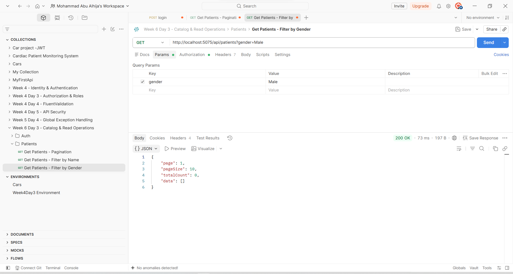
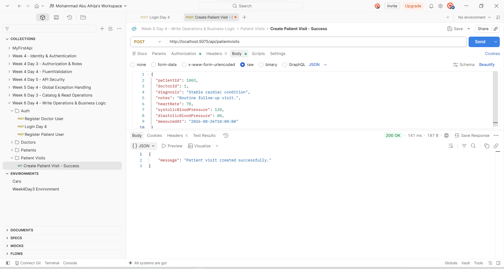
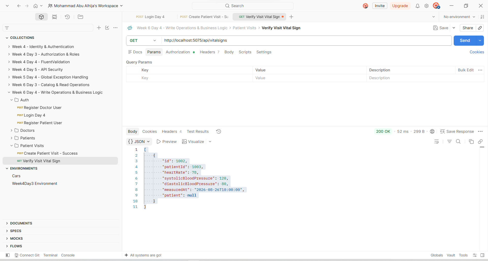
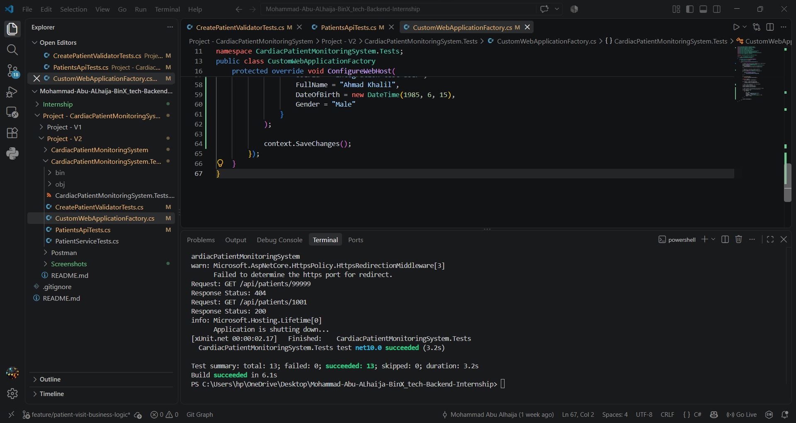
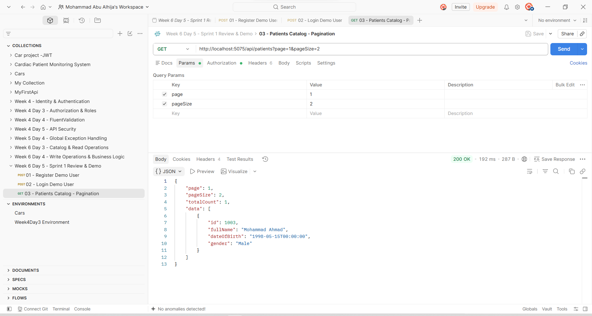
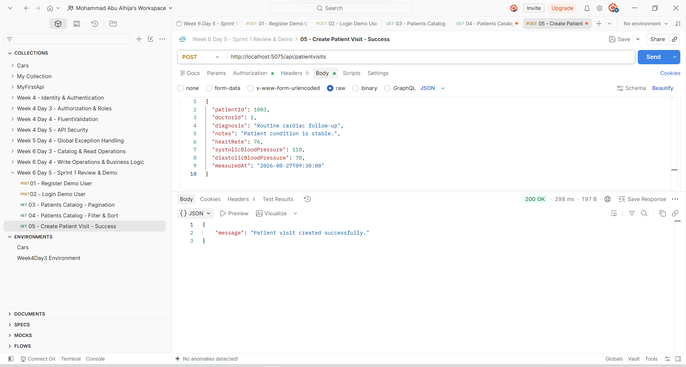

# Cardiac Patient Monitoring System — V3

## Overview

The **Cardiac Patient Monitoring System** is an ASP.NET Core Web API project developed as part of my backend development training.

The project has evolved through three main versions:

```text
Version 1
    │
    ├── API Foundation
    ├── CRUD Operations
    ├── Entity Framework Core
    ├── SQL Server
    ├── ASP.NET Core Identity
    ├── JWT Authentication
    ├── Authorization
    ├── FluentValidation
    ├── Middleware
    └── Automated Testing
            │
            ▼
Version 2
    │
    ├── Database Redesign
    ├── Normalization
    ├── Expanded Domain Model
    ├── Pagination
    ├── Filtering
    ├── Sorting
    ├── DTO Projection
    ├── Business Logic
    ├── Services
    ├── Transactions
    └── Expanded API
            │
            ▼
Version 3
    │
    ├── Identity Redesign
    ├── Admin / Doctor / Patient Roles
    ├── Domain User Linking
    ├── Expanded Controllers
    ├── Role-Based Authorization
    ├── Automated Testing
    └── Preparation for Week 7
````

Version 3 builds directly on the work completed in V1 and V2.

The main focus at the end of **Week 6** was to make the Identity system more realistic by separating users into three main roles:

```text
Admin
Doctor
Patient
```

The API was also expanded with the remaining controllers required by the larger V2 domain model.

This README will continue to be updated during **Week 7** as new functionality is added to V3.

---

# Version 1 — Building the Foundation

Version 1 was the starting point of the Cardiac Patient Monitoring System.

The main goal was to build a functional ASP.NET Core Web API and apply the backend concepts learned during the first phase of the training.

The initial system focused on four main resources:

```text
Patient
├── Vital Signs
├── Medications
└── Appointments
```

The API supported asynchronous CRUD operations using ASP.NET Core and Entity Framework Core with SQL Server.

V1 introduced:

* ASP.NET Core Web API
* Entity Framework Core
* SQL Server LocalDB
* Code First approach
* ASP.NET Core Identity
* JWT Authentication
* Protected API routes
* FluentValidation
* LINQ
* Swagger / OpenAPI
* Postman
* Global Exception Handling
* Request Logging Middleware
* xUnit
* Moq
* Validator Tests
* Integration Tests

By the end of V1, the project had:

```text
13 automated tests passing
```

## V1 API Overview

Swagger was used to review and test the available API endpoints.


Swagger provided a clear overview of the available endpoints and made it easier to test the API during development.

---

## V1 Authentication

ASP.NET Core Identity and JWT Authentication were introduced in V1.

The authentication flow allowed users to register and log in to receive a JWT token.



The generated JWT could then be used to access protected API endpoints.


At this stage, authentication was mainly focused on proving the identity of the user and protecting API routes.

The more detailed separation between Admin, Doctor, and Patient was introduced later in V3.

---

## V1 Validation

FluentValidation was used to validate incoming API requests before they reached the main application logic.



This provided clearer validation responses and kept validation rules separate from the controller logic.

---

## V1 Global Exception Handling

A centralized exception-handling middleware was also introduced.


This allowed unexpected exceptions to be handled consistently instead of implementing separate exception handling logic inside every controller.

---

## V1 Automated Testing

Testing was gradually introduced throughout V1.

The project included:

* xUnit tests
* Validator tests
* Moq-based tests
* Integration tests

### xUnit Tests


### Moq Tests


### Integration Tests



These tests became an important foundation for the later versions of the project.

---

# Version 2 — Expanding the Domain

Version 2 continued directly from V1.

Instead of rebuilding the application, the existing system was expanded into a more complete healthcare domain.

One of the biggest changes in V2 was the database redesign.

The original V1 structure was mainly:

```text
Patient
├── Vital Signs
├── Medications
└── Appointments
```

The V2 structure expanded into:

```text
Patients
PatientPhones
EmergencyContacts

Doctors
DoctorPhones
Departments

VitalSigns
Medications
PatientMedications

Appointments
MedicalRecords

ASP.NET Core Identity Users
```

The purpose of this redesign was to create a stronger foundation for future API functionality.

---

# V2 Database Redesign

The database was redesigned using normalization concepts.

The goal was to reduce unnecessary duplication and keep each table responsible for a clear type of information.

## Patient and Doctor Phone Numbers

Instead of storing multiple phone numbers directly inside Patient or Doctor records, separate tables were introduced:

```text
PatientPhones
DoctorPhones
```

This avoided structures such as:

```text
Phone1
Phone2
Phone3
```

and allowed a patient or doctor to have multiple phone numbers.

---

## Medication Redesign

In V1, the Medication entity contained both medication information and patient-specific prescription information.

For example:

```text
PatientId
Dosage
Frequency
StartDate
EndDate
```

In V2, these responsibilities were separated.

The Medication entity became:

```text
Medication
├── Id
├── Name
└── Description
```

while the relationship between a patient and a medication was moved into:

```text
PatientMedication
├── PatientId
├── MedicationId
├── Dosage
├── Frequency
├── StartDate
└── EndDate
```

This allowed the same medication to be assigned to multiple patients without duplicating the medication information.

---

# V2 Entity Relationship Diagram

The redesigned database was represented through an ERD using dbdiagram.io.


The main relationships included:

```text
AspNetUsers 1 ---- 0..1 Patient

AspNetUsers 1 ---- 0..1 Doctor

Patient 1 ---- * PatientPhone

Patient 1 ---- * EmergencyContact

Patient 1 ---- * VitalSign

Patient 1 ---- * PatientMedication

Patient 1 ---- * Appointment

Patient 1 ---- * MedicalRecord

Department 1 ---- * Doctor

Doctor 1 ---- * DoctorPhone

Doctor 1 ---- * Appointment

Doctor 1 ---- * MedicalRecord

Doctor 1 ---- * Doctor

        Supervisor relationship

Medication 1 ---- * PatientMedication
```

The ERD became the main reference for implementing the expanded EF Core model.

---

# V2 EF Core Model

After finalizing the ERD, the EF Core model was expanded to include:

```text
Patient
Doctor
Department
Appointment
VitalSign
Medication
PatientMedication
PatientPhone
DoctorPhone
EmergencyContact
MedicalRecord
```

Navigation properties were added to represent relationships directly in C#.

For example:

```csharp
public ICollection<VitalSign> VitalSigns { get; set; }
    = new List<VitalSign>();
```

and:

```csharp
public int PatientId { get; set; }

public Patient Patient { get; set; } = null!;
```

Important relationships were also configured using the EF Core Fluent API.

---

# V2 Database Migration

After updating the entities, navigation properties, DTOs, controllers, validators, and `AppDbContext`, the project was verified using:

```bash
dotnet build
```

The new database migration was created using:

```bash
dotnet ef migrations add BuildFullDataModel
```

The migration included the expected:

* Tables
* Columns
* Foreign Keys
* Indexes
* Relationships
* Department seed data
* Removal of fields from the previous model

The existing migration history was kept instead of starting again from an empty migration history.

The development database was recreated using:

```bash
dotnet ef database drop
```

followed by:

```bash
dotnet ef database update
```

The resulting database was then verified using SQL Server Management Studio.

---

# V2 Patient Catalog Improvements

After completing the database redesign, the Patients API was improved.

The original endpoint:

```http
GET /api/patients
```

was expanded to support:

* Pagination
* Filtering
* Sorting
* DTO projection
* Dynamic queries

Instead of returning the full Patient entity, a dedicated response DTO was introduced:

```text
PatientResponse
```

The query was built using `IQueryable`, allowing filtering, sorting, pagination, and projection to be applied before the query was executed.

---

# V2 Pagination

The Patients endpoint supports:

```text
page
pageSize
```

Example:

```http
GET /api/patients?page=1&pageSize=2
```

The query uses:

```csharp
.Skip((page - 1) * pageSize)
.Take(pageSize)
```

The endpoint also calculates the total number of matching records.


The screenshot demonstrates pagination being tested through Postman.

---

# V2 Filtering by Name

The Patients endpoint supports optional name filtering.

Example:

```http
GET /api/patients?name=Ahmad
```

The filter is applied only when a value is supplied.


This allows the client to search for patients without creating a separate endpoint for every possible search condition.

---

# V2 Filtering by Gender

The endpoint also supports filtering by gender.

Example:

```http
GET /api/patients?gender=Male
```



The filtering logic is applied dynamically to the existing `IQueryable`.

---

# V2 Combining Query Parameters

The query parameters can work together.

For example:

```http
GET /api/patients?page=1&pageSize=5&name=Ahmad&gender=Male
```

The filters are applied before pagination.

The `totalCount` value is calculated after filtering so it represents the number of matching patients.


This allowed the same endpoint to handle multiple query combinations without creating unnecessary routes.

---

# V2 Sorting

The Patients endpoint also supports sorting through the `sort` query parameter.

Supported examples include:

```text
name_desc
birthdate_asc
birthdate_desc
```

If no sorting option is supplied, patients are ordered by name by default.

---

## Sort by Name

Example:

```http
GET /api/patients?sort=name_desc
```


---

## Sort by Birth Date

Example:

```http
GET /api/patients?sort=birthdate_asc
```


---

# V2 Patient Query Flow

The improved Patients endpoint follows this flow:

```text
Patients
   │
   ▼
Build IQueryable
   │
   ▼
Apply Optional Filters
   │
   ▼
Count Matching Records
   │
   ▼
Apply Sorting
   │
   ▼
Apply Pagination
   │
   ▼
Project to PatientResponse DTO
   │
   ▼
Execute with ToListAsync()
   │
   ▼
Return Response
```

This improved the read operation by allowing the database query to retrieve only the required records and fields.

---

# V2 Business Logic — Patient Visit

Another important V2 improvement was moving beyond simple CRUD operations.

A Patient Visit workflow was introduced to represent a business operation that combines multiple pieces of healthcare information.

The workflow creates:

```text
MedicalRecord
+
VitalSign
```

as part of one operation.

---

## CreatePatientVisitRequest

A dedicated request DTO was introduced:

```text
CreatePatientVisitRequest
```

The request contains information such as:

* Patient ID
* Doctor ID
* Diagnosis
* Notes
* Heart rate
* Systolic blood pressure
* Diastolic blood pressure
* Measurement date

A dedicated validator was also added:

```text
CreatePatientVisitValidator
```

---

# V2 PatientVisitService

The main business logic was moved into:

```text
PatientVisitService
```

The service checks that:

* The Patient exists
* The Doctor exists
* The measurement date is not in the future

The workflow is:

```text
Create Patient Visit
        │
        ▼
Check Patient
        │
        ▼
Check Doctor
        │
        ▼
Apply Business Rules
        │
        ▼
Begin Transaction
        │
        ├── Create MedicalRecord
        │
        └── Create VitalSign
        │
        ▼
Save Changes
        │
        ▼
Commit
```

This kept the controller small and moved the business operation into a dedicated service.

---

# V2 EF Core Transaction

Because the Patient Visit operation creates multiple related records, an explicit EF Core transaction was used.

The transaction ensures that the operation is treated as one unit.

Conceptually:

```text
Patient Visit
     │
     ├── MedicalRecord
     │
     └── VitalSign
```

If the operation succeeds, the transaction is committed.

If an exception occurs, the transaction is rolled back.

This prevents a situation where only part of the Patient Visit is stored.

---

# V2 Patient Visit API

A new controller was introduced:

```text
PatientVisitsController
```

with:

```http
POST /api/patientvisits
```

The request flow became:

```text
HTTP Request
     │
     ▼
PatientVisitsController
     │
     ▼
PatientVisitService
     │
     ▼
Business Rules
     │
     ▼
EF Core Transaction
     │
     ├── MedicalRecord
     └── VitalSign
```

---

## Successful Patient Visit

The Patient Visit workflow was tested through Postman using an existing Patient and Doctor.

The request successfully completed and returned:

```text
200 OK
```



---

## Verifying the Database Write

After creating the Patient Visit, the Vital Signs endpoint was used to verify that the measurement was actually stored.



The created record contained the expected heart rate and blood pressure values.

---

## Business Rule Verification

The Patient Visit workflow also prevents vital-sign measurements from being recorded with a future date.

A request containing a future `MeasuredAt` value was tested.

The API correctly rejected the request with:

```text
400 Bad Request
```

and:

```text
Measurement date cannot be in the future.
```


This demonstrated that the endpoint was applying actual business rules rather than simply saving incoming data.

---

# V2 Initial Doctor API

The V2 database already contained the Doctor entity, but the API initially did not provide full Doctor functionality.

To support the Patient Visit workflow, the initial Doctor API was introduced.

The following components were added:

```text
DoctorsController
CreateDoctorRequest
CreateDoctorValidator
```

Doctor creation included checks such as:

* Identity user exists
* Department exists
* Supervisor exists when provided
* Identity user is not already assigned to another Doctor

The seeded Cardiology department was used when preparing the Doctor required for Patient Visit testing.

This became the first step toward connecting the larger V2 database model to the API layer.

---

# V2 Identity Registration Improvement

The existing registration endpoint was also slightly improved.

Previously, successful registration returned only a message.

It was updated to also return the generated Identity user ID.

Example:

```json
{
  "message": "User registered successfully.",
  "userId": "..."
}
```

Returning the generated User ID made it easier to connect an Identity account with domain entities such as Patients and Doctors.

---

# V2 Automated Tests

After changing the V1 model and expanding the V2 domain, some existing tests needed to be updated.

Some tests were still using fields that had been removed or moved during normalization.

For example:

```text
PhoneNumber
Address
```

The affected tests were updated to match the new V2 model.

The integration-test setup was also updated so that it creates the required Patient inside the isolated test database.

This kept the tests independent from the real development database.

---

# V2 Final Test Result

After updating the affected tests, the complete automated test suite was executed.

The result was:

```text
Total: 13
Succeeded: 13
Failed: 0
Skipped: 0
```



This confirmed that the existing automated testing layer remained successful after the V2 structural changes.

---

# V2 Pull Request & Code Review

The Patient Visit work was developed on:

```text
feature/patient-visit-business-logic
```

After completing the implementation and testing, the feature branch was pushed to GitHub and a Pull Request was opened into `main`.

The Pull Request focused on:

* PatientVisitService business logic
* EF Core transaction handling
* Controller/service separation
* Validation
* Error handling


The Pull Request was reviewed and approved by the mentor.

After approval, it was merged into `main`.

---

# V2 Sprint 1 Review

Sprint 1 concluded with a review and Postman demonstration of the main Version 2 functionality.

The demonstrated workflow was:

```text
Register User
      ↓
Login & Generate JWT
      ↓
Browse Patients
      ↓
Filtering & Sorting
      ↓
Create Patient Visit
      ↓
Verify Created Vital Sign
      ↓
Test Business Rule Error Case
```

---

## Patients Catalog Demo

The improved Patients endpoint was demonstrated using pagination.



Filtering and sorting were also tested together.


---

## Patient Visit Demo

A complete Patient Visit was created successfully through Postman.



After creating the visit, the Vital Signs endpoint was used to verify that the measurement was stored.


---

## Business Rule Demo

The Patient Visit workflow was tested with a future measurement date.

The API correctly rejected the request.


---

# Transition from V2 to V3

At the end of Week 6, the project moved from the V2 database and API expansion stage into V3.

The main reason for this transition was the need to make the Identity system match the healthcare domain more realistically.

Previously, Identity mainly represented users who could authenticate and access protected routes.

In V3, the system now distinguishes between:

```text
Admin
Doctor
Patient
```

The goal is to make authentication and authorization more meaningful by connecting the authenticated user to the correct role and domain entity.

The transition can be summarized as:

```text
V1
Basic Authentication
      │
      ▼
V2
Expanded Domain + Business Logic
      │
      ▼
V3
Role-Based Identity + Expanded API
```

---

# Version 3 — Identity Redesign

The biggest change introduced in V3 was the redesign of the Identity structure.

The project now works around three main user roles:

```text
Admin
Doctor
Patient
```

Each role represents a different responsibility within the system.

The general structure is:

```text
                    ASP.NET Core Identity
                            │
             ┌──────────────┼──────────────┐
             │              │              │
             ▼              ▼              ▼
           Admin          Doctor         Patient
                            │              │
                            ▼              ▼
                         Doctor          Patient
                         Entity          Entity
```

The Identity account remains responsible for authentication.

The domain entities contain the healthcare-specific information.

---

# V3 Admin Role

The Admin role represents the system administrator.

The Admin is responsible for system-level operations that should not be available to normal users.

The role is intended to provide access to administrative operations such as managing users and system resources according to the authorization rules implemented in the project.

The important distinction is that an Admin is an Identity role rather than a healthcare domain entity like Patient or Doctor.

Conceptually:

```text
Identity User
     │
     ▼
   Admin
```

This separation allows administrative permissions to be controlled using role-based authorization.

---

# V3 Doctor Role

The Doctor role represents healthcare professionals using the system.

A Doctor is connected to an Identity user through the user's `UserId`.

Conceptually:

```text
Identity User
     │
     ▼
   Doctor
     │
     ├── Department
     ├── Doctor Phones
     ├── Appointments
     ├── Medical Records
     └── Supervisor Relationship
```

This allows the authenticated Doctor account to be connected to the corresponding Doctor domain record.

The system can therefore distinguish between:

```text
Who is authenticated?
        +
What Doctor record belongs to that user?
```

This becomes important for authorization and future Week 7 functionality.

---

# V3 Patient Role

The Patient role represents patients using the system.

A Patient is also connected to an Identity user through `UserId`.

Conceptually:

```text
Identity User
     │
     ▼
  Patient
     │
     ├── Patient Phones
     ├── Emergency Contacts
     ├── Vital Signs
     ├── Medications
     ├── Appointments
     └── Medical Records
```

This allows the system to identify the authenticated patient and connect the Identity account to the correct Patient domain entity.

---

# V3 Identity and Domain Separation

An important concept in V3 is keeping Identity information separate from healthcare domain information.

The Identity system answers questions such as:

```text
Who is the user?
Can the user authenticate?
What role does the user have?
```

The domain model answers questions such as:

```text
Which Patient does this user represent?
Which Doctor does this user represent?
What healthcare information belongs to that Patient or Doctor?
```

Conceptually:

```text
ASP.NET Core Identity
        │
        ├── Authentication
        ├── User
        └── Roles
             │
             ├── Admin
             ├── Doctor
             └── Patient
                    │
                    ▼
              Domain Entity
```

This provides a clearer foundation for authorization rules.

---

# V3 Role-Based Authorization

With the introduction of Admin, Doctor, and Patient roles, authorization can now be based on the user's role.

The general structure is:

```text
Authenticated User
        │
        ▼
      Role
        │
   ┌────┼────┐
   │    │    │
   ▼    ▼    ▼
 Admin Doctor Patient
```

Different API operations can then require different roles.

For example:

```text
Admin
 └── Administrative operations

Doctor
 └── Doctor-related healthcare operations

Patient
 └── Patient-related operations
```

The exact authorization rules will continue to be expanded during Week 7.

---

# V3 API Expansion

Another major part of the V3 work was expanding the controller layer.

The V2 database already contained several entities, but not every entity had a corresponding controller.

By the end of Week 6, V3 contains controllers for the main domain resources.

The current controller structure is:

```text
Controllers/
│
├── AppointmentsController.cs
├── AuthController.cs
├── DoctorPhonesController.cs
├── DoctorsController.cs
├── EmergencyContactsController.cs
├── MedicalRecordsController.cs
├── MedicationsController.cs
├── PatientMedicationsController.cs
├── PatientPhonesController.cs
├── PatientsController.cs
├── PatientVisitsController.cs
└── VitalSignsController.cs
```

This represents a significant expansion compared with the original V1 API.

---

# V3 Controllers

## Authentication

```text
AuthController
```

Responsible for authentication-related operations such as registration and login.

---

## Patients

```text
PatientsController
```

Handles Patient-related API operations.

The Patients API also retains the improvements introduced in V2 such as:

* Pagination
* Filtering
* Sorting
* DTO projection

---

## Doctors

```text
DoctorsController
```

Handles Doctor-related operations and connects Doctors with Identity users, Departments, and other related domain information.

---

## Doctor Phones

```text
DoctorPhonesController
```

Provides API support for Doctor phone numbers.

This controller works with the normalized `DoctorPhones` table introduced in V2.

---

## Patient Phones

```text
PatientPhonesController
```

Provides API support for Patient phone numbers.

This continues the normalized database design introduced in V2.

---

## Emergency Contacts

```text
EmergencyContactsController
```

Provides API support for Patient emergency contacts.

The controller works with the `EmergencyContact` entity introduced as part of the V2 domain expansion.

---

## Medical Records

```text
MedicalRecordsController
```

Provides API support for Medical Records.

Medical Records became part of the expanded V2 domain model and are also used by the Patient Visit business workflow.

---

## Medications

```text
MedicationsController
```

Provides API operations for the Medication reference data.

The Medication structure follows the normalized design introduced in V2.

---

## Patient Medications

```text
PatientMedicationsController
```

Handles the relationship between Patients and Medications.

This controller works with:

```text
PatientMedication
```

which stores patient-specific prescription information such as dosage, frequency, start date, and end date.

---

## Vital Signs

```text
VitalSignsController
```

Handles Vital Sign records associated with Patients.

This controller is also used to verify Vital Signs created through the Patient Visit workflow.

---

## Appointments

```text
AppointmentsController
```

Handles appointment-related operations between Patients and Doctors.

The V2 model changed the appointment structure so that it references a Doctor using `DoctorId` rather than storing the Doctor's name directly.

---

## Patient Visits

```text
PatientVisitsController
```

Handles the business operation introduced in V2:

```http
POST /api/patientvisits
```

The controller delegates the main workflow to:

```text
PatientVisitService
```

and uses the transaction-based workflow introduced in V2.

---

# V3 API Structure

The current API layer can now be viewed as:

```text
                         ASP.NET Core API
                                │
          ┌─────────────────────┼─────────────────────┐
          │                     │                     │
          ▼                     ▼                     ▼
   Authentication          Healthcare API        Business Operations
          │                     │                     │
          ▼                     ▼                     ▼
    AuthController       PatientsController    PatientVisitsController
                        DoctorsController
                        AppointmentsController
                        VitalSignsController
                        MedicationsController
                        PatientMedicationsController
                        MedicalRecordsController
                        PatientPhonesController
                        DoctorPhonesController
                        EmergencyContactsController
```

This represents a much more complete API compared with the original V1 system.

---

# V3 Automated Testing

Testing was also continued during the transition to V3.

The V3 test project currently contains tests for several important areas.

The current test files include:

```text
CreatePatientValidatorTests.cs

MedicalRecordsApiTests.cs

MedicationsApiTests.cs

PatientMedicationsApiTests.cs

PatientPhonesApiTests.cs

PatientsApiTests.cs

PatientServiceTests.cs
```

The testing structure therefore covers multiple layers of the application.

---

# V3 Test Coverage

The current tests include areas such as:

```text
Validation
    │
    └── CreatePatientValidatorTests

API Integration / API Tests
    │
    ├── MedicalRecordsApiTests
    ├── MedicationsApiTests
    ├── PatientMedicationsApiTests
    ├── PatientPhonesApiTests
    └── PatientsApiTests

Business Logic
    │
    └── PatientServiceTests
```

The goal is to continue expanding this coverage as the V3 API grows.

Additional controller tests will be added during the following development stages.

---

# V3 Testing Philosophy

The project does not attempt to test every line of code immediately.

Instead, testing focuses on important and failure-prone functionality.

The approach is:

```text
Implement Feature
      │
      ▼
Verify Manually
      │
      ▼
Identify Important Scenarios
      │
      ▼
Add Automated Tests
      │
      ▼
Run Full Test Suite
```

This approach helps detect regressions while the project continues to grow.

---

# V1 → V2 → V3 Comparison

| Area                | V1                     | V2                               | V3                          |
| ------------------- | ---------------------- | -------------------------------- | --------------------------- |
| API                 | Basic CRUD             | Expanded API                     | Expanded API                |
| Database            | Initial Model          | Normalized Model                 | Continues V2 Model          |
| Patients            | Basic CRUD             | Filtering / Sorting / Pagination | Role-linked Patient         |
| Doctors             | Limited                | Added Domain Model               | Doctor Identity Role        |
| Identity            | Basic Authentication   | User ID linking                  | Admin / Doctor / Patient    |
| Authorization       | Basic Protected Routes | Foundation                       | Role-Based Authorization    |
| Medications         | Basic                  | Normalized                       | Dedicated API               |
| Patient Medications | Basic relationship     | Normalized                       | Dedicated API               |
| Medical Records     | Added to model         | Business workflow                | Dedicated API               |
| Phone Numbers       | Direct fields          | Separate tables                  | Dedicated APIs              |
| Appointments        | Basic                  | Doctor relationship              | Dedicated API               |
| Business Logic      | Limited                | Patient Visit Service            | Continues and expands       |
| Transactions        | Not used               | Patient Visit transaction        | Continues                   |
| Validation          | FluentValidation       | Expanded                         | Continues                   |
| Testing             | 13 tests               | Updated V2 tests                 | Expanded controller testing |
| Documentation       | Initial README         | Detailed V2 README               | V3 continuously updated     |

---

# End of Week 6 — What Changed?

At the end of Week 6, the project had moved significantly beyond the original V1 foundation.

The main V3 changes were:

### Identity

* Introduced Admin role
* Introduced Doctor role
* Introduced Patient role
* Improved the relationship between Identity users and domain entities
* Prepared the project for more detailed authorization rules

### API

* Expanded the controller layer
* Added controllers for additional V2 entities
* Connected the API layer to the expanded database model
* Continued the existing Patients API improvements
* Continued the Patient Visit business workflow

### Testing

* Continued automated testing
* Added and maintained tests for several API areas
* Updated tests to match the evolving domain model
* Prepared the testing structure for additional Week 7 coverage

---

# Current V3 Architecture

The current project can be viewed at a high level as:

```text
                         Client
                           │
                           ▼
                    ASP.NET Core API
                           │
              ┌────────────┼────────────┐
              │            │            │
              ▼            ▼            ▼
        Controllers     Services     Middleware
              │            │            │
              └────────────┼────────────┘
                           │
                           ▼
                     Entity Framework
                           │
                           ▼
                       SQL Server
                           │
          ┌────────────────┼────────────────┐
          │                │                │
          ▼                ▼                ▼
       Identity        Domain Model      Database
          │
          ├── Admin
          ├── Doctor
          └── Patient
```

This architecture represents the current direction of the project while keeping the concepts learned during the training.

---

# Current Domain Model

The current healthcare domain is centered around:

```text
Patient
│
├── PatientPhones
├── EmergencyContacts
├── VitalSigns
├── PatientMedications
├── Appointments
└── MedicalRecords


Doctor
│
├── DoctorPhones
├── Department
├── Appointments
├── MedicalRecords
└── Supervisor


Medication
│
└── PatientMedications


Department
│
└── Doctors
```

Identity connects authenticated users to the appropriate domain entity:

```text
Identity User
     │
     ├── Admin
     │
     ├── Doctor ──────► Doctor Entity
     │
     └── Patient ─────► Patient Entity
```

---

# Current Project Structure

The V3 project currently follows the ASP.NET Core structure:

```text
Project - V3/
│
├── CardiacPatientMonitoringSystem/
│   │
│   ├── Controllers/
│   │   ├── AppointmentsController.cs
│   │   ├── AuthController.cs
│   │   ├── DoctorPhonesController.cs
│   │   ├── DoctorsController.cs
│   │   ├── EmergencyContactsController.cs
│   │   ├── MedicalRecordsController.cs
│   │   ├── MedicationsController.cs
│   │   ├── PatientMedicationsController.cs
│   │   ├── PatientPhonesController.cs
│   │   ├── PatientsController.cs
│   │   ├── PatientVisitsController.cs
│   │   └── VitalSignsController.cs
│   │
│   ├── Data/
│   ├── DTOs/
│   ├── Middleware/
│   ├── Migrations/
│   ├── Models/
│   ├── Services/
│   ├── Validators/
│   │
│   ├── Program.cs
│   └── appsettings.json
│
├── CardiacPatientMonitoringSystem.Tests/
│   │
│   ├── CreatePatientValidatorTests.cs
│   ├── MedicalRecordsApiTests.cs
│   ├── MedicationsApiTests.cs
│   ├── PatientMedicationsApiTests.cs
│   ├── PatientPhonesApiTests.cs
│   ├── PatientsApiTests.cs
│   └── PatientServiceTests.cs
│
├── Postman/
│
├── Screenshots/
│
└── README.md
```

---

# Technologies Used

* C#
* .NET 10
* ASP.NET Core Web API
* Entity Framework Core
* SQL Server LocalDB
* SQL Server Management Studio
* ASP.NET Core Identity
* JWT Authentication
* Role-Based Authorization
* FluentValidation
* LINQ
* xUnit
* Moq
* ASP.NET Core Integration Testing
* Swagger / OpenAPI
* Postman
* dbdiagram.io
* Git
* GitHub

---

# Development Workflow

The project has gradually moved toward a more structured development process.

The current workflow is:

```text
Plan
  │
  ▼
Design
  │
  ▼
Implement
  │
  ▼
Build
  │
  ▼
Test
  │
  ▼
Postman Verification
  │
  ▼
Automated Tests
  │
  ▼
Code Review
  │
  ▼
Merge
```

This workflow was especially useful when moving from V1 to V2 and then V3 because changes to the domain model could affect controllers, DTOs, validators, and tests.

---

# What Was Learned Through V1, V2 and V3

The project has gradually moved from simple API development toward a more complete backend system.

## V1

The main focus was learning how to build the API:

```text
CRUD
+
EF Core
+
Authentication
+
Validation
+
Middleware
+
Testing
```

## V2

The focus moved toward designing a stronger backend:

```text
Database Design
+
Normalization
+
Query Optimization
+
Pagination
+
Filtering
+
Sorting
+
DTO Projection
+
Business Logic
+
Services
+
Transactions
```

## V3

The focus is now moving toward a more realistic application:

```text
Identity
+
Roles
+
Domain User Linking
+
Authorization
+
Expanded API
+
Automated Testing
```

---

# Week 7 — Planned Development

V3 is still under active development.

During **Week 7**, the project will continue to build on the current V3 foundation.

The planned direction includes further development of:

* Role-based authorization
* Admin permissions
* Doctor permissions
* Patient permissions
* Domain-user ownership checks
* API behavior based on the authenticated user
* Additional automated tests
* Testing of the newly added controllers
* Further API improvements
* Additional validation where required
* Verification of relationships between Identity and domain entities

The exact functionality will be added incrementally as the Week 7 requirements are implemented.

---

# V3 Current Status

**Version 3 is currently under active development.**

The project has progressed from the original V1 API foundation through the database and business-logic improvements of V2 and into a more structured Identity and authorization stage in V3.

The main progression is:

```text
V1
Basic Backend Foundation
        │
        ▼
V2
Normalized Database
+
Improved Queries
+
Business Logic
+
Transactions
        │
        ▼
V3
Admin
+
Doctor
+
Patient
+
Role-Based Authorization
+
Expanded Controllers
+
Automated Testing
```

The current V3 version provides the foundation for continuing development during Week 7.

New functionality will be added to this same README as the project evolves.

---

# Final Summary

The **Cardiac Patient Monitoring System** started as a simple CRUD-based ASP.NET Core Web API and gradually evolved into a larger backend project.

V1 established the foundation with:

```text
CRUD
EF Core
SQL Server
Identity
JWT
Validation
Middleware
Testing
```

V2 expanded the system with:

```text
Database Redesign
Normalization
Doctors
Departments
Medical Records
Patient Medications
Phone Tables
Pagination
Filtering
Sorting
DTO Projection
Patient Visit Business Logic
Services
Transactions
```

At the end of Week 6, V3 introduced a more realistic Identity structure:

```text
Admin
Doctor
Patient
```

The API was also expanded with controllers covering the larger domain model:

```text
Appointments
Doctors
Doctor Phones
Emergency Contacts
Medical Records
Medications
Patient Medications
Patient Phones
Patients
Patient Visits
Vital Signs
Authentication
```

Automated testing was continued alongside the development to help maintain stability as the project grows.

The project will continue from this point during **Week 7**, building new functionality on top of the current V3 foundation rather than restarting the system.

---

# Version History

```text
V1
│
├── Initial ASP.NET Core Web API
├── CRUD
├── EF Core
├── SQL Server
├── Identity
├── JWT
├── FluentValidation
├── Middleware
└── Automated Testing
      │
      ▼
V2
│
├── Database Redesign
├── Normalization
├── Expanded Domain
├── Pagination
├── Filtering
├── Sorting
├── DTO Projection
├── Patient Visit
├── Business Logic
├── Services
└── Transactions
      │
      ▼
V3
│
├── Admin Role
├── Doctor Role
├── Patient Role
├── Identity / Domain Linking
├── Role-Based Authorization
├── Expanded Controllers
├── Automated Testing
└── Week 7 Development
```

**Current Version: V3**