# Cardiac Patient Monitoring System

## Project Overview

The **Cardiac Patient Monitoring System** is an ASP.NET Core Web API project that I built during my backend training.

The main idea of the project is to manage cardiac patients and information related to their monitoring and care.

The system currently manages four main resources:

- Patients
- Vital Signs
- Medications
- Appointments

I built the project step by step. I started with the models and database, then added CRUD operations, authentication, validation, middleware, filtering, automated testing, and centralized error handling.

The project uses synthetic test data only and does not contain real patient information.

---

# Project Structure

I organized the project into separate folders so that each part has a clear responsibility.

```text
Project1/
│
├── CardiacPatientMonitoringSystem/
│   ├── Controllers/
│   ├── Data/
│   ├── DTOs/
│   ├── Middleware/
│   ├── Migrations/
│   ├── Models/
│   ├── Repositories/
│   ├── Services/
│   ├── Validators/
│   ├── Program.cs
│   └── appsettings.json
│
├── CardiacPatientMonitoringSystem.Tests/
│   ├── PatientServiceTests.cs
│   ├── CreatePatientValidatorTests.cs
│   ├── PatientsApiTests.cs
│   └── CustomWebApplicationFactory.cs
│
├── Postman/
│   └── Cardiac Patient Monitoring System.postman_collection.json
│
├── screenshots/
│
└── README.md
```

### Main Folders

**Controllers**  
Contain the API endpoints for Patients, Vital Signs, Medications, Appointments, and Authentication.

**Models**  
Contain the main database entities.

**DTOs**  
Contain the request objects used when creating and updating data.

**Data**  
Contains `AppDbContext`, which connects Entity Framework Core to the database.

**Validators**  
Contain the FluentValidation rules.

**Middleware**  
Contains request logging and global exception handling.

**Services**  
Contains application logic such as the patient age calculation.

**Repositories**  
Contains `IPatientRepository`, which I used while practicing dependency mocking with Moq.

**CardiacPatientMonitoringSystem.Tests**  
Contains the xUnit, Moq, validation, and integration tests.

---

# Database and Entity Framework Core

I used **SQL Server LocalDB** with **Entity Framework Core Code First**.

The main relationship in the system is:

```text
Patient
 ├── VitalSigns
 ├── Medications
 └── Appointments
```

A Patient can have many Vital Signs, Medications, and Appointments.

```text
Patient 1 ---- * VitalSign
Patient 1 ---- * Medication
Patient 1 ---- * Appointment
```

Each related entity contains a `PatientId` foreign key.

For example:

```csharp
public int PatientId { get; set; }

public Patient Patient { get; set; } = null!;
```

My `AppDbContext` exposes the main tables using `DbSet`:

```csharp
public DbSet<Patient> Patients { get; set; }
public DbSet<VitalSign> VitalSigns { get; set; }
public DbSet<Medication> Medications { get; set; }
public DbSet<Appointment> Appointments { get; set; }
```

I used EF Core migrations to create and update the database.

```bash
dotnet ef migrations add MigrationName
dotnet ef database update
```

The project currently includes migrations for:

- Initial database creation
- ASP.NET Core Identity
- Synthetic seed data

---

# Synthetic Seed Data

I added simple synthetic seed data so that I could test the API without creating all the data manually every time.

The seed data includes:

- One Patient
- One Vital Sign
- One Medication
- One Appointment

The seeded patient has:

```text
Patient ID: 1001
```

I can retrieve the seeded patient using:

```http
GET /api/patients/1001
```

### Seeded Patient

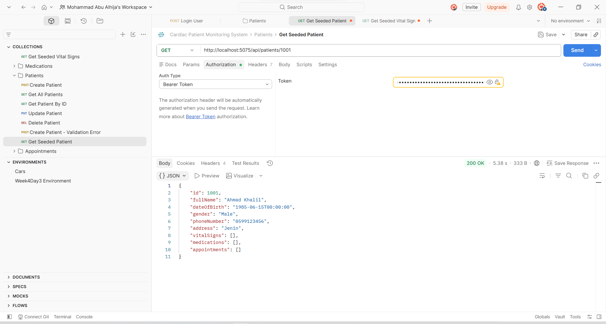

---

# Patient API

The Patient API supports full asynchronous CRUD operations.

| Method | Endpoint | Description |
| --- | --- | --- |
| GET | `/api/patients` | Get all patients |
| GET | `/api/patients/{id}` | Get a patient by ID |
| POST | `/api/patients` | Create a patient |
| PUT | `/api/patients/{id}` | Update a patient |
| DELETE | `/api/patients/{id}` | Delete a patient |

I used asynchronous Entity Framework Core methods such as:

```csharp
await _context.Patients.ToListAsync();
await _context.Patients.FindAsync(id);
await _context.SaveChangesAsync();
```

This allowed the controller to work asynchronously when accessing the database.

### Get All Patients

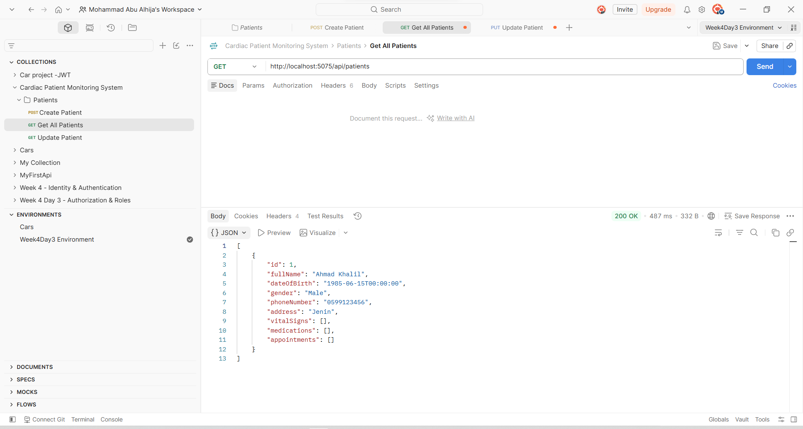

### Delete Patient

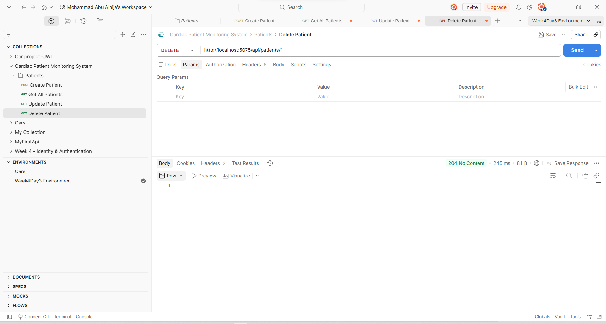

---

# 404 Not Found Handling

I also tested what happens when a Patient ID does not exist.

Example:

```http
GET /api/patients/99999
```

The API returns:

```text
404 Not Found
```

### Patient Not Found

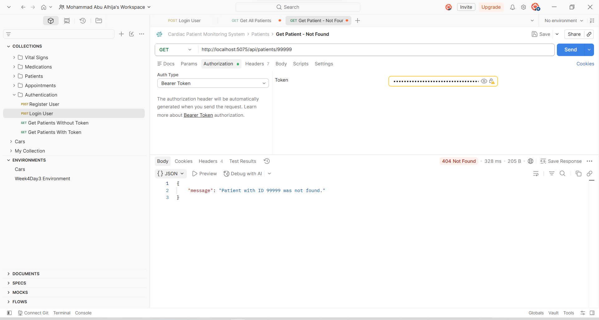

---

# Vital Signs API

The Vital Signs module stores cardiac measurements for a patient.

Each Vital Sign contains:

- Patient ID
- Heart Rate
- Systolic Blood Pressure
- Diastolic Blood Pressure
- Measurement Date and Time

Available endpoints:

| Method | Endpoint | Description |
| --- | --- | --- |
| GET | `/api/vitalsigns` | Get all vital signs |
| GET | `/api/vitalsigns/{id}` | Get a vital sign by ID |
| POST | `/api/vitalsigns` | Create a vital sign |
| PUT | `/api/vitalsigns/{id}` | Update a vital sign |
| DELETE | `/api/vitalsigns/{id}` | Delete a vital sign |

Before creating or updating a Vital Sign, I check that the Patient exists.

```csharp
var patientExists = await _context.Patients
    .AnyAsync(p => p.Id == request.PatientId);
```

### Get All Vital Signs

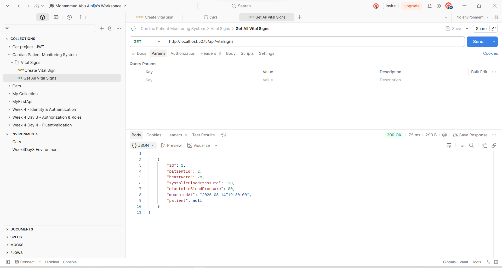

### Delete Vital Sign

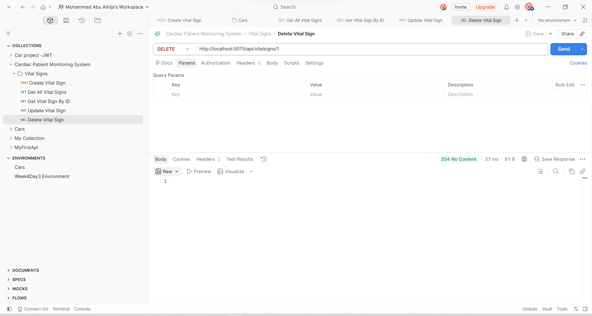

---

# Medications API

The Medications module manages medications related to a patient.

Each Medication contains:

- Patient ID
- Medication Name
- Dosage
- Frequency
- Start Date
- Optional End Date

Available endpoints:

| Method | Endpoint | Description |
| --- | --- | --- |
| GET | `/api/medications` | Get all medications |
| GET | `/api/medications/{id}` | Get a medication by ID |
| POST | `/api/medications` | Create a medication |
| PUT | `/api/medications/{id}` | Update a medication |
| DELETE | `/api/medications/{id}` | Delete a medication |

I also check that the Patient exists before creating or updating a Medication.

### Get All Medications

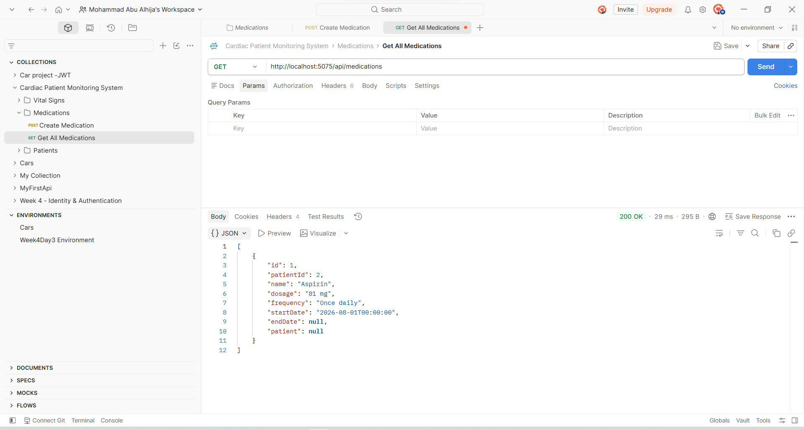

### Delete Medication

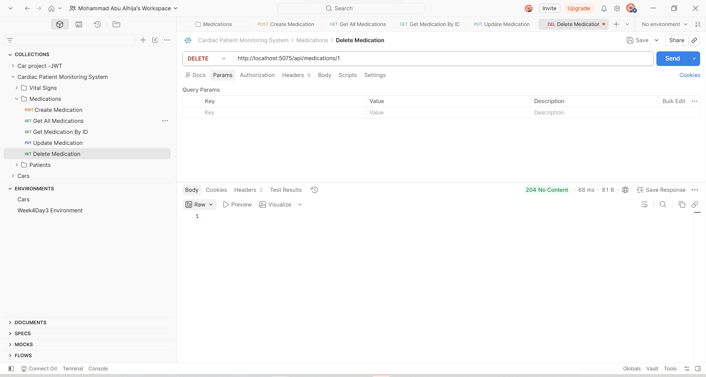

---

# Appointments API

The Appointments module manages patient appointments.

Each Appointment contains:

- Patient ID
- Appointment Date
- Doctor Name
- Reason
- Status

Available endpoints:

| Method | Endpoint | Description |
| --- | --- | --- |
| GET | `/api/appointments` | Get all appointments |
| GET | `/api/appointments/{id}` | Get an appointment by ID |
| POST | `/api/appointments` | Create an appointment |
| PUT | `/api/appointments/{id}` | Update an appointment |
| DELETE | `/api/appointments/{id}` | Delete an appointment |

### Get All Appointments

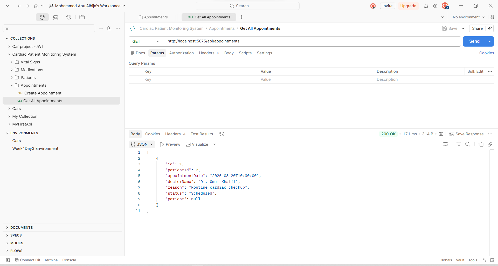

### Delete Appointment

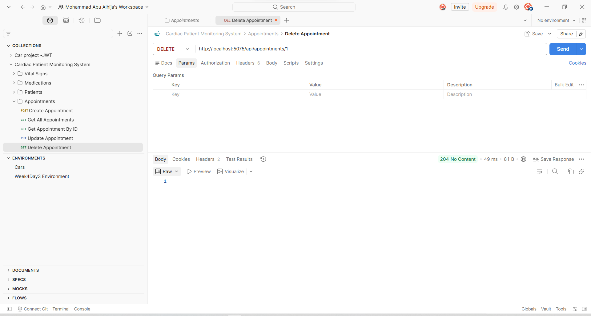

---

# LINQ Filtering

I used LINQ to add filtering to the Appointments endpoint.

For example:

```http
GET /api/appointments?status=Scheduled
```

The controller starts with an `IQueryable`:

```csharp
var query = _context.Appointments.AsQueryable();

if (!string.IsNullOrWhiteSpace(status))
{
    query = query.Where(a => a.Status == status);
}

var appointments = await query.ToListAsync();
```

This allows the API to return only appointments that match the requested status.

### Filter Appointments by Status

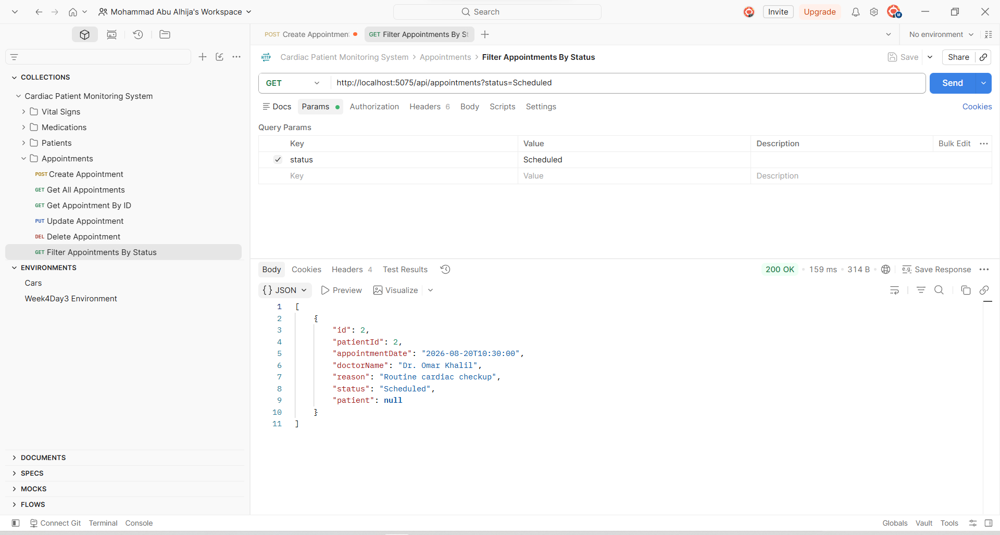

---

# Authentication with ASP.NET Core Identity

I used **ASP.NET Core Identity** to manage application users and passwords.

The Authentication API provides two main endpoints:

```http
POST /api/auth/register
POST /api/auth/login
```

The register endpoint creates a new Identity user.

### Register User

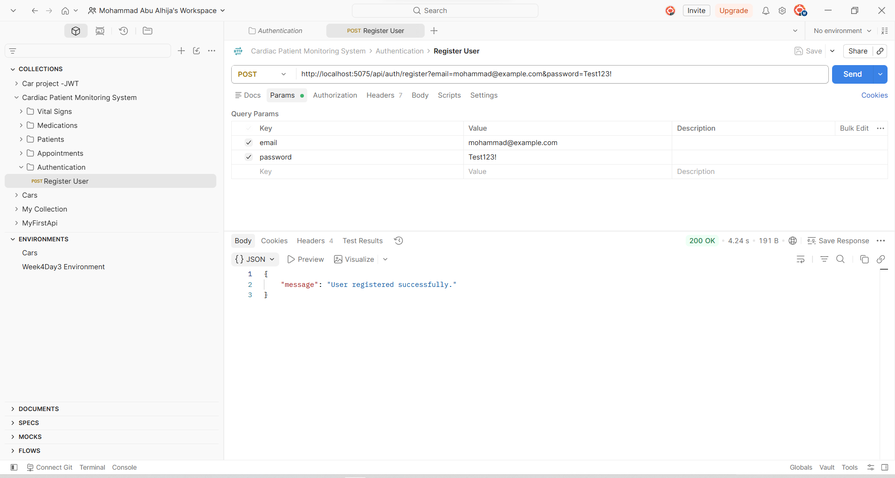

---

# JWT Authentication

After a successful login, the API generates a **JSON Web Token (JWT)**.

The token is signed using:

```text
HMAC SHA-256
```

The API validates:

- Issuer
- Audience
- Token lifetime
- Signing key

### Login and JWT Generation


The authentication flow is:

```text
Register
   ↓
Login
   ↓
Generate JWT
   ↓
Send Bearer Token
   ↓
JWT Validation
   ↓
Protected Endpoint
```

---

# Protected API Routes

The main controllers are protected using:

```csharp
[Authorize]
```

This includes:

- Patients
- Vital Signs
- Medications
- Appointments

Without a JWT, the API returns:

```text
401 Unauthorized
```

### Protected Request Without JWT

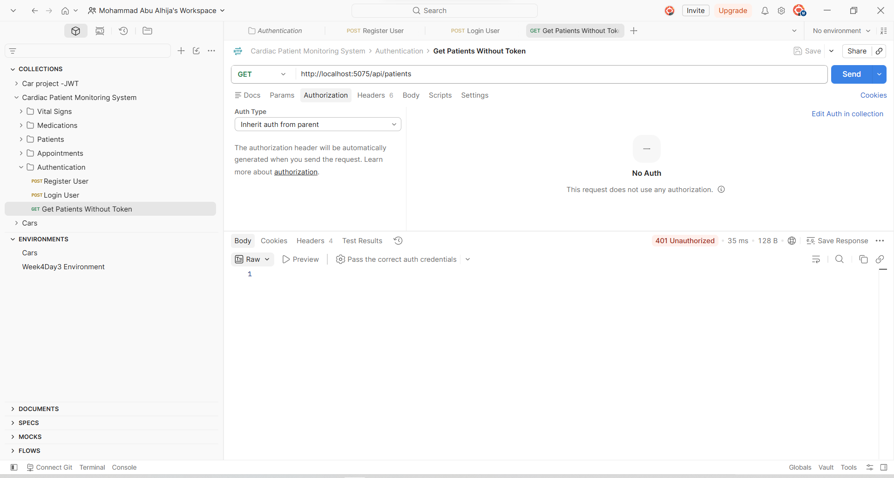

After sending a valid Bearer Token, the same endpoint can be accessed normally.

```text
200 OK
```

### Protected Request With JWT

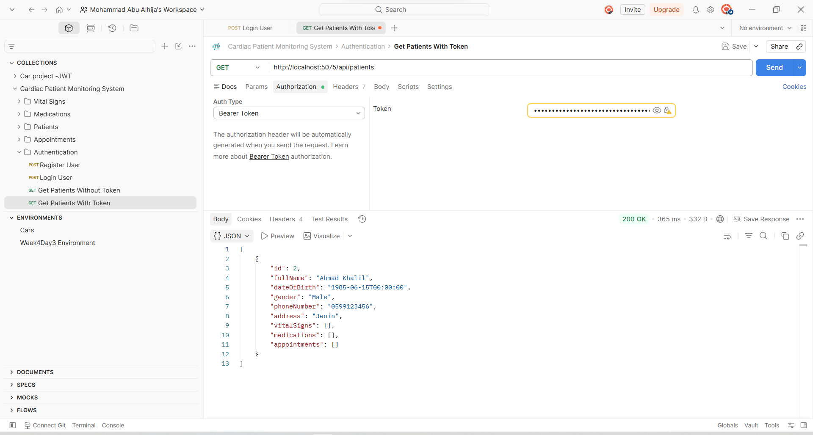

This helped me understand the difference between:

**Authentication** — Who is the user?

**Authorization** — Is the user allowed to access this endpoint?

---

# Input Validation with FluentValidation

I used **FluentValidation** to keep validation rules separate from the controllers.

I created Create and Update validators for:

- Patients
- Vital Signs
- Medications
- Appointments

For example, the Patient validator contains rules such as:

```csharp
RuleFor(x => x.FullName)
    .NotEmpty()
    .WithMessage("Patient full name is required.");

RuleFor(x => x.DateOfBirth)
    .NotEmpty()
    .LessThan(DateTime.Today)
    .WithMessage("Date of birth must be in the past.");
```

The validators are registered in `Program.cs`:

```csharp
builder.Services.AddFluentValidationAutoValidation();

builder.Services.AddValidatorsFromAssemblyContaining<
    CreatePatientValidator>();
```

If the request contains invalid data, the API returns:

```text
400 Bad Request
```

### Invalid Patient Request


---

# HTTP Status Codes

I tested different API scenarios and made sure the endpoints return suitable HTTP status codes.

| Status Code | Meaning | Example |
| --- | --- | --- |
| `200 OK` | Successful request | Get resources |
| `201 Created` | Resource created | Create Patient |
| `204 No Content` | Successful update/delete | Update or Delete |
| `400 Bad Request` | Invalid input | Validation error |
| `401 Unauthorized` | Authentication required | Missing JWT |
| `404 Not Found` | Resource does not exist | Invalid Patient ID |
| `500 Internal Server Error` | Unexpected server error | Global exception handler |

---

# Request Logging Middleware

I created a custom middleware to log incoming requests and response status codes.

Before calling the next middleware:

```csharp
Console.WriteLine(
    $"Request: {context.Request.Method} {context.Request.Path}"
);
```

Then:

```csharp
await _next(context);
```

After the request finishes:

```csharp
Console.WriteLine(
    $"Response Status: {context.Response.StatusCode}"
);
```

Example:

```text
Request: GET /api/patients
Response Status: 200
```

This helped me understand how middleware works inside the ASP.NET Core request pipeline.

---

# Global Exception Handling

I added a `GlobalExceptionMiddleware` to handle unexpected errors in one central place.

The basic idea is:

```csharp
try
{
    await _next(context);
}
catch (Exception ex)
{
    // Log the exception
    // Return a safe response
}
```

Instead of adding the same `try/catch` inside every controller, the middleware can catch unexpected exceptions from the request pipeline.

---

## ProblemDetails

For unexpected errors, the API returns a standardized `ProblemDetails` response.

Example:

```json
{
  "title": "An unexpected error occurred.",
  "status": 500,
  "instance": "/api/patients/test-error"
}
```

The client receives:

```text
500 Internal Server Error
```

but does not receive the real exception message or stack trace.

### Safe 500 Response


---

## Exception Logging

The real exception is still useful for debugging, so I log it on the server using `ILogger`.

```csharp
_logger.LogError(
    ex,
    "Unhandled exception occurred for request {Method} {Path}",
    context.Request.Method,
    context.Request.Path
);
```

This gives me the real exception on the server while keeping the API response safe.

### Server Exception Log


---

# Unit Testing with xUnit

During Week 5, I started adding automated testing using **xUnit**.

I created a separate test project:

```text
CardiacPatientMonitoringSystem.Tests
```

For the first unit tests, I created a `PatientService` method that calculates a patient's age.

```csharp
public int CalculateAge(
    DateTime dateOfBirth,
    DateTime referenceDate)
{
    int age = referenceDate.Year - dateOfBirth.Year;

    if (dateOfBirth.Date >
        referenceDate.AddYears(-age).Date)
    {
        age--;
    }

    return age;
}
```

I passed a `referenceDate` instead of using the current system date directly so that the test result stays predictable.

I tested three situations using `[Fact]`:

- Birthday already passed
- Birthday has not happened yet
- Birthday is today

I also used `[Theory]` with `[InlineData]` to run the same test logic with multiple inputs.

The tests follow the **Arrange - Act - Assert** pattern:

```text
Arrange
   ↓
Act
   ↓
Assert
```

The first xUnit suite contained:

```text
3 Fact cases
+
3 Theory cases
=
6 test cases
```

### xUnit Test Result


---

# Mocking Dependencies with Moq

After basic unit testing, I used **Moq** to test a service that depends on another component.

I created:

```csharp
public interface IPatientRepository
{
    Task<Patient?> GetByIdAsync(int id);
}
```

`PatientService` receives the repository through constructor injection.

```csharp
private readonly IPatientRepository _patientRepository;

public PatientService(
    IPatientRepository patientRepository)
{
    _patientRepository = patientRepository;
}
```

During the test, I replace the real repository with a mock.

```csharp
var mockRepo =
    new Mock<IPatientRepository>();

mockRepo
    .Setup(r => r.GetByIdAsync(1))
    .ReturnsAsync(patient);
```

I also tested a repository failure:

```csharp
mockRepo
    .Setup(r => r.GetByIdAsync(1))
    .ThrowsAsync(
        new Exception("Database error")
    );
```

Finally, I used `Verify()` to check that the expected repository method was called once.

```csharp
mockRepo.Verify(
    r => r.GetByIdAsync(1),
    Times.Once
);
```

This allowed me to test `PatientService` without using the real database.

### Moq Test Result

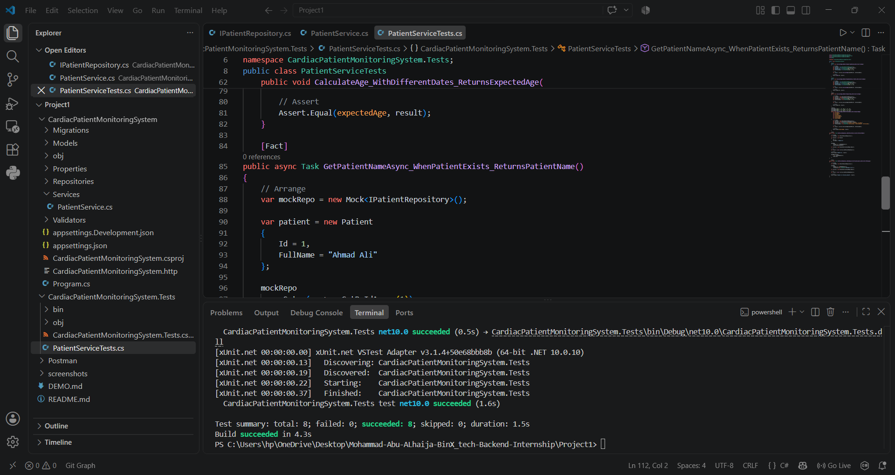

---

# Integration Testing with WebApplicationFactory

After testing small parts of the application separately, I added **Integration Testing** using `WebApplicationFactory`.

The purpose was to test a real HTTP request through multiple parts of the API.

The integration test flow is:

```text
xUnit Test
    ↓
HttpClient
    ↓
ASP.NET Core Pipeline
    ↓
JWT Authentication
    ↓
PatientsController
    ↓
Entity Framework Core
    ↓
In-Memory Database
    ↓
HTTP Response
    ↓
Assertions
```

---

## In-Memory Test Database

I did not want integration tests to modify my normal SQL Server development database.

For that reason, I replaced it with an EF Core In-Memory database during integration tests.

```csharp
services.AddDbContext<AppDbContext>(options =>
{
    options.UseInMemoryDatabase(
        "CardiacPatientMonitoringTestDb"
    );
});
```

The test database is recreated for the test environment:

```csharp
context.Database.EnsureDeleted();
context.Database.EnsureCreated();
```

---

## Patient Integration Tests

The integration tests cover:

```http
GET /api/patients/{id}
```

### Existing Patient

```http
GET /api/patients/1001
```

Expected:

```text
200 OK
```

The test also checks the returned Patient data.

### Missing Patient

```http
GET /api/patients/99999
```

Expected:

```text
404 Not Found
```

Because `PatientsController` is protected, the test also generates and sends a valid JWT.

### Integration Test Result


---

# Validation Unit Testing

I also added direct unit tests for `CreatePatientValidator`.

I created:

```text
CreatePatientValidatorTests.cs
```

The tests cover:

### Valid Patient

A correct Patient request should pass validation.

```csharp
Assert.True(result.IsValid);
```

### Empty Patient Name

An empty `FullName` should fail.

```csharp
Assert.Contains(
    result.Errors,
    error => error.PropertyName == "FullName"
);
```

### Future Date of Birth

A future Date of Birth should also fail.

```csharp
Assert.Contains(
    result.Errors,
    error => error.PropertyName == "DateOfBirth"
);
```

This allowed me to verify the validation rules without sending an HTTP request.

---

# Testing Priorities

At the end of Week 5, I reviewed the project and focused on the areas that were more important to test first.

The three main areas were:

| Area | Why I Tested It |
| --- | --- |
| `CalculateAge()` | Contains date calculation and branching |
| `GetPatientNameAsync()` | Depends on a repository and has success/failure paths |
| `CreatePatientValidator` | Protects the API from invalid Patient data |

This helped me understand that testing is not about trying to test every line.

It is better to start with important logic and areas where a bug could have a bigger effect.

---

# Current Automated Test Suite

The test project currently includes:

```text
Automated Tests
│
├── xUnit Unit Tests
│   └── CalculateAge()
│
├── Moq Tests
│   └── PatientService + IPatientRepository
│
├── Validation Tests
│   └── CreatePatientValidator
│
└── Integration Tests
    └── GET /api/patients/{id}
```

Current result:

```text
Total tests: 13
Passed: 13
Failed: 0
Skipped: 0
```

All current automated tests pass successfully.

---

# Swagger / OpenAPI

I configured Swagger to make it easier to view and manually test the API.

Swagger shows the available controllers and endpoints and also supports JWT Bearer authentication.

In my current development configuration:

```text
http://localhost:5075/swagger
```

> The port may change depending on the local launch configuration.

### Swagger API Overview


---

# Postman Testing

I also use Postman to manually test the API.

The main Postman collection contains requests for:

### Authentication

- Register
- Login
- Protected request without JWT
- Protected request with JWT

### Patients

- Create
- Get All
- Get By ID
- Update
- Delete
- 404 Not Found
- Validation Error

### Vital Signs

- Create
- Get All
- Get By ID
- Update
- Delete

### Medications

- Create
- Get All
- Get By ID
- Update
- Delete

### Appointments

- Create
- Get All
- Get By ID
- Update
- Delete
- Filter by status

The exported collection is stored in:

```text
Postman/Cardiac Patient Monitoring System.postman_collection.json
```

---

# API Request Flow

A normal protected request follows this flow:

```text
Client / Swagger / Postman
          ↓
Global Exception Middleware
          ↓
Request Logging Middleware
          ↓
JWT Authentication
          ↓
Authorization
          ↓
FluentValidation
          ↓
Controller
          ↓
Entity Framework Core
          ↓
SQL Server
          ↓
HTTP Response
```

This flow helped me understand how the different parts of an ASP.NET Core backend work together.

---

# Running the Project

## Requirements

- .NET 10 SDK
- SQL Server LocalDB
- Entity Framework Core CLI tools

From the `Project1` folder:

```bash
cd CardiacPatientMonitoringSystem
```

Restore the packages:

```bash
dotnet restore
```

Apply the migrations:

```bash
dotnet ef database update
```

Run the API:

```bash
dotnet run
```

Then open Swagger using the URL displayed in the terminal.

---

# Running the Tests

From the `Project1` directory:

```bash
dotnet test CardiacPatientMonitoringSystem.Tests
```

Current result:

```text
Total tests: 13
Passed: 13
Failed: 0
Skipped: 0
```

The API does not need to be started manually before running the automated tests.

---

# Technologies Used

- C#
- .NET 10
- ASP.NET Core Web API
- Entity Framework Core
- SQL Server LocalDB
- EF Core In-Memory
- ASP.NET Core Identity
- JWT Bearer Authentication
- FluentValidation
- LINQ
- xUnit
- Moq
- WebApplicationFactory
- HttpClient
- ProblemDetails
- ILogger
- Swagger / OpenAPI
- Postman
- Git / GitHub

---

# What I Learned

This project helped me connect the backend topics I learned during the training inside one application.

I practiced how to:

- Design related database entities.
- Use Entity Framework Core and migrations.
- Build asynchronous CRUD APIs.
- Use DTOs and validation.
- Create authentication using Identity and JWT.
- Protect API endpoints.
- Use LINQ for filtering.
- Understand the middleware pipeline.
- Handle unexpected exceptions globally.
- Test APIs manually with Swagger and Postman.
- Write unit tests using xUnit.
- Use `[Fact]`, `[Theory]`, and `[InlineData]`.
- Mock dependencies using Moq.
- Test validation rules directly.
- Write integration tests using WebApplicationFactory.
- Use an isolated In-Memory database for integration tests.
- Test a protected endpoint using JWT.
- Decide which parts of the project should be tested first.

The biggest change for me was moving from only testing manually with Swagger and Postman to also having automated tests that I can run whenever the project changes.

---

# Current Project Status

At this stage, the project includes:

- Database design and EF Core
- CRUD for all four main resources
- Async database operations
- Seed data
- LINQ filtering
- ASP.NET Core Identity
- JWT Authentication
- Protected endpoints
- FluentValidation
- Request logging middleware
- Global exception handling
- Swagger documentation
- Postman testing
- xUnit unit tests
- Moq tests
- Validator tests
- Integration tests
- EF Core In-Memory test database

The current automated test result is:

```text
13 / 13 tests passing
```

I will continue updating the same project as the remaining training topics are covered.